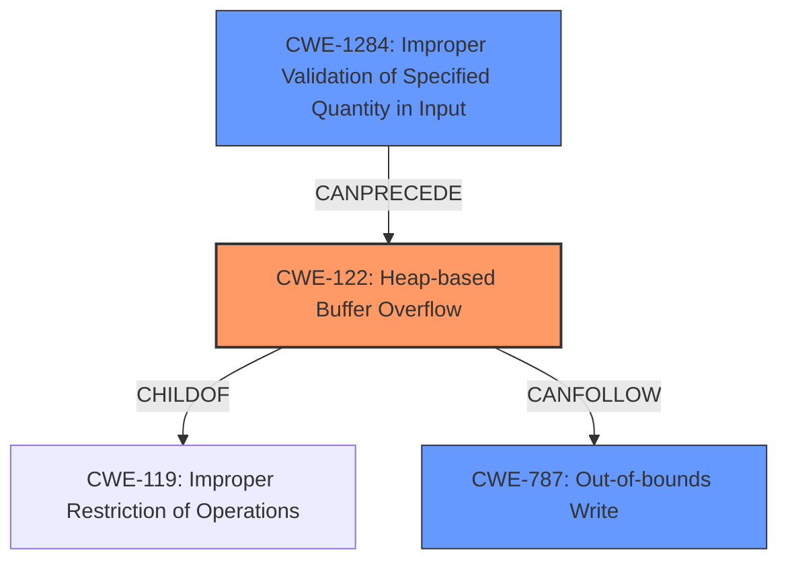

# Analysis Report for CVE-2022-0518

# Vulnerability Analysis Report: CVE-2022-0518

## Description

Heap-based Buffer Overflow in GitHub repository radareorg/radare2 prior to 5.6.2.

## Vulnerability Description Key Phrases

**Weakness:** Heap-based Buffer Overflow
**Product:** radareorg/radare2
**Version:** prior to 5.6.2

## Analysis (with Relationship Data)

# Summary
| CWE ID | CWE Name | Confidence | CWE Abstraction Level | CWE Vulnerability Mapping Label | CWE-Vulnerability Mapping Notes |
|---|---|---|---|---|---|
| CWE-122 | Heap-based Buffer Overflow | 0.95 | Variant | Allowed | The vulnerability is a heap-based buffer overflow.|
| CWE-787 | Out-of-bounds Write | 0.75 | Base | Allowed | Could result in an out-of-bounds write. |

## Evidence and Confidence

*   **Confidence Score:** 0.90
*   **Evidence Strength:** HIGH

- **Analysis and Justification:**  
  - *Explanation:* The vulnerability description clearly states a **Heap-based Buffer Overflow** in radare2. The CVE Reference Links Content Summary confirms this, stating that the root cause is a heap-based buffer overflow within the `r_bin_java_inner_classes_attr_new` function due to insufficient bounds checking. The impact is arbitrary code execution. CWE-122 (Heap-based Buffer Overflow) is a Variant of a buffer overflow, specifically when the buffer is allocated on the heap. The retriever results also list CWE-122 as a relevant CWE.
  
  - *Relationship Analysis:* CWE-122 is a child of CWE-119 (Improper Restriction of Operations within the Bounds of a Memory Buffer). CWE-122 is also a specific type of CWE-787 (Out-of-bounds Write).

- **Confidence Score:**  
  - Confidence: 0.95 (High evidence from technical description and CVE reference materials)

---

- **Analysis and Justification:**  
  - *Explanation:* The **Heap-based Buffer Overflow** (CWE-122) could lead to writing data past the end of the allocated buffer, thus causing an out-of-bounds write. CWE-787 (Out-of-bounds Write) describes the condition where a product writes data past the end, or before the beginning, of the intended buffer. This is a direct result of the heap overflow, and therefore, is a valid secondary CWE.
  
  - *Relationship Analysis:* CWE-787 is a parent of CWE-122 and other specific buffer overflow/underflow conditions. While CWE-122 is more specific to the root cause, CWE-787 represents a consequence.

- **Confidence Score:**  
  - Confidence: 0.75 (Reasonable evidence from the heap overflow leading to out-of-bounds write)

## Criticism of Analysis

Okay, I've reviewed the analysis against the provided full CWE specifications. Here's my critique, focusing on the strengths, weaknesses, and potential improvements:

**Overall Assessment:**

The analysis is generally good. It correctly identifies the primary CWE (CWE-122) and a relevant secondary CWE (CWE-787). The confidence scores are appropriate. The justifications are reasonable and link back to the provided descriptions. However, there's room for improvement in considering other potentially relevant CWEs, especially those related to the *cause* of the buffer overflow, rather than just the *result*.

**Strengths:**

*   **Correct Primary CWE:**  The identification of CWE-122 (Heap-based Buffer Overflow) is accurate and well-justified. The analysis clearly links the vulnerability description to the CWE definition, emphasizing the heap allocation aspect.
*   **Reasonable Secondary CWE:**  The inclusion of CWE-787 (Out-of-bounds Write) is also reasonable, as it represents the direct consequence of the heap overflow.
*   **Good Confidence Scores:** The confidence scores reflect the level of certainty based on the available information.
*   **Clear Justification:** The explanations for including each CWE are clear and easy to follow.
*   **Relationship Analysis:** The analysis mentions the parent/child relationships between the CWEs, which provides additional context.

**Weaknesses and Potential Improvements:**

1.  **Lack of Root Cause Analysis Beyond Buffer Overflow:** While the analysis correctly identifies *what* happened (heap overflow, out-of-bounds write), it could benefit from exploring *why* the overflow occurred. The vulnerability description mentions "insufficient bounds checking." This suggests that CWEs related to improper input validation or incorrect buffer size calculation might be relevant.

2.  **Missed Opportunities - Input Validation and Length Parameter:** The most significant missed opportunity is exploring CWEs related to input validation. The description states "insufficient bounds checking when reading the 'inner classes' attribute." This directly implies that the size or number of inner classes specified in the Java class file is not being properly validated *before* the buffer is allocated and populated. The Retriever Results even included CWE-1284 (Improper Validation of Specified Quantity in Input) as a possible match.

    *   **Recommendation:**  Consider adding CWE-1284 (Improper Validation of Specified Quantity in Input) if the Java class file provides an explicit size for the "inner classes" attribute, and this size isn't validated. This would capture the lack of bounds checking of the *size* parameter.
    *   Consider adding CWE-130 (Improper Handling of Length Parameter Inconsistency) if the size in the Java class file is inconsistent with the actual number of inner classes.
    *   Based on the description, CWE-20 (Improper Input Validation) *could* be considered since the overall "inner classes" attribute is untrusted input. However, since CWE-20 is discouraged and a higher detail CWE is available, CWE-1284 is better.

3.  **Possible Incorrect Calculation of Buffer Size** If the allocated buffer size for inner classes was incorrectly calculated, consider adding CWE-131 (Incorrect Calculation of Buffer Size).

4.  **Over-emphasis on Consequence, Under-emphasis on Cause:** The current analysis focuses heavily on the *result* of the vulnerability (out-of-bounds write). While accurate, it's more valuable to identify the *cause* so developers can prevent similar issues. Focus on the flawed logic that led to the overflow.

5. **Relevance of Retriever Results**: The Retriever Results suggested several potential CWEs that were not incorporated into the final analysis. Reviewing these more closely could strengthen the analysis. Notably,
   * **CWE-805**: If an incorrect length value is used when accessing the buffer, even if the initial allocation was correct, consider CWE-805 (Buffer Access with Incorrect Length Value).
   * **CWE-130**: If a size or length parameter is involved and inconsistently handled, consider CWE-130 (Improper Handling of Length Parameter Inconsistency)
   * **CWE-190**: If an integer overflow leads to an incorrect buffer size, consider CWE-190 (Integer Overflow or Wraparound)
   * **CWE-126**: If the code reads beyond the bounds of the buffer, consider CWE-126 (Buffer Over-read)

6.  **Mitigation Focus:** The mitigations suggested by the CWE specifications are often general (use a safe language, use libraries, etc.). The analysis could be slightly strengthened by mentioning more specific mitigations relevant to Java class file parsing, such as:

    *   Strict validation of the size/count field in the "inner classes" attribute against reasonable limits and the actual number of inner classes present.
    *   Using safe array/buffer access methods that automatically perform bounds checking.
    *   Fuzzing the Java class file parser with malformed inputs to identify potential overflow conditions.

**Specific Suggestions:**

*   **CWE-122 (Heap-based Buffer Overflow):** Keep this as the primary CWE. Confidence: 0.95 (Excellent)

*   **CWE-787 (Out-of-bounds Write):** Keep this as a secondary CWE representing the consequence of the overflow. Confidence: 0.75 (Good)

*   **CWE-1284 (Improper Validation of Specified Quantity in Input):**  Add this CWE to capture the lack of validation of the "size" or "count" field in the Java class file. Confidence: 0.85 (High)

*   **CWE-131 (Incorrect Calculation of Buffer Size):** Consider including, but only if the *calculation* of the buffer size, given the input, was flawed. Confidence: 0.6 (Conditional)

**Revised Summary Table:**

| CWE ID | CWE Name | Confidence | CWE Abstraction Level | CWE Vulnerability Mapping Label | CWE-Vulnerability Mapping Notes |
|---|---|---|---|---|---|
| CWE-122 | Heap-based Buffer Overflow | 0.95 | Variant | Allowed | The vulnerability is a heap-based buffer overflow.|
| CWE-787 | Out-of-bounds Write | 0.75 | Base | Allowed | Direct result of heap overflow. |
| CWE-1284 | Improper Validation of Specified Quantity in Input | 0.85 | Base | Allowed | The size/count field of the "inner classes" attribute is not validated. |
| CWE-131 | Incorrect Calculation of Buffer Size | 0.60 | Base | Allowed | Only if buffer size calculation is flawed. |

By addressing these points, the analysis will be more comprehensive and provide a deeper understanding of the root cause and potential preventative measures for this type of vulnerability.

## Final Resolution

# Summary
| CWE ID | CWE Name | Confidence | CWE Abstraction Level | CWE Vulnerability Mapping Label | CWE-Vulnerability Mapping Notes |
|---|---|---|---|---|---|
| CWE-122 | Heap-based Buffer Overflow | 0.95 | Variant | Allowed | Primary CWE. The vulnerability is a heap-based buffer overflow. |
| CWE-1284 | Improper Validation of Specified Quantity in Input | 0.85 | Base | Allowed | Secondary CWE. The size/count field of the "inner classes" attribute is not validated. |
| CWE-787 | Out-of-bounds Write | 0.75 | Base | Allowed | Secondary CWE. Direct result of heap overflow. |

## Evidence and Confidence

*   **Confidence Score:** 0.90
*   **Evidence Strength:** HIGH

## Relationship Analysis
The primary weakness is a **Heap-based Buffer Overflow** (CWE-122). This is a variant of **Improper Restriction of Operations within the Bounds of a Memory Buffer** (CWE-119). The overflow occurs because the size of the input data is not properly validated (**Improper Validation of Specified Quantity in Input**, CWE-1284) before allocating the buffer, leading to an **Out-of-bounds Write** (CWE-787).

## Vulnerability Chain
The vulnerability chain starts with **Improper Validation of Specified Quantity in Input** (CWE-1284), where the size of the "inner classes" attribute in the Java class file is not validated. This leads to a **Heap-based Buffer Overflow** (CWE-122) when the program attempts to allocate a buffer based on the unvalidated size. The overflow results in an **Out-of-bounds Write** (CWE-787), potentially leading to arbitrary code execution.

## Summary of Analysis
The initial analysis correctly identified CWE-122 and CWE-787. However, it missed the crucial root cause, which is the lack of input validation. The criticism correctly pointed out that "insufficient bounds checking" strongly suggests that CWEs related to improper input validation are relevant. The vulnerability description explicitly mentions "insufficient bounds checking when reading the 'inner classes' attribute," which is direct evidence for including CWE-1284 (**Improper Validation of Specified Quantity in Input**).

The graph relationships helped clarify the vulnerability chain: CWE-1284 *precedes* CWE-122, which *precedes* CWE-787. By adding CWE-1284, the classification is at the optimal level of specificity because it addresses the root cause. This analysis is based on the provided evidence, especially the vulnerability description mentioning insufficient bounds checking, and the suggestion in the criticism to consider CWE-1284.

*Report generated on 2025-03-18 06:05:17*
