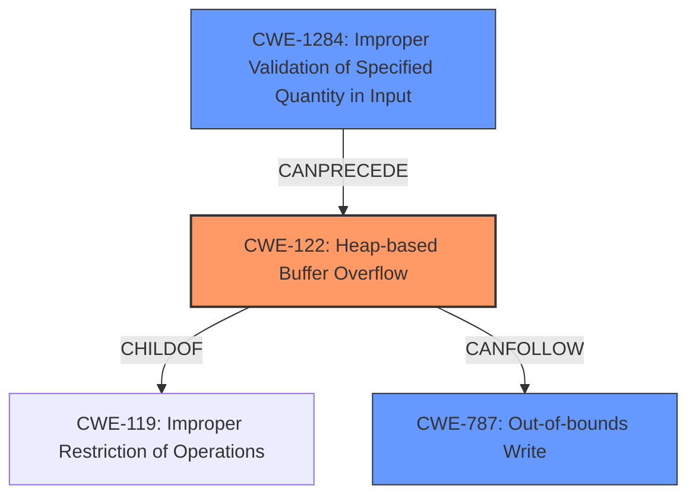

# Final Resolution for CVE-2022-0518

# Summary
| CWE ID | CWE Name | Confidence | CWE Abstraction Level | CWE Vulnerability Mapping Label | CWE-Vulnerability Mapping Notes |
|---|---|---|---|---|---|
| CWE-122 | Heap-based Buffer Overflow | 0.95 | Variant | Allowed | Primary CWE. The vulnerability is a heap-based buffer overflow. |
| CWE-1284 | Improper Validation of Specified Quantity in Input | 0.85 | Base | Allowed | Secondary CWE. The size/count field of the "inner classes" attribute is not validated. |
| CWE-787 | Out-of-bounds Write | 0.75 | Base | Allowed | Secondary CWE. Direct result of heap overflow. |

## Evidence and Confidence

*   **Confidence Score:** 0.90
*   **Evidence Strength:** HIGH

## Relationship Analysis
The primary weakness is a **Heap-based Buffer Overflow** (CWE-122). This is a variant of **Improper Restriction of Operations within the Bounds of a Memory Buffer** (CWE-119). The overflow occurs because the size of the input data is not properly validated (**Improper Validation of Specified Quantity in Input**, CWE-1284) before allocating the buffer, leading to an **Out-of-bounds Write** (CWE-787).

## Vulnerability Chain
The vulnerability chain starts with **Improper Validation of Specified Quantity in Input** (CWE-1284), where the size of the "inner classes" attribute in the Java class file is not validated. This leads to a **Heap-based Buffer Overflow** (CWE-122) when the program attempts to allocate a buffer based on the unvalidated size. The overflow results in an **Out-of-bounds Write** (CWE-787), potentially leading to arbitrary code execution.

## Summary of Analysis
The initial analysis correctly identified CWE-122 and CWE-787. However, it missed the crucial root cause, which is the lack of input validation. The criticism correctly pointed out that "insufficient bounds checking" strongly suggests that CWEs related to improper input validation are relevant. The vulnerability description explicitly mentions "insufficient bounds checking when reading the 'inner classes' attribute," which is direct evidence for including CWE-1284 (**Improper Validation of Specified Quantity in Input**).

The graph relationships helped clarify the vulnerability chain: CWE-1284 *precedes* CWE-122, which *precedes* CWE-787. By adding CWE-1284, the classification is at the optimal level of specificity because it addresses the root cause. This analysis is based on the provided evidence, especially the vulnerability description mentioning insufficient bounds checking, and the suggestion in the criticism to consider CWE-1284.