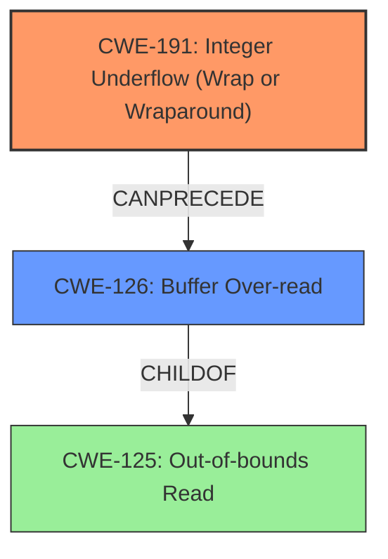

# Final Resolution for CVE-2022-0544

# Summary
| CWE ID | CWE Name | Confidence | CWE Abstraction Level | CWE Vulnerability Mapping Label | CWE-Vulnerability Mapping Notes |
|---|---|---|---|---|---|
| CWE-191 | Integer Underflow (Wrap or Wraparound) | 0.95 | Base | Allowed | Primary CWE: The vulnerability's root cause is an integer underflow. |
| CWE-126 | Buffer Over-read | 0.95 | Variant | Allowed | Secondary CWE: The integer underflow leads to an out-of-bounds read. |

## Evidence and Confidence

*   **Confidence Score:** 0.95
*   **Evidence Strength:** HIGH

## Relationship Analysis
The primary relationship is that CWE-191 **Integer Underflow** can precede CWE-126 **Buffer Over-read**. The integer underflow results in an incorrect size calculation, which leads to reading beyond the allocated buffer. CWE-126 is a child of CWE-125 **Out-of-bounds Read**, providing a more specific classification for the type of out-of-bounds read that occurs in this vulnerability. The abstraction levels are appropriate, with CWE-191 at the Base level and CWE-126 at the Variant level, giving the right level of specificity.

## Vulnerability Chain
The vulnerability chain starts with an **Integer Underflow (CWE-191)** in the DDS loader. This underflow leads to an incorrect size calculation. The incorrect size calculation results in a **Buffer Over-read (CWE-126)**, where the application reads data past the end of the intended buffer. This can potentially lead to an attacker reading sensitive data.

## Summary of Analysis
The initial analysis and criticism are both strong. The vulnerability description explicitly mentions an "**integer underflow**" leading to an "**out-of-bounds read**." The CVE reference summary supports that the **ROOTCAUSE** is an integer underflow. The `size` variable becomes a large value, bypassing bounds checks, and resulting in an out-of-bounds read.

The initial analysis correctly identified CWE-191 and CWE-125. The criticism suggested using the more specific CWE-126 instead of CWE-125, and this suggestion is reasonable and well-justified. "The product reads from a buffer using buffer access mechanisms such as indexes or pointers that reference memory locations *after* the targeted buffer." The graph relationships influenced the selection by highlighting the child-parent relationship between CWE-125 and CWE-126, and the chain relationship between CWE-191 and CWE-126.

The selected CWEs are at the optimal level of specificity because CWE-191 is the root cause and CWE-126 is a specific type of out-of-bounds read that accurately describes the vulnerability.