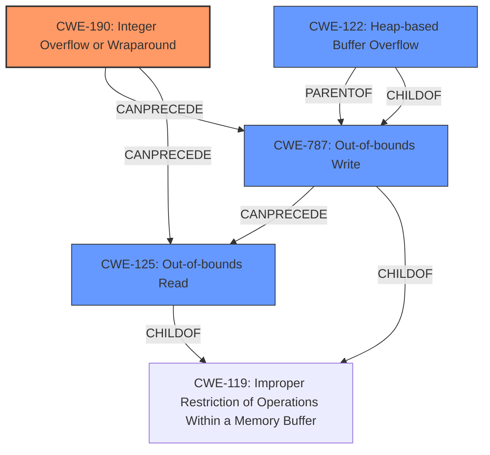

# Analysis Report for CVE-2022-0545

# Vulnerability Analysis Report: CVE-2022-0545

## Description

An integer overflow in the processing of loaded 2D images leads to a write-what-where vulnerability and an out-of-bounds read vulnerability, allowing an attacker to leak sensitive information or achieve code execution in the context of the Blender process when a specially crafted image file is loaded. This flaw affects Blender versions prior to 2.83.19, 2.93.8 and 3.1.

## Vulnerability Description Key Phrases

**Rootcause:** integer overflow
**Weakness:** ['write-what-where', 'out-of-bounds read']
**Impact:** ['leak sensitive information', 'code execution']
**Vector:** specially crafted image file
**Attacker:** attacker
**Product:** Blender
**Version:** prior to 2.83.19, 2.93.8 and 3.1

## Analysis (with Relationship Data)

# Summary
| CWE ID  | CWE Name                        | Confidence | CWE Abstraction Level | CWE Vulnerability Mapping Label | CWE-Vulnerability Mapping Notes |
|---------|---------------------------------|------------|-----------------------|---------------------------------|---------------------------------|
| CWE-190 | Integer Overflow or Wraparound  | 0.95       | Base                  | Allowed                        | Primary CWE                     |
| CWE-787 | Out-of-bounds Write             | 0.90       | Base                  | Allowed                        | Secondary Candidate            |
| CWE-125 | Out-of-bounds Read              | 0.85       | Base                  | Allowed                        | Secondary Candidate            |

## Evidence and Confidence

*   **Confidence Score:** 0.90
*   **Evidence Strength:** HIGH

- **Analysis and Justification:**  
  - *Explanation:* The vulnerability description explicitly states an **integer overflow** as the root cause, leading to a **write-what-where** vulnerability and an **out-of-bounds read**. The CVE reference confirms this, noting that a missing bounds check in `IMB_flipy()` can cause an integer overflow. Specifically, a large `ibuf->x` can overflow when allocating memory for the `linef` buffer, causing a heap buffer overflow and out-of-bounds write. This aligns directly with CWE-190 (Integer Overflow or Wraparound). The resulting out-of-bounds write (CWE-787) allows attackers to overwrite memory locations, leading to potential code execution. Additionally, the **integer overflow** leads to an **out-of-bounds read** (CWE-125) which can leak sensitive information.

  - *Relationship Analysis:* CWE-190 is a base-level weakness. It can lead to CWE-787 (Out-of-bounds Write) and CWE-125 (Out-of-bounds Read). The retriever results also support this choice, with CWE-190 having a high score.

- **Confidence Score:**  
  - *CWE-190 Confidence: 0.95* (High confidence due to explicit mention in the description and CVE details)
  - *CWE-787 Confidence: 0.90* (High confidence as a direct consequence of the integer overflow leading to memory corruption)
  - *CWE-125 Confidence: 0.85* (High confidence as a direct consequence of the integer overflow leading to information leak)

---

## Criticism of Analysis

Okay, I've reviewed the provided analysis against the full CWE specifications. Here's my critique:

**Overall Assessment:**

The analysis is generally good and arrives at a reasonable conclusion. The identified CWEs – CWE-190, CWE-787, and CWE-125 – are all relevant to the vulnerability description. The confidence levels are also appropriate given the information provided. The reasoning and justification are well-articulated and clearly explain the relationship between the root cause (integer overflow) and the resulting vulnerabilities (out-of-bounds write and read).

**Specific Observations and Recommendations:**

*   **CWE-190: Integer Overflow or Wraparound (Primary CWE):**

    *   **Correct:** The analysis correctly identifies this as the root cause. The description explicitly mentions an integer overflow, and the CVE reference details the missing bounds check and the overflow during memory allocation.
    *   **Mapping Guidance:** The analysis aligns with the CWE's mapping guidance, which encourages the use of Base-level CWEs.
    *   **Mitigations:** The suggested mitigations for CWE-190 in the specification (Requirements, Language Selection, Libraries/Frameworks) are all relevant and would help prevent this type of vulnerability.
    *   **Observed Examples**: The document provides a relevant observed example.
*   **CWE-787: Out-of-bounds Write (Secondary Candidate):**

    *   **Correct:** The analysis accurately identifies the out-of-bounds write as a consequence of the integer overflow. The "write-what-where" description further reinforces this. The CVE details point to `bottomf` and `topf` pointer wrapping, leading to overwrite, and `linef` heap buffer overflow/out-of-bounds write, which support this classification.
    *   **Mapping Guidance:** The analysis follows the mapping guidance by using a Base-level CWE.
    *   **Mitigations:** The suggested mitigations (Language Selection, Libraries/Frameworks, Environment Hardening) are standard techniques for preventing buffer overflows and are appropriate.
    *   **CWE-123: Write-what-where Condition is also applicable**: Since the attacker has the ability to write arbitrary data to an arbitrary memory location, CWE-123 (Write-what-where condition) is also applicable.
*   **CWE-125: Out-of-bounds Read (Secondary Candidate):**

    *   **Correct:** The analysis appropriately identifies the out-of-bounds read, linking it to information leakage resulting from the integer overflow.
    *   **Mapping Guidance:** Again, the analysis adheres to the mapping guidance by selecting a Base-level CWE.
    *   **Mitigations:** The suggested mitigations (Input Validation, Language Selection) align with preventing out-of-bounds reads. Ensuring that length arguments, buffer size calculations, and offsets are validated is especially pertinent.
    *   **Observed Examples**: The document provides a relevant observed example.
*   **CWE-122: Heap-based Buffer Overflow**:

    *   The analysis mentions a heap buffer overflow, and CWE-122 is a more specific variant of CWE-787.  It is directly caused by the integer overflow when allocating memory. The retriever also listed this CWE with a score of 0.5502

**Minor suggestions**

*   **CWE-131: Incorrect Calculation of Buffer Size**: It is mentioned that a large `ibuf->x` can cause an integer overflow before allocating memory for the `linef` buffer. Given that the integer overflow is happening because of an incorrect buffer size calculation, CWE-131 could also be applicable since the root cause of the overflow is ultimately related to the allocation size calculation. However, if the integer overflow is happening due to the bounds check being missing, then this is less relevant.
*  **CWE-20 Improper Input Validation.** It can be argued that improper input validation is a precursort to the integer overflow and therefore the out-of-bounds read and write. However, CWE-20 is a high-level and overly broad CWE, so I would suggest sticking to the CWEs that directly cause the vulnerability.

**Areas for potential improvement (lower priority):**

*   **Chain of Causation:** The analysis clearly outlines the chain of events. While the analysis mentions `CWE-190 -> CWE-787 and CWE-125`, it might benefit from a more explicit statement of the causal relationship. For example: "The integer overflow (CWE-190) leads to an incorrect memory allocation size, resulting in an out-of-bounds write (CWE-787) during image flipping and potentially an out-of-bounds read (CWE-125) if the code attempts to access data beyond the allocated region."
*   **Impact Detail:** While the analysis mentions potential code execution, elaborating slightly on how an attacker might achieve this would be beneficial. Briefly mentioning techniques like overwriting function pointers or return addresses could add clarity.

**In Summary:**

This is a solid analysis that correctly identifies the key CWEs and their relationships. The suggestions above are primarily for refinement and greater clarity but don't fundamentally alter the correctness of the analysis. The inclusion of observed examples for CWE-190, 787, and 125 are good practice. The minor suggestion I have would be considering including CWE-122 (Heap-based buffer overflow) since it is a direct consequence of the integer overflow, and CWE-131 since it is related to calculating the size of the buffer.

## Final Resolution

# Summary
| CWE ID  | CWE Name                        | Confidence | CWE Abstraction Level | CWE Vulnerability Mapping Label | CWE-Vulnerability Mapping Notes |
|---------|---------------------------------|------------|-----------------------|---------------------------------|---------------------------------|
| CWE-190 | Integer Overflow or Wraparound  | 0.95       | Base                  | Allowed                        | Primary CWE                     |
| CWE-787 | Out-of-bounds Write             | 0.90       | Base                  | Allowed                        | Secondary Candidate            |
| CWE-125 | Out-of-bounds Read              | 0.85       | Base                  | Allowed                        | Secondary Candidate            |
| CWE-122 | Heap-based Buffer Overflow | 0.75    | Variant                  | Allowed                        | Secondary Candidate            |

## Evidence and Confidence

*   **Confidence Score:** 0.92
*   **Evidence Strength:** HIGH

## Relationship Analysis
The primary **WEAKNESS** is an **integer overflow (CWE-190)**. This leads to an **out-of-bounds write (CWE-787)**, specifically a **heap-based buffer overflow (CWE-122)**, and an **out-of-bounds read (CWE-125)**. CWE-190 is the root cause, with CWE-787, CWE-122 and CWE-125 as consequences. The relationships show a clear progression from the initial **flaw** to the resulting vulnerabilities. All selected CWEs are at the Base or Variant level, offering optimal specificity.

## Vulnerability Chain
The vulnerability chain starts with an **integer overflow (CWE-190)** during the processing of 2D images. This **overflow** leads to an incorrect calculation of buffer size, causing a **heap-based buffer overflow (CWE-122)** and a general **out-of-bounds write (CWE-787)** when allocating memory for the `linef` buffer. Subsequently, this results in an **out-of-bounds read (CWE-125)**, potentially leaking sensitive information. The sequence is: CWE-190 -> CWE-122 -> CWE-787 -> CWE-125.

## Summary of Analysis
The initial analysis correctly identified CWE-190, CWE-787, and CWE-125. The criticism suggested including CWE-122, which is a valid consideration. The vulnerability description explicitly states an **integer overflow** as the **ROOTCAUSE**, leading to a **write-what-where** vulnerability and an **out-of-bounds read**. The CVE reference confirms that a missing bounds check in `IMB_flipy()` can cause an **integer overflow**. The graph relationships clearly show how the **integer overflow** leads to the other weaknesses. The decision to include CWE-122 is based on the explicit mention of a heap buffer overflow in the analysis: "a large `ibuf->x` can overflow when allocating memory for the `linef` buffer, causing a heap buffer overflow and out-of-bounds write." All selected CWEs are at the optimal level of specificity, being either Base or Variant level.

*Report generated on 2025-03-18 06:08:01*
