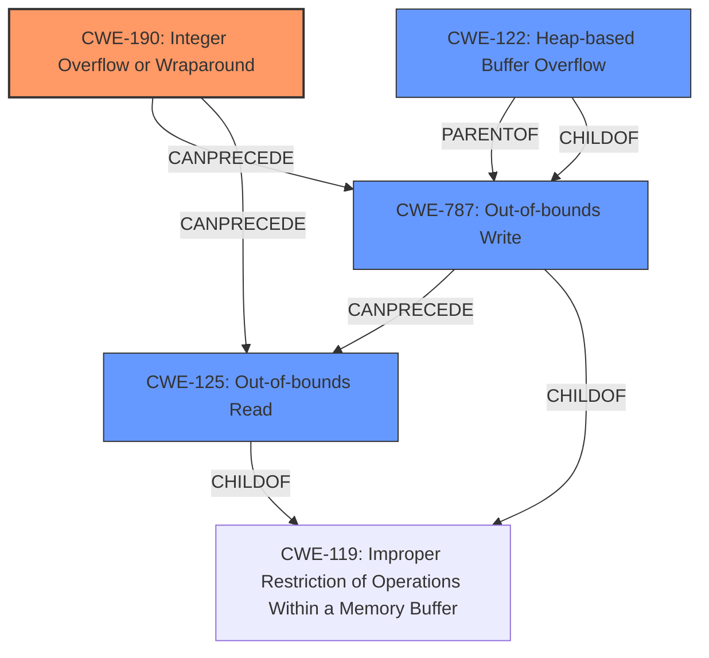

# Final Resolution for CVE-2022-0545

# Summary
| CWE ID  | CWE Name                        | Confidence | CWE Abstraction Level | CWE Vulnerability Mapping Label | CWE-Vulnerability Mapping Notes |
|---------|---------------------------------|------------|-----------------------|---------------------------------|---------------------------------|
| CWE-190 | Integer Overflow or Wraparound  | 0.95       | Base                  | Allowed                        | Primary CWE                     |
| CWE-787 | Out-of-bounds Write             | 0.90       | Base                  | Allowed                        | Secondary Candidate            |
| CWE-125 | Out-of-bounds Read              | 0.85       | Base                  | Allowed                        | Secondary Candidate            |
| CWE-122 | Heap-based Buffer Overflow | 0.75    | Variant                  | Allowed                        | Secondary Candidate            |

## Evidence and Confidence

*   **Confidence Score:** 0.92
*   **Evidence Strength:** HIGH

## Relationship Analysis
The primary **WEAKNESS** is an **integer overflow (CWE-190)**. This leads to an **out-of-bounds write (CWE-787)**, specifically a **heap-based buffer overflow (CWE-122)**, and an **out-of-bounds read (CWE-125)**. CWE-190 is the root cause, with CWE-787, CWE-122 and CWE-125 as consequences. The relationships show a clear progression from the initial **flaw** to the resulting vulnerabilities. All selected CWEs are at the Base or Variant level, offering optimal specificity.

## Vulnerability Chain
The vulnerability chain starts with an **integer overflow (CWE-190)** during the processing of 2D images. This **overflow** leads to an incorrect calculation of buffer size, causing a **heap-based buffer overflow (CWE-122)** and a general **out-of-bounds write (CWE-787)** when allocating memory for the `linef` buffer. Subsequently, this results in an **out-of-bounds read (CWE-125)**, potentially leaking sensitive information. The sequence is: CWE-190 -> CWE-122 -> CWE-787 -> CWE-125.

## Summary of Analysis
The initial analysis correctly identified CWE-190, CWE-787, and CWE-125. The criticism suggested including CWE-122, which is a valid consideration. The vulnerability description explicitly states an **integer overflow** as the **ROOTCAUSE**, leading to a **write-what-where** vulnerability and an **out-of-bounds read**. The CVE reference confirms that a missing bounds check in `IMB_flipy()` can cause an **integer overflow**. The graph relationships clearly show how the **integer overflow** leads to the other weaknesses. The decision to include CWE-122 is based on the explicit mention of a heap buffer overflow in the analysis: "a large `ibuf->x` can overflow when allocating memory for the `linef` buffer, causing a heap buffer overflow and out-of-bounds write." All selected CWEs are at the optimal level of specificity, being either Base or Variant level.