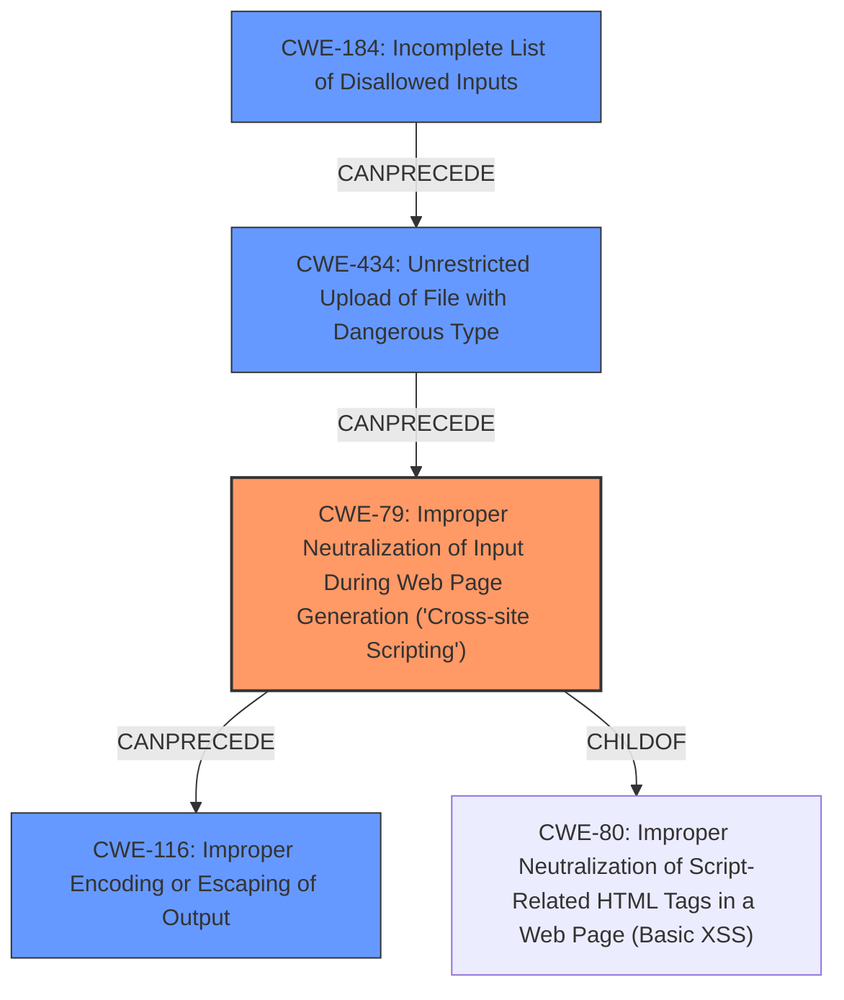

# Analysis Report for CVE-2022-0565

# Vulnerability Analysis Report: CVE-2022-0565

## Description

Cross-site Scripting in Packagist pimcore/pimcore prior to 10.3.1.

## Vulnerability Description Key Phrases

**Weakness:** Cross-site scripting
**Product:** pimcore/pimcore
**Version:** prior to 10.3.1

## Analysis (with Relationship Data)

# Summary
| CWE ID | CWE Name | Confidence | CWE Abstraction Level | CWE Vulnerability Mapping Label | CWE-Vulnerability Mapping Notes |
|---|---|---|---|---|---|
| CWE-79 | Improper Neutralization of Input During Web Page Generation ('Cross-site Scripting') | 1.0 | Base | Primary | Allowed |
| CWE-434 | Unrestricted Upload of File with Dangerous Type | 0.7 | Base | Secondary | Allowed |

## Evidence and Confidence

*   **Confidence Score:** 0.9
*   **Evidence Strength:** HIGH

- **Analysis and Justification:**
  - *Explanation:* The vulnerability description explicitly states "**Cross-site Scripting** in Packagist pimcore/pimcore prior to 10.3.1.". The CVE Reference Links Content Summary confirms this, indicating the root cause is the lack of proper sanitization of SVG files, leading to a **potential XSS**. The analysis of changes in `SettingsController.php` and `AssetSanitizationListener.php` shows the implementation of SVG sanitization using `enshrined/svg-sanitize`, further reinforcing the XSS vulnerability due to unsanitized input. CWE-79 (Improper Neutralization of Input During Web Page Generation ('Cross-site Scripting')) directly addresses this weakness. The retriever results also strongly suggest CWE-79 as the primary weakness.
  
  - *Relationship Analysis:* CWE-79 is a Base level CWE. It has child CWEs that represent more specific types of XSS, such as CWE-80 (Improper Neutralization of Script-Related HTML Tags in a Web Page (Basic XSS)) and CWE-83 (Improper Neutralization of Script in Attributes in a Web Page). However, the provided information doesn't give enough detail to select a more specific child, so the base CWE-79 is most appropriate. CWE-79 can precede CWE-184 (Incomplete List of Disallowed Inputs) because an incomplete list of disallowed inputs (e.g., SVG elements) can lead to XSS.

- **Confidence Score:**
  - *Example:* Confidence: 1.0 (High evidence from the vulnerability description, CVE reference, and retriever results)

---

- **Analysis and Justification:**
  - *Explanation:* The vulnerability involves the upload of SVG files which, when unsanitized, can lead to XSS. The **insecure SVG Uploads** weakness mentioned in the CVE Reference Links Content Summary aligns with CWE-434 (Unrestricted Upload of File with Dangerous Type). The initial reliance on file extension checks, rather than mime type checks, further supports this classification. While the primary impact is XSS (CWE-79), the ability to upload a dangerous file type contributes to the vulnerability.
  
  - *Relationship Analysis:* CWE-434 is a Base level CWE. It can precede CWE-73 (External Control of File Name or Path) if the attacker can control the file name or path during the upload. It can also follow CWE-183 (Permissive List of Allowed Inputs) or CWE-184 (Incomplete List of Disallowed Inputs) if the allowed file types or extensions are not properly restricted.

- **Confidence Score:**
  - *Example:* Confidence: 0.7 (Moderate evidence linking the file upload process directly to the XSS vulnerability)

## Criticism of Analysis

Okay, let's review the CWE analysis provided, focusing on the appropriateness of the CWE assignments, their abstraction levels, and the relationship analyses.

**Overall Assessment:**

The analysis is generally good, identifying the primary weakness as CWE-79 with high confidence.  The secondary weakness, CWE-434, is also relevant. The confidence scores seem reasonable. However, there are some opportunities to refine the analysis, particularly in considering more specific variants of XSS and potential chaining relationships.

**Detailed Critique:**

**1. CWE-79: Improper Neutralization of Input During Web Page Generation ('Cross-site Scripting')**

*   **Assessment:** The assignment of CWE-79 as the primary weakness is correct and well-justified.  The description clearly states XSS, the CVE summary confirms the root cause as lack of sanitization, and the code changes address SVG sanitization. The retriever results also support this as the primary weakness.
*   **Confidence:** 1.0 is appropriate.
*   **Abstraction Level:** Base is appropriate. The analysis correctly identifies that more specific child CWEs exist (CWE-80, CWE-83), but insufficient detail is provided to confidently choose one of these.
*   **Relationship Analysis:**
    *   The relationship analysis to CWE-184 is accurate. An incomplete denylist can certainly lead to XSS.
    * It would be beneficial to consider adding a relationship to CWE-116 (Improper Encoding or Escaping of Output) since inadequate output encoding is a direct cause of XSS. The fix implemented relies heavily on output encoding using the `enshrined/svg-sanitize` library.
*   **Mitigations:** The mitigations are good. The suggested mitigation of using a vetted library such as the OWASP ESAPI Encoding module is pertinent to the Pimcore implementation.

**2. CWE-434: Unrestricted Upload of File with Dangerous Type**

*   **Assessment:** The assignment of CWE-434 as a secondary weakness is also valid. The vulnerability involves uploading SVG files, a potentially dangerous file type, and the lack of proper mime type checking exacerbated the risk.
*   **Confidence:** 0.7 is reasonable. While the direct impact is XSS, the file upload process is a necessary component.
*   **Abstraction Level:** Base is appropriate.
*   **Relationship Analysis:**
    *   The relationships to CWE-73, CWE-183, and CWE-184 are accurate and well-explained.
    *   The analysis could benefit from mentioning the relationship to CWE-669 (Incorrect Resource Transfer Between Spheres) which is a ChildOf of CWE-434
*   **Mitigations:** The mitigations are good. Storing uploaded files outside the web document root is a sensible recommendation.

**Suggestions for Improvement & Additional CWEs to Consider:**

1.  **More Specific XSS Variant:**  Reviewing the `SettingsController.php` and `AssetSanitizationListener.php` code, determine if the XSS is more likely to occur in HTML attributes (e.g., `src` attribute of an `` tag, pointing to a malicious SVG) or within script-related HTML tags.  If the former is more likely, consider using **CWE-83: Improper Neutralization of Script in Attributes in a Web Page**. If HTML tags are the main concern, then consider **CWE-80: Improper Neutralization of Script-Related HTML Tags in a Web Page (Basic XSS)**. Choosing a more specific variant would increase the precision of the analysis.

2.  **Incomplete Denylist / Allowlist (CWE-184 or CWE-183):** The analysis mentions that the code initially relied on file extension checks, which are easily bypassed.  This implies either an incomplete list of disallowed file types (CWE-184) or a permissive list of *allowed* file types that was too broad (CWE-183).  Explicitly adding CWE-184 or CWE-183 could strengthen the analysis, making it a chained vulnerability.

3.  **CWE-116: Improper Encoding or Escaping of Output** Add a relationship to CWE-116 because output encoding is a direct cause of XSS, and the mitigations in the fixes implement output encoding to sanitize the uploaded files.

**Updated Summary Table (with suggestions):**

| CWE ID | CWE Name | Confidence | CWE Abstraction Level | CWE Vulnerability Mapping Label | CWE-Vulnerability Mapping Notes |
|---|---|---|---|---|---|
| CWE-79 | Improper Neutralization of Input During Web Page Generation ('Cross-site Scripting') | 0.9 | Base | Primary | Allowed |
| CWE-434 | Unrestricted Upload of File with Dangerous Type | 0.7 | Base | Secondary | Allowed |
| CWE-184 or CWE-183 | Incomplete List of Disallowed Inputs or Permissive List of Allowed Inputs | 0.5 | Base | Contributing | Allowed |

**Justification for additions:**

*   **CWE-184/183:** the initial reliance on file extension checks implies a weakness in defining which file types were considered safe or unsafe. If a specific safe or unsafe list can be identified, update the confidence accordingly.

By incorporating these suggestions, the analysis would become more detailed and provide a more complete picture of the vulnerabilities present.

## Final Resolution

# Summary
| CWE ID | CWE Name | Confidence | CWE Abstraction Level | CWE Vulnerability Mapping Label | CWE-Vulnerability Mapping Notes |
|---|---|---|---|---|---|
| CWE-79 | Improper Neutralization of Input During Web Page Generation ('Cross-site Scripting') | 0.9 | Base | Primary | Allowed |
| CWE-434 | Unrestricted Upload of File with Dangerous Type | 0.7 | Base | Secondary | Allowed |
| CWE-184 | Incomplete List of Disallowed Inputs | 0.6 | Base | Contributing | Allowed |
| CWE-116 | Improper Encoding or Escaping of Output | 0.5 | Class | Contributing | Allowed-with-Review |

## Evidence and Confidence

*   **Confidence Score:** 0.85
*   **Evidence Strength:** HIGH

## Relationship Analysis
The analysis involved examining parent-child relationships to ensure specificity, chain relationships to map the vulnerability's progression, and peer relationships for alternative classifications. Abstraction levels guided the selection of the most appropriate CWEs.

## Vulnerability Chain
The vulnerability chain starts with an **incomplete list of disallowed inputs (CWE-184)**, leading to the **unrestricted upload of a file with a dangerous type (CWE-434)**. This uploaded file is then processed without proper neutralization, resulting in **improper neutralization of input during web page generation (CWE-79)**, which can be exacerbated by **improper encoding or escaping of output (CWE-116)**. The initial flaw is the incomplete input validation, with the final impact being cross-site scripting.

## Summary of Analysis
The initial analysis correctly identified CWE-79 as the primary weakness due to the explicit mention of cross-site scripting in the vulnerability description. The CVE Reference Links Content Summary confirms the lack of proper sanitization of SVG files, which can lead to XSS. The analysis of changes in `SettingsController.php` and `AssetSanitizationListener.php` further reinforces the XSS vulnerability.

The criticism suggested adding CWE-184 or CWE-183 due to the initial reliance on file extension checks. The initial reliance on file extension checks does imply a weakness in defining which file types were considered safe or unsafe, therefore, CWE-184 (Incomplete List of Disallowed Inputs) is added as a contributing factor.

The criticism also suggested adding a relationship to CWE-116. CWE-116 is included because output encoding is a direct cause of XSS, and the mitigations in the fixes implement output encoding to sanitize the uploaded files. "The fix implemented relies heavily on output encoding using the `enshrined/svg-sanitize` library."

The selection of CWE-79, CWE-434, CWE-184, and CWE-116 provides the optimal level of specificity, as it captures the entire vulnerability chain from the initial input validation issues to the final XSS impact.

*Report generated on 2025-03-17 05:04:38*
