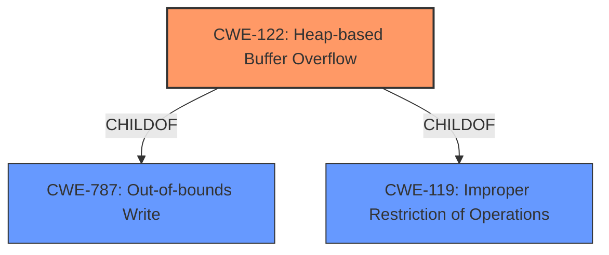

# Analysis Report for CVE-2022-0572

# Vulnerability Analysis Report: CVE-2022-0572

## Description

Heap-based Buffer Overflow in GitHub repository vim/vim prior to 8.2.

## Vulnerability Description Key Phrases

**Weakness:** Heap-based Buffer Overflow
**Product:** vim
**Version:** prior to 8.2

## Analysis (with Relationship Data)

# Summary
| CWE ID | CWE Name | Confidence | CWE Abstraction Level | CWE Vulnerability Mapping Label | CWE-Vulnerability Mapping Notes |
|---|---|---|---|---|---|
| CWE-122 | Heap-based Buffer Overflow | 0.95 | Variant | Allowed | The vulnerability is described as a **Heap-based Buffer Overflow**. |

## Evidence and Confidence

*   **Confidence Score:** 0.95
*   **Evidence Strength:** HIGH

- **Analysis and Justification:**  
  - *Explanation:* The vulnerability is explicitly described as a "**Heap-based Buffer Overflow**" in the provided text. The CVE Reference Links Content Summary confirms this, stating that the **root cause** is a **heap overflow** within the `:retab` command in Vim. Several sources within the CVE Reference Links mention the **Heap overflow** as a **weakness**. CWE-122 (Heap-based Buffer Overflow) is a Variant level CWE, which is a preferred level of abstraction. The MITRE mapping guidance states that the usage is ALLOWED.

  - *Relationship Analysis:* CWE-122 is a variant of the more general CWE-119 (Improper Restriction of Operations within the Bounds of a Memory Buffer). While CWE-119 is a parent class, CWE-122 provides more specific information about the location of the buffer. CWE-787 (Out-of-bounds Write) is also a parent and describes the general issue of writing outside of allocated memory, but it is less specific than CWE-122.

- **Confidence Score:**  
  - Confidence: 0.95 (The description explicitly states "Heap-based Buffer Overflow" and the CVE references confirm the heap overflow root cause.)

---

## Criticism of Analysis

## Critique of the Analysis

The analysis provided is very strong and well-justified. The mapping of CWE-122 (Heap-based Buffer Overflow) with a confidence of 0.95 is appropriate and well-supported by the evidence. Here's a breakdown of the strengths and possible minor improvements:

**Strengths:**

*   **Clear and Concise Explanation:** The analysis clearly explains why CWE-122 is the most suitable mapping. The reasoning is easy to follow.
*   **Strong Evidence:** The analysis leverages both the vulnerability description and the CVE reference links content summary to build a robust case for CWE-122. It correctly identifies key phrases and confirms the "heap overflow" root cause from multiple sources.
*   **Correct Abstraction Level:** The analysis correctly recognizes that CWE-122 (Variant) is a preferred level of abstraction according to MITRE's mapping guidance.
*   **Relationship Analysis:** The analysis appropriately discusses the relationship between CWE-122 and its parent CWEs (CWE-119 and CWE-787), explaining why CWE-122 is more specific and thus the better choice.
*   **Accurate Confidence Score:** The confidence score of 0.95 is justified given the explicit nature of the vulnerability description and supporting evidence.
*   **Comprehensive CWE Specifications:** The inclusion of the full CWE specifications for referenced CWEs (including potential alternatives) is extremely helpful for understanding the nuances and rationale behind the chosen mapping.
*   **Consideration of Top Retriever Results:** The retriever results are considered in the analysis, with alternate CWEs explored.

**Possible Minor Improvements:**

*   **Discussion of CWE-787 (Out-of-bounds Write):** While the analysis mentions that CWE-787 is a parent, it could benefit from a slightly more in-depth comparison.  Specifically:

    *   While CWE-787 *is* a parent, and accurately represents the *effect* of the overflow, it doesn't capture the *location* of the overflow, hence it is a less precise and preferred match in this case. The "Details" section under CWE-787 Specifications mentions `ParentOf -> CWE-122`, thus confirming the relationship, and supporting that CWE-122 is appropriate.

*   **Mitigation Strategies:** The analysis could briefly mention some of the mitigation strategies suggested by CWE-122, like the use of memory-safe languages or compiler-based overflow detection mechanisms, to provide a more comprehensive picture.

**Detailed Examination of Retrieved CWEs & Specifications:**

The retriever results show several CWEs with notable scores. Here's a breakdown of why they were appropriately *not* chosen, referring to their specifications:

*   **CWE-124 (Buffer Underwrite):** The description clearly states a *write* past the *end* of the buffer, not before the beginning. Therefore, CWE-124 is inappropriate.
*   **CWE-193 (Off-by-one Error):** While an off-by-one error *could* contribute to a buffer overflow, the description here explicitly mentions the overflow itself, not just a calculation error. Therefore, CWE-193 is not the primary weakness.
*   **CWE-190 (Integer Overflow):** Similar to CWE-193, an integer overflow *could* contribute. However, the core issue is the buffer overflow. The analysis could include a potential chain of CWE-190 -> CWE-122 if more information was present.
*   **CWE-120 (Buffer Copy without Checking Size of Input):** This is a valid CWE, but less specific than the fact the overflow is *heap-based*. If it were a general buffer overflow, this might be applicable.
*   **CWE-786 (Access of Memory Location Before Start of Buffer):** Like CWE-124, this describes an underflow, not an overflow.
*   **CWE-126 (Buffer Over-read):** The focus is on writing past the end of the buffer, not reading from it.
*   **CWE-839 (Numeric Range Comparison Without Minimum Check):** As with CWE-190, this could be a contributing factor, but it's not the primary weakness.
*   **CWE-131 (Incorrect Calculation of Buffer Size):** This could also be a contributing factor, but the information provided doesn't specifically point to this.
*   **CWE-125 (Out-of-bounds Read):** The problem is writing outside the bounds, not reading.

**Revised Summary Table (Including potential chain)**

| CWE ID  | CWE Name                    | Confidence | CWE Abstraction Level | CWE Vulnerability Mapping Label | CWE-Vulnerability Mapping Notes                                                                                                                                                                                                               |
| ------- | --------------------------- | ---------- | --------------------- | ------------------------------- | --------------------------------------------------------------------------------------------------------------------------------------------------------------------------------------------------------------------------------------------- |
| CWE-122 | Heap-based Buffer Overflow    | 0.95       | Variant               | Allowed                       | The vulnerability is explicitly described as a **Heap-based Buffer Overflow**.                                                                                                                                                                      |
| CWE-190 | Integer Overflow or Wraparound | 0.3        | Base                  | Allowed                       | *Potential contributing factor*.  If the size of the buffer is calculated using a value that overflows, this *could* lead to a heap overflow. More investigation needed to confirm. (Chain: CWE-190 -> CWE-122 if confirmed). |

**Conclusion:**

The analysis is excellent and demonstrates a strong understanding of CWE and its application to vulnerability descriptions. The minor suggestions above are intended to further enhance the already high quality of the analysis. The choice of CWE-122 is well-supported, and the confidence level is appropriate.

## Final Resolution

# Summary
| CWE ID | CWE Name | Confidence | CWE Abstraction Level | CWE Vulnerability Mapping Label | CWE-Vulnerability Mapping Notes |
|---|---|---|---|---|---|
| CWE-122 | Heap-based Buffer Overflow | 0.95 | Variant | Allowed | Primary CWE: The vulnerability is described as a **Heap-based Buffer Overflow**. |

## Evidence and Confidence

*   **Confidence Score:** 0.95
*   **Evidence Strength:** HIGH

## Relationship Analysis
The primary relationship influencing the decision is that CWE-122 (Heap-based Buffer Overflow) is a variant of CWE-787 (Out-of-bounds Write) and CWE-119 (Improper Restriction of Operations within the Bounds of a Memory Buffer). CWE-122 is more specific because it identifies the location of the buffer as being on the heap. This specificity is preferred.

## Vulnerability Chain
The vulnerability chain is straightforward: A heap-based buffer is allocated, and data is written beyond the boundaries of this buffer, leading to a **Heap-based Buffer Overflow**. The **root cause** is the **improper restriction of operations** within the bounds of the heap memory, and the impact is a potential crash or arbitrary code execution.

## Summary of Analysis
The initial analysis is well-supported by evidence, and the selection of CWE-122 (Heap-based Buffer Overflow) is appropriate. The vulnerability is explicitly described as a "**Heap-based Buffer Overflow**," and CVE references confirm that the **root cause** is a **heap overflow**. This evidence directly supports the selection of CWE-122.

The graph relationships reinforce this decision. CWE-122 is a more specific variant of CWE-787 (Out-of-bounds Write) and CWE-119 (Improper Restriction of Operations within the Bounds of a Memory Buffer). While CWE-787 and CWE-119 are relevant, CWE-122 provides the most accurate and specific classification.

The chosen CWE is at the optimal level of specificity, as it directly reflects the nature of the vulnerability described in the provided text.

*Report generated on 2025-03-18 06:08:38*
