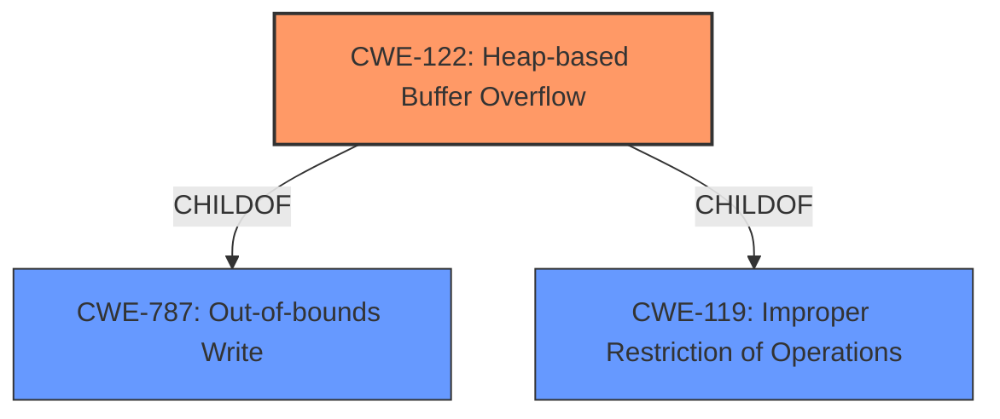

# Final Resolution for CVE-2022-0572

# Summary
| CWE ID | CWE Name | Confidence | CWE Abstraction Level | CWE Vulnerability Mapping Label | CWE-Vulnerability Mapping Notes |
|---|---|---|---|---|---|
| CWE-122 | Heap-based Buffer Overflow | 0.95 | Variant | Allowed | Primary CWE: The vulnerability is described as a **Heap-based Buffer Overflow**. |

## Evidence and Confidence

*   **Confidence Score:** 0.95
*   **Evidence Strength:** HIGH

## Relationship Analysis
The primary relationship influencing the decision is that CWE-122 (Heap-based Buffer Overflow) is a variant of CWE-787 (Out-of-bounds Write) and CWE-119 (Improper Restriction of Operations within the Bounds of a Memory Buffer). CWE-122 is more specific because it identifies the location of the buffer as being on the heap. This specificity is preferred.

## Vulnerability Chain
The vulnerability chain is straightforward: A heap-based buffer is allocated, and data is written beyond the boundaries of this buffer, leading to a **Heap-based Buffer Overflow**. The **root cause** is the **improper restriction of operations** within the bounds of the heap memory, and the impact is a potential crash or arbitrary code execution.

## Summary of Analysis
The initial analysis is well-supported by evidence, and the selection of CWE-122 (Heap-based Buffer Overflow) is appropriate. The vulnerability is explicitly described as a "**Heap-based Buffer Overflow**," and CVE references confirm that the **root cause** is a **heap overflow**. This evidence directly supports the selection of CWE-122.

The graph relationships reinforce this decision. CWE-122 is a more specific variant of CWE-787 (Out-of-bounds Write) and CWE-119 (Improper Restriction of Operations within the Bounds of a Memory Buffer). While CWE-787 and CWE-119 are relevant, CWE-122 provides the most accurate and specific classification.

The chosen CWE is at the optimal level of specificity, as it directly reflects the nature of the vulnerability described in the provided text.