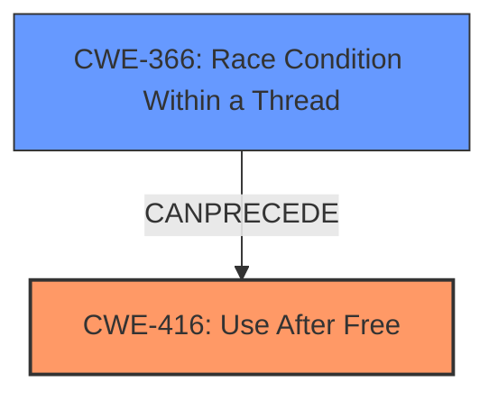

# Analysis Report for CVE-2022-0603

# Vulnerability Analysis Report: CVE-2022-0603

## Description

Use after free in File Manager in Google Chrome on Chrome OS prior to 98.0.4758.102 allowed a remote attacker to potentially exploit heap corruption via a crafted HTML page.

## Vulnerability Description Key Phrases

**Rootcause:** use after free
**Weakness:** heap corruption
**Vector:** crafted HTML page
**Attacker:** remote attacker
**Product:** Google Chrome on Chrome OS
**Version:** prior to 98.0.4758.102
**Component:** File Manager

## Analysis (with Relationship Data)

# Summary
| CWE ID | CWE Name | Confidence | CWE Abstraction Level | CWE Vulnerability Mapping Label | CWE-Vulnerability Mapping Notes |
|---|---|---|---|---|---|
| CWE-416 | Use After Free | 1.0 | Variant | Allowed | This CWE entry is at the Variant level of abstraction, which is a preferred level of abstraction for mapping to the root causes of vulnerabilities. |

## Evidence and Confidence

*   **Confidence Score:** 1.0
*   **Evidence Strength:** HIGH

- **Analysis and Justification:**
  - *Explanation:* The vulnerability description explicitly states "**use after free** in File Manager," which directly matches the CWE-416 description: "The product reuses or references memory after it has been freed." The CVE Reference Links Content Summary also confirms the root cause as "Use after free". This vulnerability can lead to **heap corruption**, as mentioned in the description. CWE-416 is a Variant level CWE, which is a preferred level of abstraction. The MITRE mapping guidance for CWE-416 indicates this is ALLOWED.
  
  - *Relationship Analysis:* CWE-416 has no direct relationships defined in the provided information.

- **Confidence Score:**
  - Confidence: 1.0 (Explicit mention of "use after free" in both the vulnerability description and the CVE summary provides high confidence.)

## Criticism of Analysis

Okay, I have reviewed the provided analysis along with the full CWE specifications for each of the top 10 CWEs identified by the retriever. Here's my critique:

**Overall Assessment:**

The analysis correctly identifies **CWE-416: Use After Free** as the primary weakness based on the provided information. The confidence score of 1.0 is justified due to the explicit mention of "use after free" in both the vulnerability description and CVE summary. The justification is well-written and clearly explains why CWE-416 is the appropriate mapping.

**Detailed Critique:**

1.  **CWE-416: Use After Free:**
    *   **Correctness:** The mapping is accurate. The description of CWE-416 directly aligns with the vulnerability description.
    *   **Abstraction Level:**  The analysis correctly notes that CWE-416 is a Variant-level CWE, which is preferred.
    *   **Mapping Guidance:** The analysis adheres to the CWE's Mapping Guidance, citing the "Allowed" usage and the rationale for acceptable use.
    *   **Mitigations:** The analysis doesn't explicitly discuss mitigations, but it's not strictly required. However, including a brief mention of mitigations could enhance the analysis. For example, mentioning that languages with automatic memory management could mitigate this weakness would be relevant. Also, stating that setting pointers to NULL after freeing can prevent use after free.
    *   **Relationships:** The analysis could be improved by mentioning the relationships of CWE-416 to other CWEs. For example, it `CanFollow` CWE-362 (Race Condition), which some of the other suggested CWEs are linked to.

2.  **Top Combined Results Assessment**
    *   **CWE-366: Race Condition within a Thread:** While not the primary weakness, the retriever results ranked this CWE second. Although `Use After Free` is the root cause, this can sometimes be triggered by a race condition. If multiple threads are interacting with the same memory and one thread frees the memory before another thread is done, a UAF can occur. This is reflected in the example CVE's.
    *   **CWE-843: Access of Resource Using Incompatible Type ('Type Confusion'):** This is not a strong mapping here, based on the information provided.
    *   **CWE-415: Double Free:** While related to memory management, the vulnerability description doesn't explicitly mention a double free. A Use-After-Free condition is distinct from a Double-Free. This seems less likely than UAF but more likely than type confusion.
    *   **CWE-356: Product UI does not Warn User of Unsafe Actions:** This is probably not relevant. The UAF vulnerability is unlikely to stem from the UI and is more likely a code-level memory management issue.
    *   **CWE-122: Heap-based Buffer Overflow:** While heap corruption is mentioned, the root cause is specifically a use-after-free, not a buffer overflow *causing* heap corruption. A UAF could *lead* to a heap corruption, so this might be a resultant impact but not the cause.
    *   **CWE-1021: Improper Restriction of Rendered UI Layers or Frames:** This is not relevant. The vulnerability description doesn't suggest anything about UI layering or framing issues.
    *   **CWE-190: Integer Overflow or Wraparound:** There's no indication of integer overflows in the provided information.
    *   **CWE-367: Time-of-check Time-of-use (TOCTOU) Race Condition:** This is another Race Condition related CWE that could be applicable. It is not as likely as `CWE-366` in this particular scenario because the vulnerability description does not explicitly mention a check.
    *   **CWE-401: Missing Release of Memory after Effective Lifetime:** A memory leak is not the same as a UAF. While a memory leak might be present, the core vulnerability being exploited is the use of freed memory, not the failure to free allocated memory.

**Suggestions for Improvement:**

*   **Briefly Discuss Alternate CWEs:** While confidently mapping to CWE-416, acknowledge some of the other top CWEs from the retriever (especially CWE-366) and *briefly* explain why they are less likely or represent contributing factors rather than the primary weakness.
*   **Add Mitigation Information:** Briefly mention potential mitigation strategies for CWE-416, referencing the CWE's mitigation section.
*   **Expand Relationship Analysis:** Briefly describe the relationships that CWE-416 has to other CWEs.
*   **Consider Chaining:** While not explicitly stated, consider the possibility of a weakness chain. Could another CWE *lead* to the UAF? For example, a race condition could lead to a UAF.

**Revised Summary Table (Example):**

| CWE ID | CWE Name | Confidence | CWE Abstraction Level | CWE Vulnerability Mapping Label | CWE-Vulnerability Mapping Notes |
|---|---|---|---|---|---|
| CWE-416 | Use After Free | 1.0 | Variant | Allowed | This CWE entry is at the Variant level of abstraction, which is a preferred level of abstraction for mapping to the root causes of vulnerabilities.  The vulnerability description explicitly states "use after free" in File Manager.  Languages with automatic memory management are a potential mitigation.  This can be caused by concurrent executions such as `CWE-366`. |

In conclusion, the analysis is generally strong, particularly in its identification of CWE-416. The suggestions above aim to provide a more comprehensive and nuanced assessment of the vulnerability within the context of the broader CWE landscape.

## Final Resolution

# Summary
| CWE ID | CWE Name | Confidence | CWE Abstraction Level | CWE Vulnerability Mapping Label | CWE-Vulnerability Mapping Notes |
|---|---|---|---|---|---|
| CWE-416 | Use After Free | 1.0 | Variant | Allowed | This CWE entry is at the Variant level of abstraction, which is a preferred level of abstraction for mapping to the root causes of vulnerabilities. The vulnerability description explicitly states "use after free" in File Manager. Languages with automatic memory management are a potential mitigation. This can be caused by concurrent executions such as **CWE-366**. |
| CWE-366 | Race Condition within a Thread | 0.6 | Base | Allowed | If multiple threads of execution use a resource simultaneously, there exists the possibility that resources may be used while invalid, in turn making the state of execution undefined. This can **precede** a **CWE-416**. |

## Evidence and Confidence

*   **Confidence Score:** 0.9
*   **Evidence Strength:** HIGH

## Relationship Analysis
The primary relationship that impacts the decision is the potential for **CWE-366** (Race Condition within a Thread) to **precede CWE-416** (Use After Free). While the vulnerability description explicitly mentions "use after free," the criticism correctly points out that race conditions can lead to UAF vulnerabilities. This suggests a potential vulnerability chain. I am keeping **CWE-416** as the primary because that is what the vulnerability description stated.

## Vulnerability Chain
The vulnerability chain starts with a potential **race condition (CWE-366)** where multiple threads interact with the same memory. If one thread frees the memory prematurely while another thread is still accessing it, it leads to a **use-after-free (CWE-416)** condition. This, in turn, allows a remote attacker to potentially exploit **heap corruption**, as mentioned in the vulnerability description.

## Summary of Analysis
The initial analysis correctly identifies **CWE-416** as the primary weakness. The criticism provides valuable insights into potential contributing factors, particularly the role of race conditions. The final determination acknowledges the possibility of a **CWE-366** leading to **CWE-416**, making **CWE-366** a secondary candidate.

The decision is primarily based on the explicit mention of "**use after free**" in the vulnerability description: "Use after free in File Manager in Google Chrome on Chrome OS prior to 98.0.4758.102 allowed a remote attacker to potentially exploit heap corruption via a crafted HTML page."

The graph relationships influenced the decision by highlighting the potential for **CWE-366** to **precede** **CWE-416**, suggesting a vulnerability chain.

The selected CWEs are at the optimal level of specificity because **CWE-416** directly describes the vulnerability, and **CWE-366** represents a potential contributing factor.

*Report generated on 2025-03-18 06:09:13*
