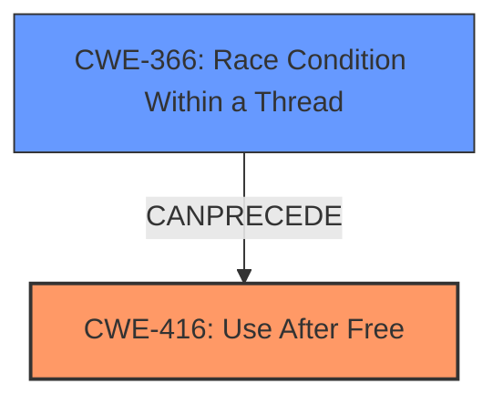

# Final Resolution for CVE-2022-0603

# Summary
| CWE ID | CWE Name | Confidence | CWE Abstraction Level | CWE Vulnerability Mapping Label | CWE-Vulnerability Mapping Notes |
|---|---|---|---|---|---|
| CWE-416 | Use After Free | 1.0 | Variant | Allowed | This CWE entry is at the Variant level of abstraction, which is a preferred level of abstraction for mapping to the root causes of vulnerabilities. The vulnerability description explicitly states "use after free" in File Manager. Languages with automatic memory management are a potential mitigation. This can be caused by concurrent executions such as **CWE-366**. |
| CWE-366 | Race Condition within a Thread | 0.6 | Base | Allowed | If multiple threads of execution use a resource simultaneously, there exists the possibility that resources may be used while invalid, in turn making the state of execution undefined. This can **precede** a **CWE-416**. |

## Evidence and Confidence

*   **Confidence Score:** 0.9
*   **Evidence Strength:** HIGH

## Relationship Analysis
The primary relationship that impacts the decision is the potential for **CWE-366** (Race Condition within a Thread) to **precede CWE-416** (Use After Free). While the vulnerability description explicitly mentions "use after free," the criticism correctly points out that race conditions can lead to UAF vulnerabilities. This suggests a potential vulnerability chain. I am keeping **CWE-416** as the primary because that is what the vulnerability description stated.

## Vulnerability Chain
The vulnerability chain starts with a potential **race condition (CWE-366)** where multiple threads interact with the same memory. If one thread frees the memory prematurely while another thread is still accessing it, it leads to a **use-after-free (CWE-416)** condition. This, in turn, allows a remote attacker to potentially exploit **heap corruption**, as mentioned in the vulnerability description.

## Summary of Analysis
The initial analysis correctly identifies **CWE-416** as the primary weakness. The criticism provides valuable insights into potential contributing factors, particularly the role of race conditions. The final determination acknowledges the possibility of a **CWE-366** leading to **CWE-416**, making **CWE-366** a secondary candidate.

The decision is primarily based on the explicit mention of "**use after free**" in the vulnerability description: "Use after free in File Manager in Google Chrome on Chrome OS prior to 98.0.4758.102 allowed a remote attacker to potentially exploit heap corruption via a crafted HTML page."

The graph relationships influenced the decision by highlighting the potential for **CWE-366** to **precede** **CWE-416**, suggesting a vulnerability chain.

The selected CWEs are at the optimal level of specificity because **CWE-416** directly describes the vulnerability, and **CWE-366** represents a potential contributing factor.