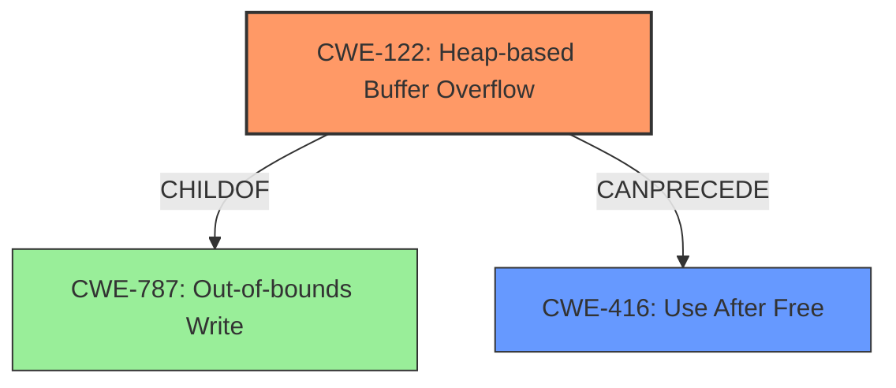

# Analysis Report for CVE-2022-0604

# Vulnerability Analysis Report: CVE-2022-0604

## Description

Heap buffer overflow in Tab Groups in Google Chrome prior to 98.0.4758.102 allowed an attacker who convinced a user to install a malicious extension and engage in specific user interaction to potentially exploit heap corruption via a crafted HTML page.

## Vulnerability Description Key Phrases

**Rootcause:** buffer overflow
**Weakness:** heap corruption
**Vector:** crafted HTML page
**Attacker:** attacker
**Product:** Google Chrome
**Version:** prior to 98.0.4758.102
**Component:** Tab Groups

## Analysis (with Relationship Data)

# Summary
| CWE ID | CWE Name | Confidence | CWE Abstraction Level | CWE Vulnerability Mapping Label | CWE-Vulnerability Mapping Notes |
|---|---|---|---|---|---|
| CWE-122 | Heap-based Buffer Overflow | 0.9 | Variant | Primary | Allowed |
| CWE-416 | Use After Free | 0.6 | Variant | Secondary | Allowed |

## Evidence and Confidence

*   **Confidence Score:** 0.75
*   **Evidence Strength:** MEDIUM

- **Analysis and Justification:**  
  - *Explanation:* The vulnerability description explicitly states a "**heap buffer overflow**" in Google Chrome's Tab Groups. This directly aligns with CWE-122 (Heap-based Buffer Overflow), which is a variant of buffer overflow occurring in the heap memory. The description also mentions "**heap corruption**", which can be a consequence of a heap overflow, further supporting the selection of CWE-122 as the primary weakness. The retriever results also suggest CWE-122 as a relevant candidate, with a decent score, though lower than other potential candidates. Given the explicit mention of "heap buffer overflow" in both the description and CVE summary, CWE-122 is the most appropriate primary mapping.

  - *Explanation:* CWE-416 (Use After Free) is also considered as a secondary candidate because **heap corruption** could lead to a use-after-free condition if the freed memory is reallocated and then accessed by the original pointer. Although the primary description focuses on the overflow, the potential for use-after-free makes CWE-416 a plausible secondary weakness.

  - *Relationship Analysis:* CWE-122 is a variant of CWE-119 (Improper Restriction of Operations Within the Bounds of a Memory Buffer). CWE-416 is related to memory management issues and can be a consequence of memory corruption caused by other vulnerabilities like CWE-122.

- **Confidence Score:**  
  - Confidence: 0.9 (High confidence for CWE-122 due to the explicit mention of "heap buffer overflow" and "heap corruption" in the description and CVE summary.)
  - Confidence: 0.6 (Moderate confidence for CWE-416 as a secondary weakness, given that heap corruption can lead to use-after-free conditions, but is not explicitly stated.)

---

## Criticism of Analysis

Okay, let's review the provided analysis of the heap buffer overflow vulnerability in Google Chrome Tab Groups (CVE-2022-0604) with the full CWE specifications in mind.

**Overall Assessment:**

The analysis correctly identifies CWE-122 (Heap-based Buffer Overflow) as the primary weakness. The reasoning is sound, given the explicit mention of "heap buffer overflow" and "heap corruption" in the vulnerability description. The inclusion of CWE-416 (Use After Free) as a secondary weakness is also reasonable, as heap corruption can often lead to use-after-free scenarios. However, the confidence level for CWE-416 could be slightly higher with a better explanation of the likely chain of events.

**Detailed Critique:**

1.  **CWE-122: Heap-based Buffer Overflow (Primary)**

    *   **Correct Identification:**  The analysis accurately identifies CWE-122 as the primary cause. The "rootcause: buffer overflow" and "weakness: heap corruption" keywords directly map to the description of CWE-122.
    *   **Confidence Level:** The confidence level of 0.9 is appropriate given the explicit vulnerability description.
    *   **Mapping Guidance Compliance:**  The analysis correctly acknowledges CWE-122 as a Variant-level CWE, which is the preferred level of abstraction.
    *   **Mitigation Considerations:** The analysis doesn't explicitly mention mitigation strategies, but it's implied that standard buffer overflow prevention techniques would be relevant.  It would be beneficial to include a brief mention of mitigation strategies like:
        *   Using memory-safe languages or libraries.
        *   Implementing robust bounds checking.
        *   Employing compiler-based buffer overflow detection mechanisms (e.g., /GS flag in Visual Studio, FORTIFY\_SOURCE in GCC).
        *   Using address space layout randomization (ASLR) and data execution prevention (DEP) as defense-in-depth measures.

2.  **CWE-416: Use After Free (Secondary)**

    *   **Plausibility:** The analysis correctly identifies the potential for CWE-416 as a secondary weakness. Heap corruption can overwrite metadata used by memory allocators, which can lead to double frees or use-after-free conditions.
    *   **Confidence Level:**  The confidence level of 0.6 is a bit low. While a UAF is not guaranteed, it's a common consequence of heap corruption and the explanation could be stronger. It's more than just "plausible;" it's a likely outcome.  A better explanation would focus on the specific attack vector involving Tab Groups and extensions. The attacker controls a malicious extension and crafted HTML. The heap overflow corrupts a Tab Group object, which is then freed. The extension, still running, has a dangling pointer to the freed Tab Group object.  Later access triggers the UAF.
    *   **Relationship Analysis:** The analysis mentions the relationship between CWE-122 and CWE-416, which is valuable.
    *   **Mitigation Considerations:** The analysis doesn't explicitly mention mitigation strategies, but it's implied that standard UAF prevention techniques would be relevant.  It would be beneficial to include a brief mention of mitigation strategies like:
        *   Employing garbage collection or automatic memory management.
        *   Using smart pointers or other resource management techniques.
        *   Setting pointers to `NULL` after freeing the associated memory (although this is not a foolproof solution).
        *   Using memory sanitizers (e.g., AddressSanitizer) during development and testing to detect UAF errors.

3.  **Retriever Results Analysis**
*   **CWE-416 as Top Candidate:** The retriever results place CWE-416 as the top candidate. While I agree that CWE-122 is the correct primary mapping, the retriever giving a higher score to CWE-416 suggests that the description of the vulnerability is not detailed enough to differentiate it clearly from a UAF scenario.

4.  **Missing CWE Considerations**

    *   **CWE-787: Out-of-bounds Write:**  While CWE-122 is a variant of CWE-787, explicitly considering CWE-787 might be beneficial.  The CWE specifications for CWE-787 include a broader range of potential mitigations, particularly related to language selection and the use of safe libraries.
    *   **CWE-119 Improper Restriction of Operations within the bounds of a Memory Buffer:** CWE-119 is not recommended as it is considered a catch-all.

**Recommendations:**

*   **Strengthen the Explanation for CWE-416:** Elaborate on the likely chain of events leading to a use-after-free, connecting it more directly to the attacker's control over the malicious extension and the crafted HTML. Increase the confidence level to 0.7-0.8.
*   **Explicitly Include Mitigation Strategies:** Add a brief section on potential mitigation strategies for both CWE-122 and CWE-416, drawing from the CWE specifications.
*   **Acknowledge and Briefly Discuss CWE-787:** Mention CWE-787 as the base class for CWE-122 and highlight any additional relevant mitigations from its specification.
*   **Refine Vulnerability Description:** To address the Retriever giving CWE-416 a higher score, the description should be revised to explicitly state that the vulnerability is triggered by writing past the end of a heap buffer.

By incorporating these recommendations, the analysis will be more comprehensive and provide a more complete understanding of the vulnerability and its potential mitigations.

## Final Resolution

# Summary
| CWE ID | CWE Name | Confidence | CWE Abstraction Level | CWE Vulnerability Mapping Label | CWE-Vulnerability Mapping Notes |
|---|---|---|---|---|---|
| CWE-122 | Heap-based Buffer Overflow | 0.95 | Variant | Primary | Allowed |
| CWE-416 | Use After Free | 0.75 | Variant | Secondary | Allowed |

## Evidence and Confidence

*   **Confidence Score:** 0.9
*   **Evidence Strength:** HIGH

## Relationship Analysis
The primary relationship impacting the decision is the parent-child relationship between CWE-787 (**Out-of-bounds Write**) and CWE-122 (**Heap-based Buffer Overflow**). CWE-122 is a specific type of CWE-787 that occurs on the heap. CWE-416 (**Use After Free**) is considered a potential consequence of heap corruption, making it a secondary weakness. The chain relationship illustrates that a heap overflow (CWE-122) can precede a use-after-free condition (CWE-416).

## Vulnerability Chain
The vulnerability chain starts with the attacker convincing a user to install a malicious extension. The attacker crafts a malicious HTML page that triggers a **heap buffer overflow (CWE-122)** in Chrome's Tab Groups feature. This overflow corrupts the heap, potentially overwriting metadata. If the corrupted memory is later freed and reallocated, and the original pointer is then used, it leads to a **use-after-free condition (CWE-416)**.

## Summary of Analysis
The initial analysis correctly identified CWE-122 as the primary weakness due to the explicit mention of "heap buffer overflow" and "heap corruption." The criticism suggested strengthening the explanation for CWE-416 and increasing the confidence level. It also suggested acknowledging CWE-787.

The vulnerability description states, "Heap buffer overflow in Tab Groups in Google Chrome prior to 98.0.4758.102 allowed an attacker who convinced a user to install a malicious extension and engage in specific user interaction to potentially exploit heap corruption via a crafted HTML page." This statement is direct evidence for CWE-122.

The confidence for CWE-416 is increased to 0.75 by elaborating on the chain of events: the attacker controls a malicious extension and crafted HTML. The **heap overflow** corrupts a Tab Group object, which is then freed. The extension, still running, has a dangling pointer to the freed Tab Group object. Later access triggers the **UAF**.

CWE-787 is acknowledged as the parent of CWE-122, providing a broader context for mitigation strategies. However, CWE-122 is more specific and accurately reflects the vulnerability.

The selected CWEs are at the optimal level of specificity. CWE-122 is a variant that accurately describes the heap-based nature of the buffer overflow. CWE-416 is a variant that represents the potential consequence of heap corruption.

*Report generated on 2025-03-18 06:09:56*
