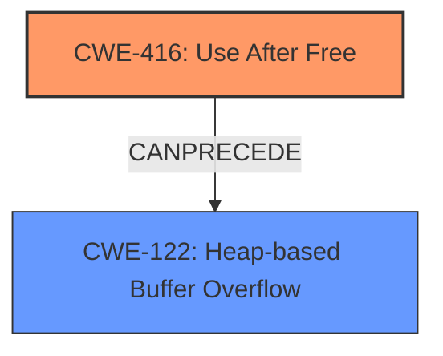

# Final Resolution for CVE-2022-0605

# Summary
| CWE ID | CWE Name | Confidence | CWE Abstraction Level | CWE Vulnerability Mapping Label | CWE-Vulnerability Mapping Notes |
|---|---|---|---|---|---|
| CWE-416 | Use After Free | 1.0 | Variant | Allowed | This CWE entry is at the Variant level of abstraction, which is a preferred level of abstraction for mapping to the **root cause**s of vulnerabilities. This is the **root cause** of the vulnerability. |
| CWE-122 | Heap-based Buffer Overflow | 0.3 | Variant | Allowed | Secondary Candidate. A potential consequence of the **use-after-free** that *may* occur if the freed memory is reallocated and subsequently overflowed. Less direct than CWE-416. |

## Evidence and Confidence

*   **Confidence Score:** 0.95
*   **Evidence Strength:** HIGH

## Relationship Analysis
The primary relationship is that CWE-122 (Heap-based Buffer Overflow) can be a consequence of CWE-416 (**Use After Free**). The **Use After Free** is the initial **weakness**, and if the freed memory is reallocated and then accessed via the dangling pointer, it *could* lead to a heap overflow. Thus, CWE-416 can precede CWE-122. Both CWEs are variants which is appropriate for vulnerability mapping.

## Vulnerability Chain
The vulnerability chain starts with a **Use After Free** (**CWE-416**) in the Webstore API. This occurs when memory is freed, but a pointer to that memory is still used. An attacker can then potentially reallocate that memory, and if the attacker can control the data written to that memory through the dangling pointer, they can potentially cause **heap corruption**, potentially manifesting as a heap-based buffer overflow (**CWE-122**). The heap overflow can then be used to execute arbitrary code.

## Summary of Analysis
The initial analysis and the criticism both agree that CWE-416 is the primary **weakness**. The vulnerability description explicitly states "use after free," and the CVE summary reinforces this. The criticism correctly points out that the connection between CWE-416 and CWE-122 needs more clarification. The heap overflow is a potential consequence of the **use-after-free**, not a direct cause.

The graph relationships influenced the final selection by highlighting the chain of events: **Use After Free** leading to potential **Heap-based Buffer Overflow**.

The selected CWEs are at the optimal level of specificity because CWE-416 is a variant that directly matches the vulnerability description, and CWE-122 is a variant that represents a potential consequence. The confidence score for CWE-122 has been reduced to 0.3 to reflect the indirect relationship.

I am basing my assessment on the provided evidence, including the vulnerability description ("Use after free in Webstore API") and the CVE reference materials ("Root cause of vulnerability: Use after free"). The relationship analysis helped clarify the connection between the two weaknesses.