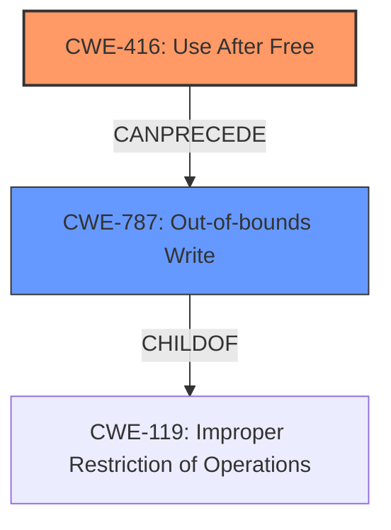

# Analysis Report for CVE-2022-0606

# Vulnerability Analysis Report: CVE-2022-0606

## Description

Use after free in ANGLE in Google Chrome prior to 98.0.4758.102 allowed a remote attacker to potentially exploit heap corruption via a crafted HTML page.

## Vulnerability Description Key Phrases

**Rootcause:** Use after free
**Weakness:** heap corruption
**Vector:** crafted HTML page
**Attacker:** remote attacker
**Product:** Google Chrome
**Version:** prior to 98.0.4758.102
**Component:** ANGLE

## Analysis (with Relationship Data)

# Summary
| CWE ID | CWE Name | Confidence | CWE Abstraction Level | CWE Vulnerability Mapping Label | CWE-Vulnerability Mapping Notes |
|---|---|---|---|---|---|
| CWE-416 | Use After Free | 0.9 | Variant | Allowed | Primary CWE. The vulnerability description clearly states "**Use after free**" which is directly addressed by CWE-416. |
| CWE-122 | Heap-based Buffer Overflow | 0.3 | Variant | Allowed | Secondary CWE. The vulnerability description mentions "**heap corruption**" as a result of the use-after-free. Heap corruption can lead to a heap overflow. |

## Evidence and Confidence

*   **Confidence Score:** 0.9
*   **Evidence Strength:** HIGH

- **Analysis and Justification:**  
  - *Explanation:* The vulnerability description explicitly mentions "**Use after free**" as the **rootcause** of the vulnerability in ANGLE within Google Chrome. CWE-416 (Use After Free) directly addresses this **weakness**, where memory is reused or referenced after it has been freed. The vulnerability can be exploited by a remote attacker through a crafted HTML page. The CVE Reference Links Content Summary also confirms that the **root_cause** is "Use after free". This aligns perfectly with the description and characteristics of CWE-416. The Usage for CWE-416 is "Allowed".
  - *Explanation:* Although the vulnerability description identifies the use-after-free, the **weakness** of "**heap corruption**" could lead to buffer overflows. CWE-122 (Heap-based Buffer Overflow) is considered a secondary candidate since exploitation of the use-after-free can lead to heap corruption and a potential buffer overflow.

  - *Relationship Analysis:* CWE-416 is a variant-level CWE, making it a specific and appropriate choice. It is related to other memory management issues but is the most precise match for the provided information. CWE-416 can lead to other weaknesses, such as out-of-bounds write (CWE-787), but the initial **rootcause** is the use-after-free condition. CWE-122 is a variant of CWE-119 and follows CWE-416 since the heap overflow can follow the use after free.

- **Confidence Score:**  
  - Confidence: 0.9 (High confidence due to direct mention of "use after free" in the vulnerability description and CVE reference.)

---

## Criticism of Analysis

Okay, I've reviewed the provided CWE analysis, incorporating the full CWE specifications you supplied. Here's my critique, focusing on the accuracy of the CWE assignments, the confidence levels, and potential alternative or additional CWEs based on the expanded information.

**Overall Assessment:**

The analysis is generally good and the primary mapping to CWE-416 is correct. The reasoning is well-articulated, and the confidence level is justified. The inclusion of CWE-122 as a secondary CWE is also reasonable, but could be refined.

**Detailed Review:**

**1. CWE-416: Use After Free (Primary)**

*   **Confidence:** 0.9 (Justified - High)
*   **Abstraction Level:** Variant (Appropriate)
*   **CWE Vulnerability Mapping Label:** Allowed (Correct)
*   **Critique:** The selection of CWE-416 is accurate and appropriate. The vulnerability description clearly states "Use after free," making it a direct match. The provided specifications confirm this. The explanation is thorough and highlights the core issue.  The CVE Reference Links Content Summary reinforces this mapping. The fact that CWE-416's Usage is "Allowed" further validates this choice.
*   **Potential Improvements:**  While the analysis mentions setting pointers to NULL after freeing as a mitigation, it's worth noting that this only helps if the *same* code is attempting to use the pointer later. In more complex scenarios (e.g., multithreading or callbacks), another part of the code might already have a copy of the pointer and still attempt to use it.  Therefore, emphasize that `NULL`ing is a *partial* mitigation. Also, consider mentioning garbage collection or smart pointers as stronger mitigation strategies available in some languages, aligning with the "Language Selection" mitigation in the specification.

**2. CWE-122: Heap-based Buffer Overflow (Secondary)**

*   **Confidence:** 0.3 (Needs Revision)
*   **Abstraction Level:** Variant (Appropriate)
*   **CWE Vulnerability Mapping Label:** Allowed (Correct)
*   **Critique:** The reasoning for CWE-122 is that heap corruption *can lead to* a heap overflow. While this is *possible*, it's not a direct consequence of *every* use-after-free. The confidence level of 0.3 reflects this uncertainty, but the mapping itself needs to be reconsidered. Heap corruption *could* lead to many different problems, not *necessarily* a heap overflow. Instead, consider a CWE that represents Memory Corruption more broadly.
*   **Proposed Alternative/Addition:** Replace CWE-122 with **CWE-787: Out-of-bounds Write** or **CWE-119: Improper Restriction of Operations within the Bounds of a Memory Buffer** or **CWE-825: Expired Pointer Dereference**. 
    *   **CWE-787** is a good fit because UAF often leads to writing to memory that now belongs to someone else. This is a general out-of-bounds write.
    *   **CWE-119** is a higher-level, more general CWE, but also appropriate given that the UAF leads to actions outside the bounds of the originally allocated memory. However, this is discouraged.
    *   **CWE-825** is relevant because the pointer dereference happens after the memory should have been released, so it is likely expired.
    *   The Confidence score should be increased to at least 0.5 if changing to one of these options.

*   **Mitigation Considerations (if using CWE-787):** Note that if CWE-787 is chosen, the mitigations for it emphasize language selection, safe libraries, and compiler-based overflow detection. This aligns with strategies to prevent the *consequences* of the UAF, even if the UAF itself isn't directly prevented.
*   **Mitigation Considerations (if using CWE-825):** Note that if CWE-825 is chosen, the mitigations for it emphasize language selection or setting pointers to NULL after freeing.

**3. Other CWEs Considered (from Retriever Results):**

*   **CWE-843 (Access of Resource Using Incompatible Type ('Type Confusion')):** While type confusion *could* theoretically be a contributing factor in how the UAF is exploited, it's not a primary aspect of the vulnerability description. I agree with excluding it.
*   **CWE-366 (Race Condition within a Thread):** Only relevant if the UAF is caused by a race condition. The vulnerability description does not suggest this.
*   **CWE-415 (Double Free):** This is a different vulnerability type. The description doesn't mention double freeing.
*   **CWE-1021 (Improper Restriction of Rendered UI Layers or Frames) & CWE-356 (Product UI does not Warn User of Unsafe Actions) & CWE-451 (User Interface (UI) Misrepresentation of Critical Information)** These are UI related issues and the vulnerability does not relate to the UI.
*   **CWE-190 (Integer Overflow or Wraparound):** Irrelevant in this case.
*   **CWE-911 (Improper Update of Reference Count):** If the UAF was a result of an incorrect update of a reference count, it could be relevant. However, this is not described in the vulnerability.

**Recommendations:**

1.  **Maintain CWE-416** as the primary mapping with high confidence (0.9).
2.  **Replace or Remove CWE-122.**
3.  **If replacing CWE-122, consider CWE-787: Out-of-bounds Write or CWE-825: Expired Pointer Dereference.**
4.  **Adjust Confidence Accordingly.**
5.  **Revise mitigations listed** to reflect the potential for mitigations to address *consequences* of UAF not just the UAF itself.

By implementing these changes, the CWE analysis will be more accurate and provide more useful information for remediation and prevention efforts.

## Final Resolution

# Summary
| CWE ID | CWE Name | Confidence | CWE Abstraction Level | CWE Vulnerability Mapping Label | CWE-Vulnerability Mapping Notes |
|---|---|---|---|---|---|
| CWE-416 | Use After Free | 0.9 | Variant | Allowed | Primary CWE. The vulnerability description clearly states "**Use after free**" which is directly addressed by **CWE-416 (Use After Free)**. |
| CWE-787 | Out-of-bounds Write | 0.5 | Base | Allowed | Secondary CWE. The vulnerability description mentions "**heap corruption**" as a result of the use-after-free, which can lead to an out-of-bounds write. |

## Evidence and Confidence

*   **Confidence Score:** 0.9
*   **Evidence Strength:** HIGH

## Relationship Analysis
The primary relationship impacting the decision is the CANPRECEDE relationship between **CWE-416 (Use After Free)** and **CWE-787 (Out-of-bounds Write)**. **CWE-416 (Use After Free)** can lead to **CWE-787 (Out-of-bounds Write)** because after memory is freed, a subsequent write to that memory location becomes an out-of-bounds write. **CWE-787 (Out-of-bounds Write)** is a child of **CWE-119 (Improper Restriction of Operations within the Bounds of a Memory Buffer)**, which is a more general class of buffer errors. This hierarchical relationship shows that **CWE-787 (Out-of-bounds Write)** is more specific and therefore more appropriate than **CWE-119 (Improper Restriction of Operations within the Bounds of a Memory Buffer)**.

## Vulnerability Chain
The vulnerability chain starts with the **rootcause** of **CWE-416 (Use After Free)**. The sequence of events is:
1.  Memory is allocated and used.
2.  The memory is freed.
3.  A dangling pointer still references the freed memory.
4.  The dangling pointer is dereferenced, leading to a write to the freed memory, now potentially used by another allocation, resulting in **CWE-787 (Out-of-bounds Write)**.
5.  The impact is heap corruption, which can lead to arbitrary code execution.

## Summary of Analysis
The initial analysis correctly identified **CWE-416 (Use After Free)** as the primary **weakness**, given the explicit mention in the vulnerability description: "Use after free in ANGLE in Google Chrome prior to 98.0.4758.102 allowed a remote attacker to potentially exploit heap corruption via a crafted HTML page."

The criticism correctly pointed out that **CWE-122 (Heap-based Buffer Overflow)** is not a direct consequence of every use-after-free. Instead, **CWE-787 (Out-of-bounds Write)** is a more accurate secondary **weakness**, as the use-after-free condition often leads to writing to memory that has been reallocated or is otherwise out of bounds.

The graph relationships confirm that **CWE-787 (Out-of-bounds Write)** is a suitable secondary **weakness**, as it can be a direct result of **CWE-416 (Use After Free)**. The choice of **CWE-787 (Out-of-bounds Write)** is also supported by its Base abstraction level, which is preferred for vulnerability mapping.

The final decision reflects the evidence from the vulnerability description and the relationships between the CWEs. **CWE-416 (Use After Free)** is the **rootcause**, and **CWE-787 (Out-of-bounds Write)** is a likely consequence given the heap corruption mentioned in the description.

*Report generated on 2025-03-18 06:11:20*
