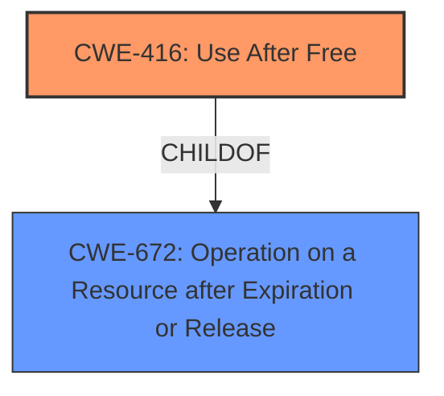

# Final Resolution for CVE-2022-0607

# Summary
| CWE ID | CWE Name | Confidence | CWE Abstraction Level | CWE Vulnerability Mapping Label | CWE-Vulnerability Mapping Notes |
|---|---|---|---|---|---|
| CWE-416 | Use After Free | 1.0 | Variant | Allowed | Primary CWE |

## Evidence and Confidence

*   **Confidence Score:** 1.0
*   **Evidence Strength:** HIGH

## Relationship Analysis
The primary relationship considered was the parent-child relationship between CWE-416 (**Use After Free**) and its parent CWE-672 (Operation on a Resource after Expiration or Release). CWE-416 is a variant of CWE-672, making it more specific and appropriate given the explicit mention of "Use After Free" in the vulnerability description. No significant chain relationships were identified based on the provided information.

## Vulnerability Chain
The vulnerability chain starts with a **Use After Free** condition (**CWE-416**) in the GPU component of Google Chrome. This **WEAKNESS** allows a remote attacker to potentially exploit heap corruption. The sequence is a direct result of accessing memory after it has been freed. The **ROOTCAUSE** is the failure to properly manage the lifecycle of memory resources. The impact is heap corruption, which can lead to arbitrary code execution.

## Summary of Analysis
The initial analysis is accurate and well-supported. The primary mapping to CWE-416 (**Use After Free**) is justified by the explicit mention of "Use after free" in the vulnerability description. The analysis also correctly considered the relationship between CWE-416 and its parent, CWE-672, and determined that CWE-416 is the more specific and appropriate classification.

The provided evidence from the vulnerability description is: "Use after free in GPU in Google Chrome prior to 98.0.4758.102 allowed a remote attacker to potentially exploit heap corruption via a crafted HTML page."

The graph relationship confirms that CWE-416 is a variant and more specific than its parent CWE-672.

The decision to classify this vulnerability as CWE-416 is based on the direct evidence of "Use after free" and is at the optimal level of specificity (Variant).