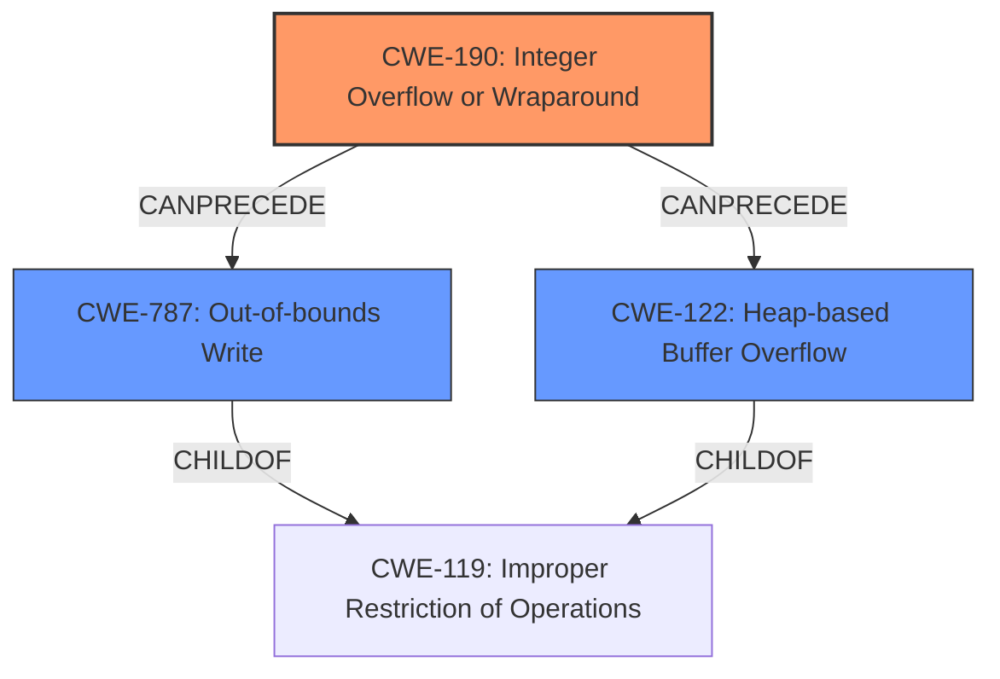

# Analysis Report for CVE-2022-0608

# Vulnerability Analysis Report: CVE-2022-0608

## Description

Integer overflow in Mojo in Google Chrome prior to 98.0.4758.102 allowed a remote attacker to potentially exploit heap corruption via a crafted HTML page.

## Vulnerability Description Key Phrases

**Rootcause:** integer overflow
**Impact:** heap corruption
**Vector:** crafted HTML page
**Attacker:** remote attacker
**Product:** Google Chrome
**Version:** prior to 98.0.4758.102
**Component:** Mojo

## Analysis (with Relationship Data)

# Summary
| CWE ID | CWE Name | Confidence | CWE Abstraction Level | CWE Vulnerability Mapping Label | CWE-Vulnerability Mapping Notes |
|---|---|---|---|---|---|
| CWE-190 | Integer Overflow or Wraparound | 0.9 | Base | Primary | Allowed |
| CWE-787 | Out-of-bounds Write | 0.6 | Base | Secondary | Allowed |
| CWE-122 | Heap-based Buffer Overflow | 0.5 | Variant | Secondary | Allowed |

## Evidence and Confidence

*   **Confidence Score:** 0.8
*   **Evidence Strength:** HIGH

- **Analysis and Justification:**  
  - *Explanation:* The vulnerability description explicitly states "**integer overflow** in Mojo in Google Chrome prior to 98.0.4758.102 allowed a remote attacker to potentially exploit **heap corruption** via a crafted HTML page." The root cause of the vulnerability is an **integer overflow** which directly matches CWE-190 (Integer Overflow or Wraparound). The "CVE Reference Links Content Summary" section confirms the root cause of the vulnerability as "**Integer overflow**". Integer overflows can lead to unexpected behavior such as buffer overflows or other memory corruption issues. The description also mentions potential **heap corruption**, which is often a consequence of integer overflows when they are used to calculate buffer sizes or memory allocations.
  
  - *Relationship Analysis:* CWE-190 is a Base level CWE, which is preferred. There are no direct relationships mentioned that affect the primary mapping decision. However, the potential impact of **heap corruption** suggests a possible follow-on weakness such as CWE-787 (Out-of-bounds Write) or CWE-122 (Heap-based Buffer Overflow).

- **Confidence Score:**  
  - Confidence: 0.9 (High confidence due to the explicit mention of integer overflow and corroborating information from CVE reference summary).

---
- **Analysis and Justification:**  
  - *Explanation:* The vulnerability description mentions potential **heap corruption** as a consequence of the **integer overflow**. Although the primary weakness is CWE-190, the potential for **heap corruption** suggests that a secondary weakness like CWE-787 (Out-of-bounds Write) might be present. Integer overflows can cause incorrect size calculations, which could lead to writing beyond the allocated buffer.

  - *Relationship Analysis:* CWE-787 (Out-of-bounds Write) is a child of CWE-119 (Improper Restriction of Operations within the Bounds of a Memory Buffer). This relationship indicates that the integer overflow (CWE-190) could lead to an out-of-bounds write (CWE-787) when an attacker crafts a specific HTML page to trigger it.

- **Confidence Score:**
  - Confidence: 0.6 (Moderate confidence as the heap corruption is a potential impact and not directly stated as an out-of-bounds write).

---

- **Analysis and Justification:**  
  - *Explanation:* Since the description also mentions the potential of exploiting **heap corruption**, and the integer overflow is triggered by a crafted HTML page, it is possible that the overflow directly leads to an overflow in the heap. Therefore, CWE-122 (Heap-based Buffer Overflow) is considered as a secondary candidate.
  - *Relationship Analysis:* CWE-122 is a variant of CWE-119 (Improper Restriction of Operations within the Bounds of a Memory Buffer). The integer overflow could lead to a heap-based buffer overflow.

- **Confidence Score:**
  - Confidence: 0.5 (Low confidence as the heap corruption is a potential impact, but this cannot be confirmed with the evidence provided).
---

## Criticism of Analysis

Okay, let's review the provided CWE analysis.

**Overall Assessment:**

The analysis is generally good and well-structured, but there are some areas where the confidence levels could be adjusted, and a few points for clarification.  The primary mapping to CWE-190 is strong, and the inclusion of CWE-787 and CWE-122 as secondary mappings is reasonable.

**Detailed Review by CWE:**

**1. CWE-190: Integer Overflow or Wraparound (Primary Mapping)**

*   **Confidence Level:** 0.9 - Justified. The description explicitly states "integer overflow", and the CVE summary confirms it.
*   **Analysis and Justification:** The explanation is clear and accurate.  The relationship analysis with CWE-119 and its children is also correctly identified.  The connection to "heap corruption" is a key element that justifies considering buffer overflow related CWEs.
*   **Mitigations:** The listed mitigations for CWE-190 are relevant. Choosing a language with automatic bounds checking or using safe integer libraries are good preventative measures. The design-level mitigation of strictly defined protocols is also important.

**2. CWE-787: Out-of-bounds Write (Secondary Mapping)**

*   **Confidence Level:** 0.6 - Seems slightly high. While heap corruption is a likely *outcome* of the integer overflow, it's not *guaranteed* to manifest as an out-of-bounds write. It depends on how the overflow is used in subsequent operations. I would suggest lowering the confidence to **0.5**.
*   **Analysis and Justification:** The explanation accurately describes how an integer overflow can lead to incorrect size calculations, ultimately resulting in an out-of-bounds write.  The child relationship to CWE-119 is also correct.
*  **Mitigations:**
    * All the provided mitigations apply.

**3. CWE-122: Heap-based Buffer Overflow (Secondary Mapping)**

*   **Confidence Level:** 0.5 - Appropriate. There is a possibility that the heap corruption can be a direct result of a buffer overflow on the heap, but it is not definite.
*   **Analysis and Justification:** It is reasonable to list CWE-122. However, it should be noted that it's a *possible* consequence rather than a definitive one based on the available description. The connection to the crafted HTML page is also valid, as this is the attack vector used to trigger the overflow.
*  **Mitigations:**
    * All the provided mitigations apply.

**General Comments and Suggestions:**

1.  **Specificity:** The analysis correctly identifies the primary weakness. It could be strengthened by attempting to be more specific about *how* the integer overflow leads to heap corruption. For example, is it an overflow in calculating the size of a memory allocation, or an overflow in an index used to write to a buffer?  If that level of detail is not available, the current analysis is appropriate given the limited information.

2.  **Alternative CWEs to Consider:**

    *   **CWE-680: Integer Overflow to Buffer Overflow:** While the analysis correctly identifies CWE-190 as primary and buffer overflows as secondary, one could consider including this *compound* CWE as a lower-confidence mapping.  It explicitly describes the path from integer overflow to buffer overflow.  However, note the "Discouraged" usage within the CWE itself due to being a "named chain."
    *   **CWE-770: Allocation of Resources Without Limits:** It is a parent of Memory Allocation Errors, and in the case of an integer overflow resulting in a very small buffer, it can lead to a memory allocation too small for a large input that will be written into it.

3.  **Retriever Results Analysis**: The retriever results present a broader view of possible weaknesses. While the selected CWEs are valid and defensible, it's worth considering why the retriever suggested other options like:
    * CWE-843 ('Type Confusion'): While not a direct match, if the integer overflow leads to an incorrect type being used in memory access, this could be relevant. This is less likely but worth considering if more information becomes available.
    * CWE-416 ('Use After Free'): While not directly linked to the description, heap corruption *could* lead to a Use-After-Free if memory is freed prematurely. This is a lower probability outcome, but it is a possibility.

4. **CWE-119**: The CWE specification mentions it's discoraged to map to CWE-119, but it is listed as parent of CWE-787, thus, it could be good to add it with "relationship" note to CWE-787.

**Revised Summary Table (with suggested changes):**

| CWE ID    | CWE Name                        | Confidence | CWE Abstraction Level | CWE Vulnerability Mapping Label | CWE-Vulnerability Mapping Notes |
| :-------- | :------------------------------ | :--------- | :-------------------- | :------------------------------ | :------------------------------ |
| CWE-190   | Integer Overflow or Wraparound  | 0.9        | Base                  | Primary                       | Allowed                       |
| CWE-787   | Out-of-bounds Write             | 0.5        | Base                  | Secondary                       | Allowed                       |
| CWE-122   | Heap-based Buffer Overflow      | 0.5        | Variant               | Secondary                       | Allowed                       |

**In conclusion:** The analysis is good, particularly the primary mapping. The suggestions above are primarily about refining confidence levels and considering slightly broader relationships based on potential, but less certain, consequences of the vulnerability.

## Final Resolution

# Summary
| CWE ID | CWE Name | Confidence | CWE Abstraction Level | CWE Vulnerability Mapping Label | CWE-Vulnerability Mapping Notes |
|---|---|---|---|---|---|
| CWE-190 | Integer Overflow or Wraparound | 0.9 | Base | Primary | Allowed |
| CWE-787 | Out-of-bounds Write | 0.5 | Base | Secondary | Allowed |
| CWE-122 | Heap-based Buffer Overflow | 0.5 | Variant | Secondary | Allowed |

## Evidence and Confidence

*   **Confidence Score:** 0.8
*   **Evidence Strength:** HIGH

## Relationship Analysis
The primary weakness is **CWE-190 (Integer Overflow or Wraparound)**, a Base level CWE. The analysis also considered **CWE-787 (Out-of-bounds Write)** and **CWE-122 (Heap-based Buffer Overflow)** as secondary weaknesses. **CWE-787** is a child of **CWE-119 (Improper Restriction of Operations within the Bounds of a Memory Buffer)**, which shows how an integer overflow can lead to an out-of-bounds write. The relationship between **CWE-190**, **CWE-787**, and **CWE-122** indicates a potential vulnerability chain where an integer overflow results in heap corruption, possibly through an out-of-bounds write or a heap-based buffer overflow.

## Vulnerability Chain
The vulnerability chain starts with **CWE-190 (Integer Overflow or Wraparound)**. This leads to heap corruption, which manifests as **CWE-787 (Out-of-bounds Write)** or **CWE-122 (Heap-based Buffer Overflow)**. The initial flaw is the integer overflow, and the impacts are heap corruption and potential out-of-bounds writes or heap-based buffer overflows.

## Summary of Analysis
The initial analysis correctly identifies **CWE-190 (Integer Overflow or Wraparound)** as the primary **ROOTCAUSE**, as supported by the vulnerability description which states "**integer overflow** in Mojo in Google Chrome prior to 98.0.4758.102 allowed a remote attacker to potentially exploit **heap corruption** via a crafted HTML page." The CVE reference summary also confirms the root cause as "**Integer overflow**".

The criticism suggested lowering the confidence level for **CWE-787 (Out-of-bounds Write)**, which I agree with. The heap corruption is a likely outcome, but not guaranteed to be an out-of-bounds write. The confidence level for **CWE-787** is thus adjusted to 0.5.

The suggestion to consider **CWE-680 (Integer Overflow to Buffer Overflow)** is valid. However, given that **CWE-680** is a compound CWE and its usage is discouraged, I will refrain from using it. I agree with the assessment that the current CWEs at their level of specificity are the right choice based on the provided information.

The relationships between **CWE-190**, **CWE-787**, and **CWE-122** confirm the possibility of a vulnerability chain. The abstraction levels of the selected CWEs are appropriate, with **CWE-190** being a Base CWE and **CWE-122** being a Variant CWE.

*Report generated on 2025-03-18 06:12:40*
