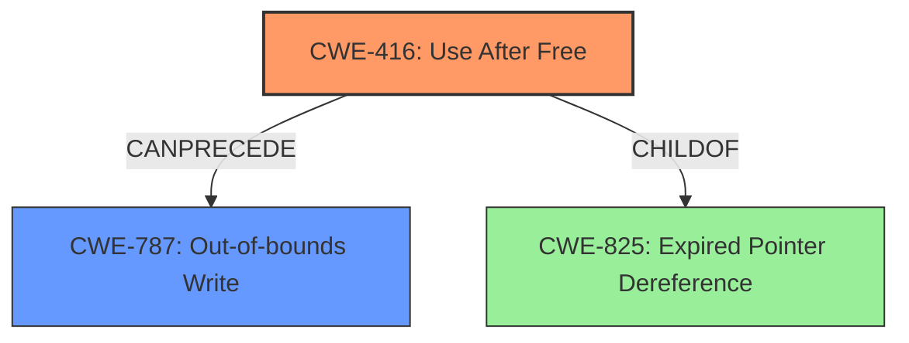

# Final Resolution for CVE-2022-0609

# Summary
| CWE ID | CWE Name | Confidence | CWE Abstraction Level | CWE Vulnerability Mapping Label | CWE-Vulnerability Mapping Notes |
|---|---|---|---|---|---|
| CWE-416 | Use After Free | 1.0 | Variant | Allowed | Primary CWE. The product reuses or references memory after it has been freed. |
| CWE-787 | Out-of-bounds Write | 0.6 | Base | Allowed | Secondary CWE. A likely consequence of CWE-416, as the UAF allows writing to freed memory, potentially corrupting the heap. |

## Evidence and Confidence

*   **Confidence Score:** 0.95
*   **Evidence Strength:** HIGH

## Relationship Analysis
The primary relationship influencing the decision is the CANPRECEDE relationship between CWE-416 (**Use After Free**) and CWE-787 (**Out-of-bounds Write**). CWE-416 is selected as the primary **ROOTCAUSE** because the vulnerability description explicitly mentions "use after free." CWE-787 is included as a secondary CWE because the vulnerability description also mentions "heap corruption," which is a common consequence of a use-after-free condition leading to an out-of-bounds write. Additionally, the relationship to CWE-825 (**Expired Pointer Dereference**) was considered, as CWE-416 is a specific type of expired pointer dereference.

## Vulnerability Chain
The vulnerability chain starts with **CWE-416 (Use After Free)**, where memory is reused or referenced after it has been freed. This leads to **heap corruption**, as the freed memory might be reallocated and then unexpectedly modified. This unexpected modification often results in **CWE-787 (Out-of-bounds Write)**, where data is written outside the intended buffer boundaries, causing further damage to the heap.
  - **ROOTCAUSE**: CWE-416
  - **WEAKNESS**: Heap Corruption
  - **IMPACT**: CWE-787

## Summary of Analysis
The initial analysis correctly identified CWE-416 (**Use After Free**) as the primary **ROOTCAUSE** of the vulnerability. The criticism offered valuable suggestions, which have been incorporated into this final analysis. Specifically, the inclusion of CWE-787 (**Out-of-bounds Write**) as a secondary CWE strengthens the analysis by explicitly acknowledging the "heap corruption" mentioned in the vulnerability description. The relationship analysis emphasizes the chain of events, where a use-after-free condition can lead to an out-of-bounds write.

The decision to include both CWE-416 and CWE-787 is based on the evidence provided in the vulnerability description: "Use after free in Animation in Google Chrome prior to 98.0.4758.102 allowed a remote attacker to potentially exploit heap corruption via a crafted HTML page." This statement directly supports the selection of CWE-416 as the primary **ROOTCAUSE**, while the mention of "heap corruption" indicates a potential consequence of CWE-416, namely CWE-787.

The CWEs have been selected at the optimal level of specificity. CWE-416 is a Variant, representing a specific type of memory error. CWE-787 is a Base CWE, representing the more general condition of writing outside buffer boundaries, which arises due to the heap corruption caused by the use-after-free.