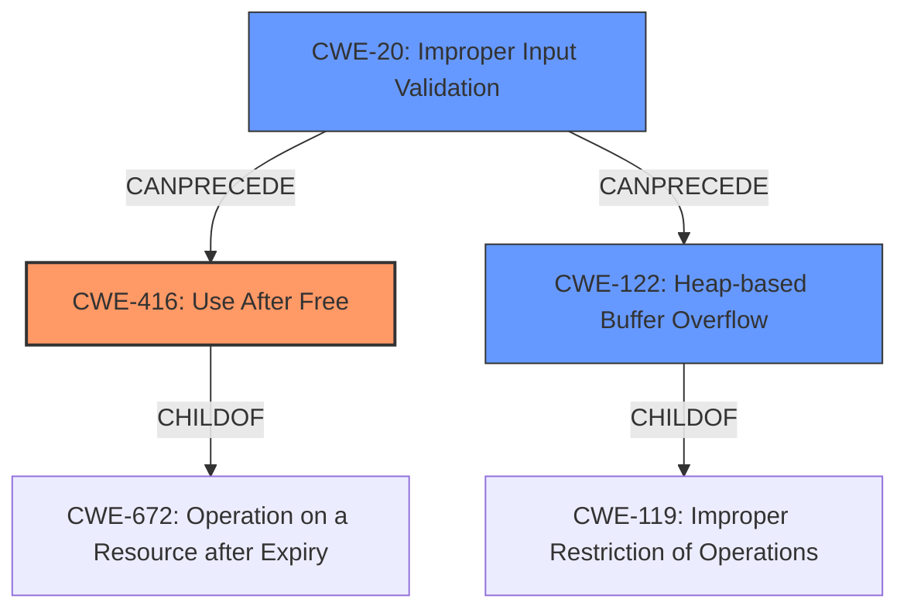

# Final Resolution for CVE-2022-0610

# Summary
| CWE ID | CWE Name | Confidence | CWE Abstraction Level | CWE Vulnerability Mapping Label | CWE-Vulnerability Mapping Notes |
|---|---|---|---|---|---|
| CWE-416 | Use After Free | 0.8 | Variant | Allowed | Primary CWE. Heap corruption due to accessing freed memory. |
| CWE-122 | Heap-based Buffer Overflow | 0.5 | Variant | Allowed | Secondary Candidate. Heap corruption could also manifest as an overflow if data is written past the allocated bounds. |
| CWE-20 | Improper Input Validation | 0.3 | Class | Allowed | Tertiary Candidate. The crafted HTML page may use improper inputs to trigger the heap corruption |

## Evidence and Confidence

*   **Confidence Score:** 0.8
*   **Evidence Strength:** MEDIUM

## Relationship Analysis
The primary relationship is that CWE-416 **Use After Free** can be caused by or lead to other weaknesses. The parent of CWE-416 is CWE-672 which is a class level CWE. CWE-122 **Heap-based Buffer Overflow** is a variant of CWE-119 **Improper Restriction of Operations within the Bounds of a Memory Buffer**. CWE-20 **Improper Input Validation** is a child of CWE-20 **Improper Input Validation**. The crafted HTML page suggests a potential lack of input validation which could **precede** the **heap corruption**.

## Vulnerability Chain
The vulnerability chain starts with a crafted HTML page (**ROOTCAUSE**/**WEAKNESS**: CWE-20 Improper Input Validation), which leads to **heap corruption**. This **heap corruption** can manifest as either (**WEAKNESS**: CWE-416 Use After Free) or (**WEAKNESS**: CWE-122 Heap-based Buffer Overflow). The final impact is a remote attacker exploiting the **heap corruption**.

## Summary of Analysis
The initial analysis and criticism both agree that CWE-416 is a strong candidate for the primary CWE. The vulnerability description mentions "**heap corruption**" which is a key indicator for both CWE-416 and CWE-122. The crafted HTML page strongly suggests that CWE-20 may also be present.

The graph relationships influenced the decision by highlighting the potential chain of events: crafted HTML page (CWE-20) leading to **heap corruption** (CWE-416 or CWE-122).

The selected CWEs are at the optimal level of specificity. CWE-416 and CWE-122 are both variant-level CWEs, providing more specific information than their class-level parents. CWE-20 is a class level CWE, but is appropriate as a tertiary candidate given the limited information about the input validation. The evidence supports the selection of CWE-416 as the primary CWE.