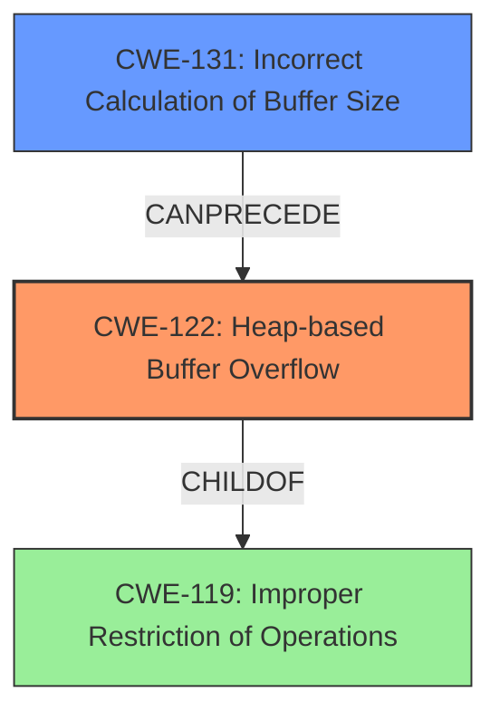

# Final Resolution for CVE-2022-0676

# Summary
| CWE ID | CWE Name | Confidence | CWE Abstraction Level | CWE Vulnerability Mapping Label | CWE-Vulnerability Mapping Notes |
|---|---|---|---|---|---|
| **CWE-122** | Heap-based Buffer Overflow | 0.95 | Variant | Primary | Allowed |
| **CWE-131** | Incorrect Calculation of Buffer Size | 0.75 | Base | Secondary | Allowed, Contributes to the root cause of the overflow. **CWE-131** -> **CWE-122** |

## Evidence and Confidence

*   **Confidence Score:** 0.92
*   **Evidence Strength:** HIGH

## Relationship Analysis
The primary weakness is **CWE-122 (Heap-based Buffer Overflow)**, a variant of **CWE-119 (Improper Restriction of Operations within the Bounds of a Memory Buffer)**, indicating a memory corruption issue on the heap. The secondary weakness, **CWE-131 (Incorrect Calculation of Buffer Size)**, is a base CWE and can precede **CWE-122**, thus contributing to the root cause.

## Vulnerability Chain
The vulnerability chain starts with **CWE-131 (Incorrect Calculation of Buffer Size)**, where an incorrect size is calculated for a buffer allocation. This leads to **CWE-122 (Heap-based Buffer Overflow)** when data larger than the allocated buffer is written to the heap, causing a buffer overflow.

## Summary of Analysis
The initial analysis correctly identified **CWE-122 (Heap-based Buffer Overflow)** as the primary issue, supported by the explicit mention of "Heap-based Buffer Overflow" in the vulnerability description. The identification of **CWE-131 (Incorrect Calculation of Buffer Size)** as a secondary issue is also appropriate, as the "CVE Reference Links Content Summary" states the root cause is an "**incorrect calculation of the size of data**".

The relationships between the CWEs, particularly **CWE-131** preceding **CWE-122**, reinforce the classification. **CWE-122** is a Variant, which is a preferred level of abstraction, while **CWE-131** is a Base CWE, suitable for identifying the root cause.

The criticism suggested adding mitigations and explaining how the incorrect size calculation leads to the overflow. The suggestion of considering other potentially relevant CWEs from the Retriever Results is also valuable. The Retriever Results list **CWE-787 (Out-of-bounds Write)** as a top CWE. While **CWE-787** is related to **CWE-122**, **CWE-122** is more specific, as it indicates that the out-of-bounds write is a heap-based buffer overflow. **CWE-130 (Improper Handling of Length Parameter Inconsistency)** and **CWE-805 (Buffer Access with Incorrect Length Value)** were also listed as top results. **CWE-130** is too generic and less descriptive than **CWE-131**, while **CWE-805** describes the consequence but not the cause, which is the incorrect calculation of the buffer size.

Therefore, the selected CWEs are at the optimal level of specificity and provide a clear understanding of the vulnerability.