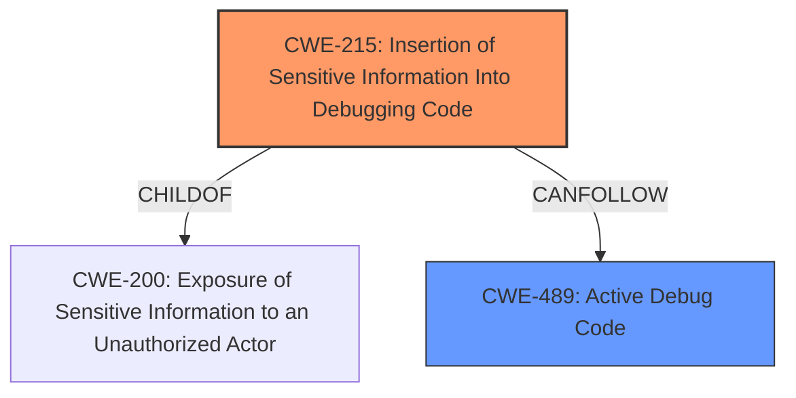

# Final Resolution for CVE-2022-0721

# Summary
| CWE ID | CWE Name | Confidence | CWE Abstraction Level | CWE Vulnerability Mapping Label | CWE-Vulnerability Mapping Notes |
|---|---|---|---|---|---|
| CWE-215 | Insertion of Sensitive Information Into Debugging Code | 1.0 | Base | Allowed | Primary CWE |
| CWE-489 | Active Debug Code | 0.6 | Base | Allowed | Secondary Candidate |

## Evidence and Confidence

*   **Confidence Score:** 0.9
*   **Evidence Strength:** HIGH

## Relationship Analysis
The primary CWE, CWE-215 (**Insertion of Sensitive Information Into Debugging Code**), is a child of CWE-200 (**Exposure of Sensitive Information to an Unauthorized Actor**). However, CWE-215 is more specific, focusing on the debugging code context. The analysis also considers CWE-489 (**Active Debug Code**), noting that CWE-215 can precede it, indicating a potential vulnerability chain where sensitive information is inserted into debugging code (CWE-215), and then that code remains active in the deployed product (CWE-489), increasing the impact.

## Vulnerability Chain
The vulnerability chain starts with the **ROOTCAUSE** of **CWE-215** (**Insertion of Sensitive Information Into Debugging Code**). This is followed by **CWE-489** (**Active Debug Code**), which is not necessarily a weakness but a condition that significantly amplifies the impact of **CWE-215**. The chain leads to the exposure of sensitive information to unauthorized actors. There are no missing links in this chain based on the available information.

## Summary of Analysis
The initial analysis correctly identified **CWE-215** (**Insertion of Sensitive Information Into Debugging Code**) as the primary **WEAKNESS**, given the direct match with the vulnerability description: "Insertion of Sensitive Information Into Debugging Code". The criticism suggested considering **CWE-489** (**Active Debug Code**), which, while not a direct cause, increases the impact.

The decision to include **CWE-489** as a secondary candidate is based on its "CanFollow" relationship with **CWE-215**. The presence of active debug code exacerbates the issue. **CWE-215** is at the optimal level of specificity, as it precisely describes the root cause, while **CWE-489** contributes to the overall risk.

The analysis is primarily based on the vulnerability description and the relationships between the CWEs. The initial analysis provided sufficient evidence for **CWE-215**, and the criticism highlighted the potential contribution of **CWE-489**.