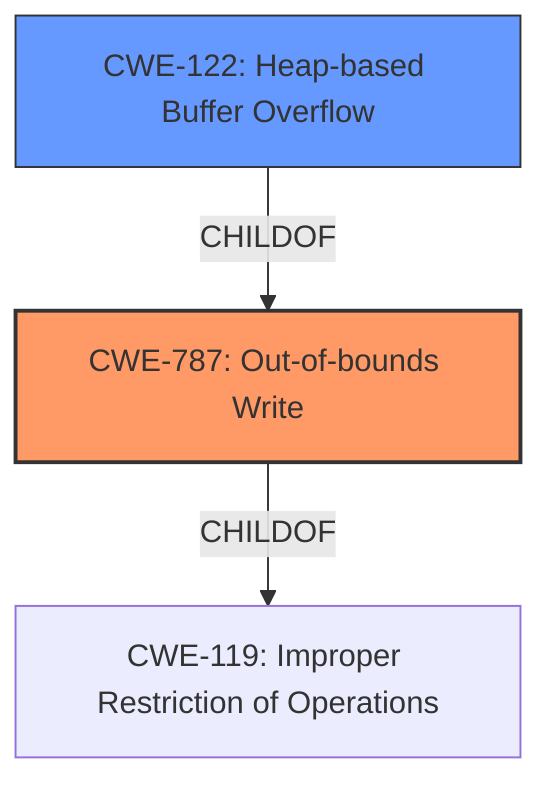

# Final Resolution for CVE-2022-0789

# Summary
| CWE ID | CWE Name | Confidence | CWE Abstraction Level | CWE Vulnerability Mapping Label | CWE-Vulnerability Mapping Notes |
|---|---|---|---|---|---|
| **CWE-787** | **Out-of-bounds Write** | 0.95 | Base | Allowed | Primary **CWE**. Root cause of the **buffer overflow**. |
| **CWE-122** | **Heap-based Buffer Overflow** | 0.75 | Variant | Allowed | Secondary candidate. Specifies the location of the buffer (heap). |

## Evidence and Confidence

*   **Confidence Score:** 0.95
*   **Evidence Strength:** HIGH

## Relationship Analysis
The primary relationship that impacted the decision was the parent-child relationship between **CWE-787** (Out-of-bounds Write) and **CWE-122** (Heap-based Buffer Overflow). **CWE-122** is a variant of **CWE-787**, providing a more specific context by indicating that the overflow occurs on the heap. This specificity helps in understanding the nature and location of the vulnerability. Both are children of **CWE-119** (Improper Restriction of Operations within the Bounds of a Memory Buffer). Choosing **CWE-787** over **CWE-119** provides a more precise description.

## Vulnerability Chain
The vulnerability chain starts with the **ROOTCAUSE** being a heap **buffer overflow**. This leads to an **CWE-787** (Out-of-bounds Write), which is further specified by **CWE-122** (Heap-based Buffer Overflow). The final impact is potential heap corruption, which can then be exploited by a remote attacker. A potential missing link is the input validation, which, if absent, could be classified as **CWE-20** (Improper Input Validation) and could precede the overflow.

## Summary of Analysis
The initial analysis and criticism correctly identify **CWE-787** as the primary **ROOTCAUSE** and **CWE-122** as a secondary **CWE** to provide more context.

The vulnerability description explicitly states "Heap **buffer overflow** in ANGLE in Google Chrome prior to 99.0.4844.51 allowed a remote attacker to potentially exploit heap corruption via a crafted HTML page." The evidence includes `"root_cause": "Heap buffer overflow in ANGLE."` and `"weaknesses": ["Heap buffer overflow"]`.

The graph relationships support the choice of **CWE-787** and **CWE-122** because they represent the most specific descriptions of the vulnerability, where **CWE-122** is a variant of **CWE-787**, clarifying the location of the overflow.

The selected **CWEs** are at the optimal level of specificity because **CWE-787** directly describes the out-of-bounds write, and **CWE-122** specifies that the overflow occurs on the heap. This provides sufficient detail without being overly broad or abstract. Other potential **CWEs** like **CWE-190** (Integer Overflow) or **CWE-125** (Out-of-bounds Read) are less relevant as the primary issue is the out-of-bounds write due to the **buffer overflow**, not an integer overflow or read.