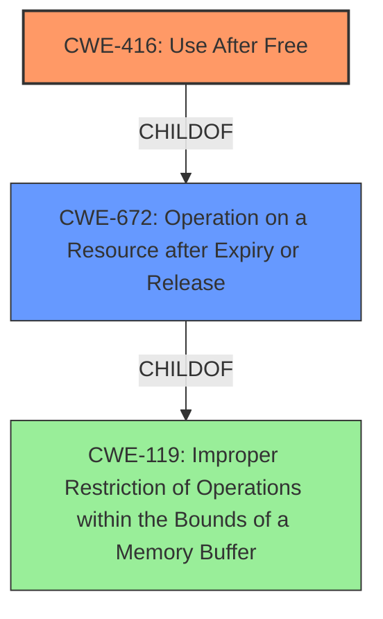

# Analysis Report for CVE-2022-0793

# Vulnerability Analysis Report: CVE-2022-0793

## Description

Use after free in Cast in Google Chrome prior to 99.0.4844.51 allowed an attacker who convinced a user to install a malicious extension and engage in specific user interaction to potentially exploit heap corruption via a crafted Chrome Extension.

## Vulnerability Description Key Phrases

**Rootcause:** Use after free
**Weakness:** heap corruption
**Vector:** crafted Chrome Extension, specific user interaction
**Product:** Google Chrome
**Version:** prior to 99.0.4844.51
**Component:** Cast

## Analysis (with Relationship Data)

# Summary
| CWE ID | CWE Name | Confidence | CWE Abstraction Level | CWE Vulnerability Mapping Label | CWE-Vulnerability Mapping Notes |
|---|---|---|---|---|---|
| CWE-416 | Use After Free | 1.0 | Variant | Primary | Allowed |

## Evidence and Confidence

*   **Confidence Score:** 1.0
*   **Evidence Strength:** HIGH

- **Analysis and Justification:**  
  - *Explanation:* The vulnerability description clearly states a "**use after free**" condition in the Cast component of Google Chrome. This aligns directly with the definition of CWE-416, which describes the reuse or referencing of memory after it has been freed. The CVE Reference Links Content Summary further reinforces this by stating that the **root cause of vulnerability** is a "**use-after-free** error". The description mentions that this can lead to "**heap corruption**", which is a potential consequence of a use-after-free vulnerability. CWE-416 is a Variant level CWE, which is a preferred level of abstraction. The MITRE mapping guidance for CWE-416 indicates this is ALLOWED for use-after-free vulnerabilities.
  
  - *Relationship Analysis:* CWE-416 is a variant of CWE-672 (Operation on a Resource after Expiry or Release). The retriever results show high scores for CWE-416, further supporting its selection as the primary CWE.

- **Confidence Score:**  
  - Confidence: 1.0 (Direct evidence and high retriever scores)

## Criticism of Analysis

Okay, here's a detailed review of the provided analysis, considering the full CWE specifications:

**Overall Assessment:**

The analysis correctly identifies CWE-416 (Use After Free) as the primary weakness.  The confidence score of 1.0 is justified based on the vulnerability description and the CVE reference summary. The justification is well-reasoned and aligns with the CWE's description and mapping guidance. The provided examples are also relevant.

**Detailed Breakdown:**

*   **CWE-416 (Use After Free):**

    *   **Correct Identification:** The analysis accurately maps the "use after free" condition to CWE-416.
    *   **Abstraction Level:** The analysis correctly identifies CWE-416 as a "Variant" level weakness, which is the preferred level of abstraction.
    *   **Mapping Guidance Adherence:** The analysis correctly states that the MITRE mapping guidance for CWE-416 indicates that its usage is "Allowed" for use-after-free vulnerabilities.
    *   **Justification:** The explanation is clear and concise. The connection to heap corruption as a potential consequence is also accurate.
    *   **Observed Examples:** The given examples of the CWE are all relevant and valid.
    *   **Relationships:** The observation that CWE-416 is a variant of CWE-672 is correct and helpful for understanding the broader context.

*   **Retriever Results Review (CWEs considered but not selected):**

    Let's examine why the other retriever results were not selected and if this was justified.

    *   **CWE-366 (Race Condition within a Thread) & CWE-362 (Concurrent Execution using Shared Resource with Improper Synchronization):** These are possible, but not primary. A use-after-free can sometimes be *caused* by a race condition. However, the core vulnerability *is* the use-after-free. The analysis correctly prioritizes the direct cause. If the root cause was determined to be the race condition that led to the UAF, THEN CWE-362 or CWE-366 would be appropriate.
    *   **CWE-843 (Access of Resource Using Incompatible Type ('Type Confusion')):** While memory corruption is possible after a UAF, the initial vulnerability is not type confusion. Type confusion would involve using the pointer in a way that interprets the underlying memory as the wrong data type. This isn't implied by the original vulnerability description.
    *   **CWE-415 (Double Free):** This is similar to UAF in that it also involves memory management issues and potential memory corruption. However, the description explicitly mentions "use after free," making CWE-416 the more precise mapping. A Double Free is a distinct type of memory management error.
    *   **CWE-122 (Heap-based Buffer Overflow):** This is a potential *consequence* of a UAF if the freed memory is reallocated and then overwritten. However, the vulnerability is not primarily a buffer overflow. The root cause is still the UAF.
    *   **CWE-356 (Product UI does not Warn User of Unsafe Actions) & CWE-451 (User Interface (UI) Misrepresentation of Critical Information):** These are less relevant. While the vulnerability involves a malicious extension, the core issue is not related to UI misrepresentation or the lack of warnings in the UI.
    *   **CWE-190 (Integer Overflow or Wraparound):** No indication of integer overflow or wraparound exists in the vulnerability description.
    *   **CWE-787 (Out-of-bounds Write):** While possible as a *result* of a UAF, it's not the root cause. The core issue is using memory after it's been freed, which *can* lead to out-of-bounds writes, but that's not the initial problem.

**Areas for Possible Enhancement (Minor):**

*   **Mitigation Strategies:** While not strictly required, the analysis could briefly mention some high-level mitigation strategies from CWE-416, such as using languages with automatic memory management (e.g., Java, C#) or employing techniques like setting pointers to NULL after freeing them (although this is not a foolproof solution).  This adds practical value to the analysis.

**Justification for Confidence Level:**

The confidence level of 1.0 is appropriate. The vulnerability description contains the explicit phrase "use after free," and the CVE content confirms this as the root cause.  The retriever results strongly support this mapping.

**Conclusion:**

The analysis is accurate, well-justified, and demonstrates a good understanding of CWE specifications. The selection of CWE-416 is correct, and the reasoning for excluding other potential CWEs is sound.  The minor suggestion about adding mitigation strategies is purely for added value and doesn't detract from the overall quality of the analysis.

## Final Resolution

# Summary
| CWE ID | CWE Name | Confidence | CWE Abstraction Level | CWE Vulnerability Mapping Label | CWE-Vulnerability Mapping Notes |
|---|---|---|---|---|---|
| CWE-416 | Use After Free | 1.0 | Variant | Primary CWE | Allowed |

## Evidence and Confidence

*   **Confidence Score:** 1.0
*   **Evidence Strength:** HIGH

## Relationship Analysis
The primary relationship considered was the parent-child relationship between CWE-416 and its parent CWEs. While CWE-416 is a variant, its direct relationship to the specific vulnerability makes it the most appropriate choice. The criticism correctly points out that other CWEs, such as CWE-362 (Race Condition) or CWE-787 (Out-of-bounds Write), could be related, but are not the primary **root cause**.

## Vulnerability Chain
The vulnerability chain starts with the **root cause**, which is the **Use After Free (CWE-416)**. This occurs when memory is freed, but a pointer still references that memory location. When the program attempts to use this dangling pointer, it can lead to several consequences, including **heap corruption**. The attacker convinces the user to install a malicious extension and engages in specific user interaction, which triggers the **use-after-free** condition.

## Summary of Analysis
The initial analysis correctly identifies CWE-416 as the primary **weakness**. The vulnerability description states "Use after free in Cast in Google Chrome prior to 99.0.4844.51 allowed an attacker who convinced a user to install a malicious extension and engage in specific user interaction to potentially exploit heap corruption via a crafted Chrome Extension.". This directly indicates a **use-after-free** vulnerability. The criticism reinforces this by examining potential alternative CWEs and explaining why they are not the most appropriate. The selection of CWE-416 is at the optimal level of specificity, as it directly addresses the **root cause** described in the vulnerability.

*Report generated on 2025-03-18 06:18:27*
