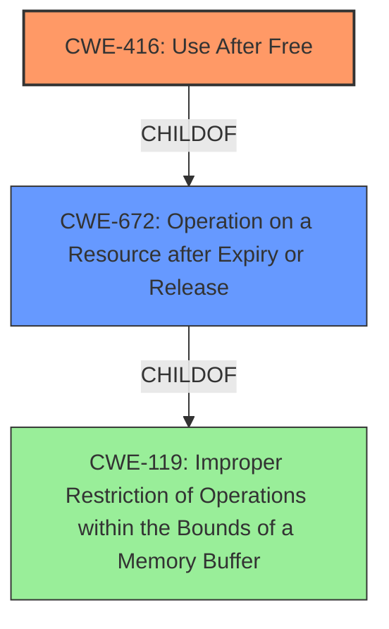

# Final Resolution for CVE-2022-0793

# Summary
| CWE ID | CWE Name | Confidence | CWE Abstraction Level | CWE Vulnerability Mapping Label | CWE-Vulnerability Mapping Notes |
|---|---|---|---|---|---|
| CWE-416 | Use After Free | 1.0 | Variant | Primary CWE | Allowed |

## Evidence and Confidence

*   **Confidence Score:** 1.0
*   **Evidence Strength:** HIGH

## Relationship Analysis
The primary relationship considered was the parent-child relationship between CWE-416 and its parent CWEs. While CWE-416 is a variant, its direct relationship to the specific vulnerability makes it the most appropriate choice. The criticism correctly points out that other CWEs, such as CWE-362 (Race Condition) or CWE-787 (Out-of-bounds Write), could be related, but are not the primary **root cause**.

## Vulnerability Chain
The vulnerability chain starts with the **root cause**, which is the **Use After Free (CWE-416)**. This occurs when memory is freed, but a pointer still references that memory location. When the program attempts to use this dangling pointer, it can lead to several consequences, including **heap corruption**. The attacker convinces the user to install a malicious extension and engages in specific user interaction, which triggers the **use-after-free** condition.

## Summary of Analysis
The initial analysis correctly identifies CWE-416 as the primary **weakness**. The vulnerability description states "Use after free in Cast in Google Chrome prior to 99.0.4844.51 allowed an attacker who convinced a user to install a malicious extension and engage in specific user interaction to potentially exploit heap corruption via a crafted Chrome Extension.". This directly indicates a **use-after-free** vulnerability. The criticism reinforces this by examining potential alternative CWEs and explaining why they are not the most appropriate. The selection of CWE-416 is at the optimal level of specificity, as it directly addresses the **root cause** described in the vulnerability.