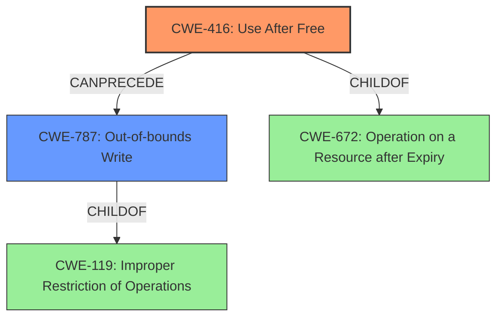

# Final Resolution for CVE-2022-0798

# Summary
| CWE ID | CWE Name | Confidence | CWE Abstraction Level | CWE Vulnerability Mapping Label | CWE-Vulnerability Mapping Notes |
|---|---|---|---|---|---|
| CWE-416 | Use After Free | 1.0 | Variant | Primary | Allowed |
| CWE-787 | Out-of-bounds Write | 0.7 | Base | Secondary | Allowed |

## Evidence and Confidence

*   **Confidence Score:** 0.9
*   **Evidence Strength:** MEDIUM

## Relationship Analysis
The primary relationship is that **CWE-787 (Out-of-bounds Write)** can potentially follow **CWE-416 (Use After Free)**. If the **use-after-free** allows an attacker to write arbitrary data to the freed memory location, it can lead to heap corruption via an out-of-bounds write. The parent of **CWE-416** is **CWE-672 (Operation on a Resource after Expiry)**. However, **CWE-416** is a more specific variant and directly reflects the vulnerability's description of "use after free."

## Vulnerability Chain
The vulnerability chain starts with the **ROOTCAUSE** of a **use-after-free (CWE-416)** condition in MediaStream. This occurs when memory is reused or referenced after it has been freed. Subsequently, this can lead to an **out-of-bounds write (CWE-787)** if the attacker can write to the freed memory, corrupting the heap. The initial flaw is exploited by convincing a user to install a malicious extension. The ultimate impact is potential heap corruption and possibly arbitrary code execution.

## Summary of Analysis
The initial analysis correctly identified **CWE-416 (Use After Free)** as the primary **WEAKNESS**. The vulnerability description explicitly states "use after free" and the CVE reference confirms this as the root cause. The retriever results also supports **CWE-416** as the most relevant.

The criticism suggested including **CWE-787 (Out-of-bounds Write)** as a secondary CWE, reflecting the potential impact of heap corruption. This is a valid point because the **use-after-free** condition can allow an attacker to overwrite memory beyond the intended boundaries, leading to an **out-of-bounds write**. I agree with including **CWE-787** as a secondary **WEAKNESS** with a confidence score of 0.7, as the heap corruption is a *potential* impact, not a certainty. The vulnerability description mentions "heap corruption," which supports this addition.

The other criticism suggested including CWE-667. While it highlights an interesting relationship concerning malicious extensions and improper access, it is not a direct factor in the memory corruption. I will omit CWE-667 as it is not directly related to the memory corruption.

The selection of **CWE-416** and **CWE-787** is at the optimal level of specificity. **CWE-416** is a variant, which is a preferred level of abstraction.