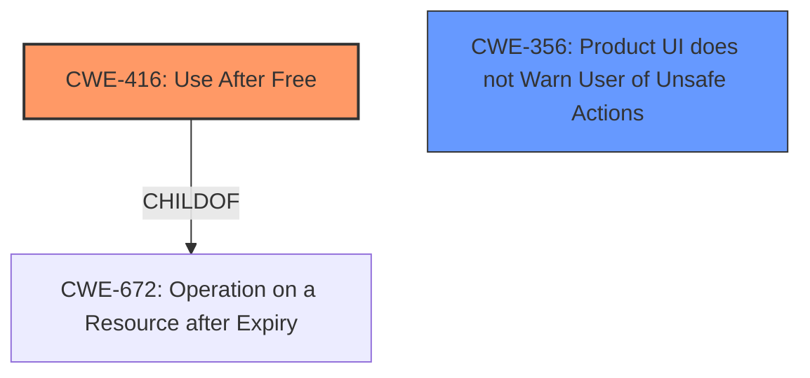

# Final Resolution for CVE-2022-0808

# Summary
| CWE ID | CWE Name | Confidence | CWE Abstraction Level | CWE Vulnerability Mapping Label | CWE-Vulnerability Mapping Notes |
|---|---|---|---|---|---|
| CWE-416 | Use After Free | 1.0 | Variant | Allowed | Primary CWE |
| CWE-356 | Product UI does not Warn User of Unsafe Actions | 0.3 | Base | Allowed | Secondary CWE |

## Evidence and Confidence

*   **Confidence Score:** 0.9
*   **Evidence Strength:** MEDIUM

## Relationship Analysis
The primary relationship influencing the decision is the direct match of the vulnerability description to **CWE-416 (Use After Free)**. The secondary consideration involves how user interaction contributes to the vulnerability. **CWE-356 (Product UI does not Warn User of Unsafe Actions)** is considered as a contributing factor. The abstraction levels influenced the selection by favoring the more specific Variant level for the primary CWE and the Base level for the secondary CWE, aligning with the root cause and contributing factor respectively.

## Vulnerability Chain
The vulnerability chain starts with a user being convinced to interact with the system in a specific way. This interaction leads to a memory being freed. Subsequently, the same memory is accessed, leading to a **CWE-416 (Use After Free)**. The lack of warnings contributes as users might unknowingly engage in risky behaviors due to inadequate UI alerts, represented by **CWE-356 (Product UI does not Warn User of Unsafe Actions)**.

## Summary of Analysis
The initial analysis correctly identified **CWE-416 (Use After Free)** as the primary **root cause**. The vulnerability description explicitly states "**use after free** in Chrome OS Shell in Google Chrome on Chrome OS prior to 99.0.4844.51 allowed a remote attacker who convinced a user to engage in a series of user interaction to potentially exploit **heap corruption** via user interactions."

The criticism suggested considering **CWE-356 (Product UI does not Warn User of Unsafe Actions)**, which is included as a secondary CWE with a confidence of 0.3. This is based on the phrase "convinced a user to engage in a series of user interaction," suggesting the UI may not adequately warn users of potential risks.

The graph relationships influenced the selection by highlighting the direct link between the vulnerability description and **CWE-416 (Use After Free)**. The abstraction levels guided the choice of a Variant level CWE for the primary cause and a Base level CWE for the contributing factor.

The selected CWEs are at the optimal level of specificity, as **CWE-416 (Use After Free)** precisely describes the technical **weakness**, and **CWE-356 (Product UI does not Warn User of Unsafe Actions)** captures the contributing factor related to user interaction.