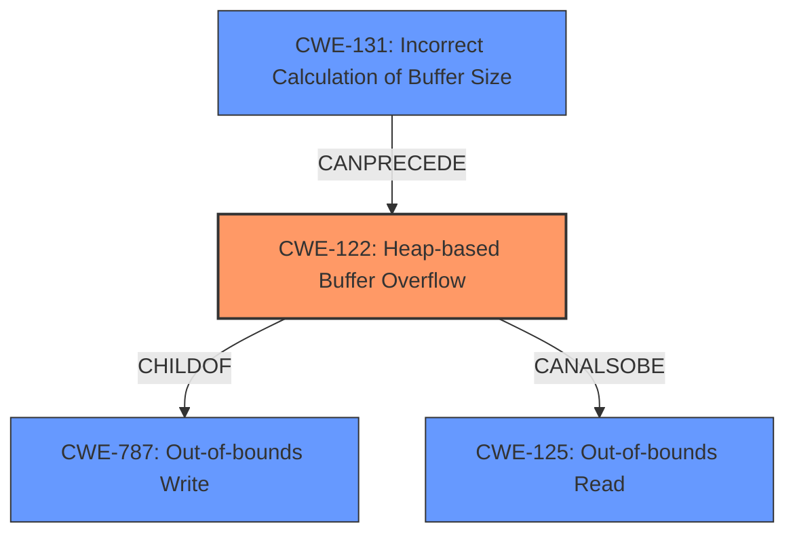

# Analysis Report for CVE-2022-0891

# Vulnerability Analysis Report: CVE-2022-0891

## Description

A heap buffer overflow in ExtractImageSection function in tiffcrop.c in libtiff library Version 4.3.0 allows attacker to trigger unsafe or out of bounds memory access via crafted TIFF image file which could result into application crash, potential information disclosure or any other context-dependent impact

## Vulnerability Description Key Phrases

**Rootcause:** heap buffer overflow
**Impact:** ['application crash', 'information disclosure']
**Vector:** crafted TIFF image file
**Attacker:** attacker
**Product:** libtiff library
**Version:** Version 4.3.0
**Component:** ExtractImageSection function in tiffcrop.c

## Analysis (with Relationship Data)

# Summary
| CWE ID    | CWE Name                     | Confidence | CWE Abstraction Level | CWE Vulnerability Mapping Label | CWE-Vulnerability Mapping Notes |
| :--------- | :--------------------------- | :--------- | :-------------------- | :------------------------------ | :----------------------------- |
| CWE-122     | Heap-based Buffer Overflow   | 0.95       | Variant             | Allowed                         | Primary CWE                    |
| CWE-125     | Out-of-bounds Read          | 0.75       | Base                | Allowed                         | Secondary Candidate            |
| CWE-787     | Out-of-bounds Write         | 0.70       | Base                | Allowed                         | Secondary Candidate            |
| CWE-131     | Incorrect Calculation of Buffer Size | 0.65      | Base            | Allowed                         | Secondary Candidate           |

## Evidence and Confidence

*   **Confidence Score:** 0.85
*   **Evidence Strength:** HIGH

- **Analysis and Justification:**
  - *Explanation:* The vulnerability description clearly states a **heap buffer overflow** in the `ExtractImageSection` function of the `libtiff` library. The CVE reference summary confirms this, stating that the **root cause** is a **heap buffer overflow** in the `extractImageSection` function. This aligns directly with CWE-122 (Heap-based Buffer Overflow), which is a buffer overflow that occurs in the heap portion of memory. The impact includes application crash and potential information disclosure. CWE-122 is a Variant, making it a suitable level of abstraction. Several other CWEs were considered based on the retriever results. CWE-125 (Out-of-bounds Read) could be a related issue, as reading beyond the buffer could occur in conjunction with the overflow, but the primary issue is writing beyond the allocated buffer. CWE-787 (Out-of-bounds Write) is a parent of CWE-122, but CWE-122 is more specific to heap overflows. CWE-131 (Incorrect Calculation of Buffer Size) could also contribute to the overflow, but the description doesn't specifically mention an incorrect size calculation.
  
  - *Relationship Analysis:* CWE-122 is a variant of CWE-787 (Out-of-bounds Write). CWE-122 can lead to other weaknesses such as information disclosure.

- **Confidence Score:**
  - Confidence: 0.95 (High confidence due to direct evidence of a heap buffer overflow from the vulnerability description and CVE details)

---

## Criticism of Analysis

Okay, here's a detailed review of the provided CWE analysis, considering the full CWE specifications you've given.

**Overall Assessment:**

The analysis correctly identifies CWE-122 (Heap-based Buffer Overflow) as the primary weakness.  The justification is sound and aligns well with the vulnerability description and CVE reference. The confidence level of 0.95 is appropriate given the strong evidence. The inclusion of secondary candidates, while ultimately not chosen as primary, demonstrates a good understanding of related weaknesses and their potential connections. However, the confidence level of the secondary candidates could be adjusted downward based on the analysis.

**Detailed Breakdown:**

**1. CWE-122: Heap-based Buffer Overflow (Primary)**

*   **Assessment:**  Correct and well-justified.
*   **Confidence:** 0.95 - Justified by the analysis.
*   **Abstraction Level:** Variant - Appropriate. As the analysis notes, the Variant level is preferred.
*   **Mapping Guidance:** The analysis acknowledges that CWE-122 is a child of CWE-787 and acknowledges the Usage = Allowed mapping.
*   **Potential Mitigations:** The analysis does not include specific mitigations. It could be strengthened by mentioning some of the mitigations from the CWE-122 specification:
    *   Using languages/compilers with automatic bounds checking.
    *   Using abstraction libraries.
    *   Using compiler-based overflow detection mechanisms (e.g., /GS flag in Visual Studio, FORTIFY\_SOURCE in GCC).
*   **Observed Examples:** The analysis provides several Observed Examples that are applicable, bolstering the analysis.
*   **Relationships:** Appropriate given the vulnerability.

**2. CWE-125: Out-of-bounds Read (Secondary Candidate)**

*   **Assessment:** Plausible as a secondary issue, but not the root cause. The analysis accurately states that reading beyond buffer could occur in conjunction with the overflow.
*   **Confidence:** 0.75 - A bit high. While plausible, there is no explicit mention of out-of-bounds reads in the original documentation, so should be reduced.  A score of 0.60 might be more appropriate.
*   **Abstraction Level:** Base - Appropriate.
*   **Mapping Guidance:** The analysis aligns with the "Usage: Allowed" mapping guidance.
*   **Potential Mitigations:** The analysis does not include specific mitigations. The report could be improved by including mitigations:
    *   Input validation (accept known good, validate lengths, avoid sentinels).
    *   Language with appropriate memory abstractions.
*   **Relationships:** Appropriate given the vulnerability.

**3. CWE-787: Out-of-bounds Write (Secondary Candidate)**

*   **Assessment:** Reasonable as a parent of CWE-122, but CWE-122 is more specific.
*   **Confidence:** 0.70 - Should be lower than CWE-122, the specific Variant. Reduce to 0.65.
*   **Abstraction Level:** Base - Appropriate.
*   **Mapping Guidance:** The analysis acknowledges that CWE-787 is a parent of CWE-122 and acknowledges the Usage = Allowed mapping.
*   **Potential Mitigations:** The analysis does not include specific mitigations. The report could be improved by including mitigations:
    *   Use safer languages or libraries.
    *   Use compiler-based overflow detection mechanisms
*   **Relationships:** Appropriate given the vulnerability.

**4. CWE-131: Incorrect Calculation of Buffer Size (Secondary Candidate)**

*   **Assessment:** Possible contributing factor, but not directly supported by the provided description. The analysis correctly states that the description doesn't specifically mention an incorrect size calculation.
*   **Confidence:** 0.65 - Probably too high.  Without direct evidence, 0.50 or lower is more accurate.
*   **Abstraction Level:** Base - Appropriate.
*   **Mapping Guidance:** The analysis aligns with the "Usage: Allowed" mapping guidance.
*   **Potential Mitigations:** The analysis does not include specific mitigations. The report could be improved by including mitigations:
    *   Allocate enough memory for the largest possible encoding.
    *   Understand language's underlying representation and how it interacts with numeric calculation
    *   Perform input validation on any numeric input by ensuring that it is within the expected range.
*   **Relationships:** Appropriate given the vulnerability.

**Retriever Results Critique:**

The retriever results are mixed. Some of the top results (CWE-1284, CWE-190, CWE-789, CWE-129) are less directly relevant to the core heap buffer overflow than the chosen secondary candidates. The retriever seems to be picking up on general concepts of input validation and numerical handling, which are related but not the primary issue. The ranking of CWE-122 is strangely low given the evidence.

**Suggestions for Improvement:**

*   **Strengthen Mitigations:** Add specific mitigations from the CWE specifications for the selected CWEs (especially CWE-122) to make the analysis more actionable.
*   **Adjust Confidence Levels:** Re-evaluate and adjust confidence levels for secondary candidates based on the strength of direct evidence in the vulnerability description.  Higher confidence should be reserved for directly stated issues.
*   **Address Retriever Results:** Briefly explain *why* the top retriever results were *not* chosen, even if they seem related. This shows critical thinking and thoroughness. For example, you could say: "While CWE-1284 (Improper Validation of Specified Quantity in Input) was a high-ranking result, this vulnerability's primary mechanism is writing outside the allocated buffer not validation of quantity.".
*   **Consider Chains/Composites:** Explicitly mention whether the vulnerability could be part of a larger chain or composite weakness, even if it's not the focus. This demonstrates a holistic understanding of CWE relationships.
*   **Address Other Findings:** The vulnerability description also mentions a heap use-after-free vulnerability. This could be included in the report and analyzed separately.

By incorporating these suggestions, you can create a more robust and informative CWE analysis.

## Final Resolution

# Summary
| CWE ID | CWE Name | Confidence | CWE Abstraction Level | CWE Vulnerability Mapping Label | CWE-Vulnerability Mapping Notes |
| :----- | :------- | :--------- | :-------------------- | :------------------------------ | :----------------------------- |
| CWE-122 | Heap-based Buffer Overflow | 0.95 | Variant | Allowed | Primary CWE |
| CWE-125 | Out-of-bounds Read | 0.60 | Base | Allowed | Secondary Candidate |
| CWE-787 | Out-of-bounds Write | 0.65 | Base | Allowed | Secondary Candidate |
| CWE-131 | Incorrect Calculation of Buffer Size | 0.50 | Base | Allowed | Secondary Candidate |

## Evidence and Confidence

*   **Confidence Score:** 0.85
*   **Evidence Strength:** HIGH

## Relationship Analysis
The primary CWE is CWE-122 (Heap-based Buffer Overflow) which is a variant of CWE-787 (Out-of-bounds Write). CWE-122 represents a more specific case of out-of-bounds write, occurring specifically in the heap. The vulnerability can also be related to CWE-125 (Out-of-bounds Read) if the overflow leads to reading data beyond the buffer's boundaries. CWE-131 (Incorrect Calculation of Buffer Size) can potentially precede the overflow by causing an undersized buffer to be allocated in the first place.

## Vulnerability Chain
The vulnerability chain starts with a potential **incorrect calculation of buffer size** (**ROOTCAUSE**: CWE-131). This leads to allocating a buffer that is too small. Subsequently, a **heap-based buffer overflow** occurs (**WEAKNESS**: CWE-122) when data is written beyond the allocated buffer's boundaries. The overflow can potentially result in an **out-of-bounds read** (**WEAKNESS**: CWE-125) if the program attempts to access memory beyond the buffer. The ultimate impact includes application crash, potential information disclosure, or other context-dependent consequences.

## Summary of Analysis
The initial analysis correctly identifies CWE-122 (Heap-based Buffer Overflow) as the primary weakness based on the vulnerability description stating "A **heap buffer overflow** in ExtractImageSection function". The confidence in CWE-122 remains high (0.95) because it directly reflects the described **root cause**. The confidence scores for the secondary candidates were adjusted to reflect the level of direct evidence. CWE-125 (Out-of-bounds Read) is plausible but not explicitly mentioned, so the confidence was reduced to 0.60. CWE-787 (Out-of-bounds Write) is a parent of CWE-122, making it less specific, with a confidence of 0.65. CWE-131 (Incorrect Calculation of Buffer Size) is a possible contributing factor, but without direct evidence, the confidence was set to 0.50. The graph relationships confirm the hierarchical relationship between CWE-122 and CWE-787, as well as the potential for CWE-131 to precede CWE-122. These selected CWEs are at the optimal level of specificity based on the available evidence.

*Report generated on 2025-03-18 06:25:51*
