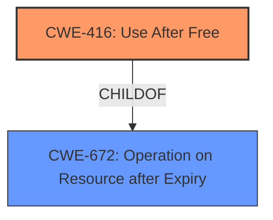

# Analysis Report for CVE-2022-0971

# Vulnerability Analysis Report: CVE-2022-0971

## Description

Use after free in Blink Layout in Google Chrome on Android prior to 99.0.4844.74 allowed a remote attacker who had compromised the renderer process to potentially exploit heap corruption via a crafted HTML page.

## Vulnerability Description Key Phrases

**Rootcause:** use after free
**Weakness:** heap corruption
**Vector:** crafted HTML page
**Attacker:** remote attacker who had compromised the renderer process
**Product:** Google Chrome on Android
**Version:** prior to 99.0.4844.74
**Component:** Blink Layout

## Analysis (with Relationship Data)

# Summary
| CWE ID | CWE Name | Confidence | CWE Abstraction Level | CWE Vulnerability Mapping Label | CWE-Vulnerability Mapping Notes |
|---|---|---|---|---|---|
| CWE-416 | Use After Free | 1.0 | Variant | Allowed | Primary CWE |

## Evidence and Confidence

*   **Confidence Score:** 1.0
*   **Evidence Strength:** HIGH

- **Analysis and Justification:**
  - *Explanation:* The vulnerability description explicitly states "**use after free**" as the **rootcause**, which directly corresponds to CWE-416 (Use After Free). The description also indicates that the vulnerability leads to "**heap corruption**," further supporting the selection of CWE-416. The CVE Reference Links Content Summary confirms the root cause as "Use after free" within the Blink Layout component. The mapping guidance for CWE-416 indicates that its usage is ALLOWED, making it the most appropriate choice.
  
  - *Relationship Analysis:* CWE-416 is a variant of CWE-672 (Operation on Resource after Expiry). While CWE-672 is a broader category, the specific mention of "Use After Free" allows for a more precise mapping to CWE-416. No other CWEs from the retriever results appear to be a better fit than CWE-416.

- **Confidence Score:**
  - Confidence: 1.0 (Direct evidence from vulnerability description and CVE details).

## Criticism of Analysis

## Critique of the Analysis

The analysis provided is accurate and well-justified, leading to a correct mapping to CWE-416 (Use After Free). The confidence score of 1.0 is appropriate given the explicit mention of "use after free" in the vulnerability description.

Here's a breakdown of the strengths and potential areas for slight improvement:

**Strengths:**

*   **Correct Identification:** The primary CWE match of CWE-416 is accurate and well-supported by the vulnerability description and CVE details.
*   **Strong Justification:** The analysis clearly explains why CWE-416 is the most suitable choice, emphasizing the explicit mention of "use after free" and the resulting "heap corruption."
*   **Relationship Analysis:** The discussion of the relationship between CWE-416 and CWE-672 demonstrates a good understanding of the CWE hierarchy and why a more specific mapping is preferred.
*   **Comprehensive CWE Details:**  The inclusion of full CWE specifications for all referenced CWEs provides valuable context and allows for a thorough understanding of the weakness.
*   **Consideration of Retriever Results:** The analysis acknowledges the retriever results and explains why other CWEs are not a better fit.
*   **High Confidence:** The high confidence score reflects the direct evidence available.

**Potential Areas for Slight Improvement:**

*   **Elaboration on Heap Corruption:** While the analysis mentions "heap corruption," it could benefit from a brief explanation of how a use-after-free can lead to heap corruption, perhaps connecting it to the potential for arbitrary code execution.  A brief link to CWE-787 (Out-of-bounds Write) or CWE-122 (Heap-based Buffer Overflow) as potential consequences of the UAF could be considered, but only if they can be strongly linked as *possible* outcomes, not as a necessary co-occurrence.
*   **Mitigations Specific to the Context:** The provided mitigations from CWE-416 (Language Selection and Setting Pointers to NULL) are general.  While appropriate, the analysis *could* briefly mention mitigations specific to the Blink Layout component or Chromium, such as rigorous code review, fuzzing, and address sanitizer (ASan) usage, although the benefit of doing so is marginal.
*   **Negative Constraints:**  Explicitly stating why other CWEs like CWE-787 or CWE-122 (even if only briefly) are *not* the primary weakness could strengthen the analysis. In this case, while heap corruption is a *potential consequence*, the root cause is the UAF, not a direct out-of-bounds write.

**Detailed Review of Retriever Results and CWE Specifications:**

*   **CWE-416 (Use After Free):**  The analysis correctly identifies this as the primary CWE.  The mapping guidance ("Usage: Allowed") and the description ("The product reuses or references memory after it has been freed") directly support this choice.
*   **CWE-366 (Race Condition within a Thread):** While race conditions can *lead* to UAF, there's no inherent race condition implied in the provided vulnerability description. It's not directly related to the root cause.
*   **CWE-843 (Access of Resource Using Incompatible Type ('Type Confusion')):** Type confusion isn't mentioned, and there's no indication that the memory is being accessed with an incompatible type.
*   **CWE-415 (Double Free):** Double free is not the stated problem. It's a different type of memory management error.
*   **CWE-1021 (Improper Restriction of Rendered UI Layers or Frames):** This is completely irrelevant to the vulnerability description. It concerns UI redress attacks like clickjacking.
*   **CWE-122 (Heap-based Buffer Overflow):** Heap corruption can be a *result* of a UAF, but the root cause isn't a direct buffer overflow. The vulnerability description focuses on the use of freed memory, not the writing of data beyond buffer boundaries.
*   **CWE-356 (Product UI does not Warn User of Unsafe Actions):**  Irrelevant. The vulnerability is a memory management issue, not a UI-related problem.
*   **CWE-190 (Integer Overflow or Wraparound):** No indication of an integer overflow.
*   **CWE-367 (Time-of-check Time-of-use (TOCTOU) Race Condition):** Similar to CWE-366, a TOCTOU is a type of race condition, but the vulnerability description doesn't suggest this specific scenario.
*   **CWE-362 (Concurrent Execution using Shared Resource with Improper Synchronization ('Race Condition')):** Same reasoning as CWE-366 and CWE-367. The general race condition classification is too broad.

**In conclusion:**

The analysis is well-executed and arrives at the correct conclusion. The suggested improvements are minor and aim to provide even greater context and clarity. The high confidence score of 1.0 is justified.

## Final Resolution

# Summary
| CWE ID | CWE Name | Confidence | CWE Abstraction Level | CWE Vulnerability Mapping Label | CWE-Vulnerability Mapping Notes |
|---|---|---|---|---|---|
| **CWE-416** | **Use After Free** | 1.0 | Variant | Allowed | Primary CWE |

## Evidence and Confidence

*   **Confidence Score:** 1.0
*   **Evidence Strength:** HIGH

## Relationship Analysis
The primary relationship considered was the parent-child relationship between CWE-416 (**Use After Free**) and its parent classes. While CWE-672 (Operation on Resource after Expiry) is a parent, CWE-416 provides a more specific classification that aligns directly with the vulnerability description. There are no chain relationships immediately relevant to this single CWE assignment.

## Vulnerability Chain
The vulnerability chain starts with the **rootcause**, which is the **use after free** condition (CWE-416). This allows a remote attacker to potentially exploit heap corruption. The impact is heap corruption, potentially leading to arbitrary code execution.

## Summary of Analysis
The initial analysis and the provided criticism both align in their assessment that **CWE-416** (**Use After Free**) is the most appropriate classification. The vulnerability description explicitly mentions "**use after free**," providing direct evidence for this classification. The analysis also correctly notes that the vulnerability leads to "**heap corruption**," which is a common consequence of **use after free** vulnerabilities. The mapping guidance for **CWE-416** indicates that its usage is ALLOWED, further solidifying its selection.

The relationship analysis confirms that while broader categories exist, **CWE-416** provides the optimal level of specificity. The criticism suggests elaborating on the connection to heap corruption and potential mitigations. However, it ultimately agrees with the initial assessment's conclusion.

The final determination is to classify this vulnerability as **CWE-416** (**Use After Free**) with a confidence score of 1.0, based on the direct evidence from the vulnerability description. The selection of **CWE-416** is at the optimal level of specificity.

*Report generated on 2025-03-18 06:28:10*
