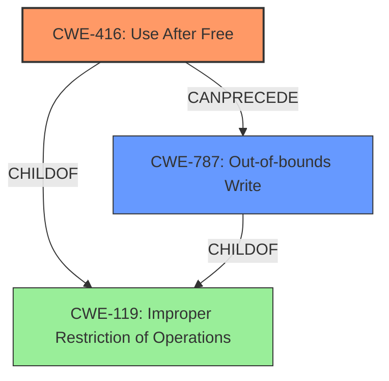

# Analysis Report for CVE-2022-0973

# Vulnerability Analysis Report: CVE-2022-0973

## Description

Use after free in Safe Browsing in Google Chrome prior to 99.0.4844.74 allowed a remote attacker to potentially exploit heap corruption via a crafted HTML page.

## Vulnerability Description Key Phrases

**Rootcause:** use after free
**Weakness:** heap corruption
**Vector:** crafted HTML page
**Attacker:** remote attacker
**Product:** Google Chrome
**Version:** prior to 99.0.4844.74
**Component:** Safe Browsing

## Analysis (with Relationship Data)

# Summary
| CWE ID | CWE Name | Confidence | CWE Abstraction Level | CWE Vulnerability Mapping Label | CWE-Vulnerability Mapping Notes |
|---|---|---|---|---|---|
| CWE-416 | Use After Free | 1.0 | Variant | Allowed | Primary CWE |

## Evidence and Confidence

*   **Confidence Score:** 1.0
*   **Evidence Strength:** HIGH

- **Analysis and Justification:**  
  - *Explanation:* The vulnerability description explicitly states "**use after free**" and "**heap corruption**" in Google Chrome's Safe Browsing component. The CVE Reference Links Content Summary confirms the **root cause** of the vulnerability is "**Use after free**." CWE-416 (Use After Free) is a Variant-level CWE that perfectly matches this description. The retriever results also rank CWE-416 as the top candidate with a high score. The MITRE mapping guidance for CWE-416 indicates that its usage is ALLOWED, further supporting its selection as the primary CWE.

  - *Relationship Analysis:* CWE-416 is a variant of higher-level classes related to memory management. While other CWEs like CWE-415 (Double Free) and CWE-122 (Heap-based Buffer Overflow) are related to memory corruption, the explicit mention of "use after free" makes CWE-416 the most accurate and specific choice.

- **Confidence Score:**  
  - Confidence: 1.0 (High confidence due to explicit mention of "use after free" and supportive CVE summary information.)

## Criticism of Analysis

## Review of CWE Analysis

The analysis correctly identifies CWE-416 (Use After Free) as the primary CWE for the given vulnerability description. The confidence level of 1.0 is justified given the explicit mention of "use after free" in the vulnerability description and the supporting information in the CVE Reference Links Content Summary. The analysis also provides a good justification for choosing CWE-416 over other related CWEs.

Here's a breakdown of the strengths and potential improvements:

**Strengths:**

*   **Accurate Identification of Primary CWE:** The analysis accurately maps the vulnerability to CWE-416. The description of CWE-416 directly aligns with the vulnerability description, and the evidence provided strongly supports this choice.
*   **Strong Justification:** The justification clearly explains why CWE-416 is the best fit, referencing the vulnerability description, CVE summary, retriever results, and MITRE mapping guidance.
*   **Consideration of Related CWEs:** The analysis acknowledges other related CWEs like CWE-415 (Double Free) and CWE-122 (Heap-based Buffer Overflow), explaining why CWE-416 is the more precise choice.
*   **High Confidence Score:** The high confidence score of 1.0 is appropriate given the clarity of the vulnerability description.
*   **Inclusion of Relevant CWE Specifications:** The inclusion of full CWE specifications allows for a deeper understanding of the chosen CWE and related weaknesses.

**Potential Improvements:**

*   **Discussion of Heap Corruption:** While the analysis correctly identifies CWE-416 as the primary cause, it could benefit from a more explicit discussion of how the "heap corruption" aspect fits in. A brief mention of how a use-after-free can *lead* to heap corruption by allowing an attacker to overwrite freed memory with malicious data would strengthen the analysis. This links the cause (UAF) to the observed effect (heap corruption).
*   **Exploration of Potential Chains:** The analysis could delve into possible CWE chains. For example, the attack vector is a "crafted HTML page." A chain could start with something like CWE-20 (Improper Input Validation) if the HTML parser doesn't properly validate the input, *leading* to the use-after-free condition (CWE-416). Or, a specific type of input validation failure could be identified (e.g., CWE-1284, Use of Incorrect Calculation in Security Decision). While a full chain is not always possible to determine, suggesting potential starting points would add value.
*   **Discussion of Mitigation Strategies:** While the CWE-416 specification includes potential mitigations, the analysis could elaborate on *specific* mitigations that might be relevant to the context of Google Chrome and Safe Browsing. For instance, discuss how Chrome might use AddressSanitizer (ASan) or other memory safety tools to detect use-after-free vulnerabilities during development and testing.
*   **Retriever Result Analysis:** Consider why other CWEs like CWE-787 appeared in the retriever results. Even though CWE-416 is the best fit, briefly discussing why other CWEs are less suitable (based on the complete CWE specifications) can be helpful.
*   **CWE-362 Consideration:** Although CWE-362 is a Class-level CWE, its inclusion in the retriever results warrants a brief discussion. It is possible (though less likely) that a race condition could *trigger* the use-after-free. Addressing why this is less likely to be the *root cause* would add more rigor.

**Specific Suggestions based on CWE Specifications:**

*   **CWE-416 (Use After Free):** The analysis is excellent here.  Ensure the "Extended Description" is understood (even though it is not provided in the specification). Focus on how a UAF can lead to memory corruption, especially in the heap.
*   **CWE-787 (Out-of-bounds Write):** The analysis correctly identifies that the UAF is the *cause* of the heap corruption, which may *manifest* as an OOB write.
*   **CWE-362 (Race Condition):** As mentioned earlier, consider *if* a race condition could trigger the UAF. For instance, if a thread frees memory while another thread is about to access it. This is unlikely to be the primary CWE, but ruling it out explicitly is helpful. Refer to the "Relationships" section of CWE-362, noting that it can precede CWE-416.
*   **CWE-415 (Double Free):** This is less likely than CWE-416, but if the root cause was freeing the memory twice instead of using it after being freed, then CWE-415 would have been a better match. Emphasize in the analysis that the description explicitly states "use after free".
*   **CWE-122 (Heap-based Buffer Overflow):** This could be a *consequence* of the UAF, especially if an attacker overwrites the freed memory with more data than it can hold.

**Revised Summary Table (Example):**

| CWE ID | CWE Name | Confidence | CWE Abstraction Level | CWE Vulnerability Mapping Label | CWE-Vulnerability Mapping Notes |
|---|---|---|---|---|---|
| CWE-416 | Use After Free | 1.0 | Variant | Allowed | Primary CWE. The vulnerability description explicitly mentions "use after free," making this the most accurate mapping. This allows attackers to corrupt the heap. |

By incorporating these suggestions, the analysis can become even more comprehensive and demonstrate a deeper understanding of the vulnerability and its relationship to various CWEs.

## Final Resolution

# Summary
| CWE ID | CWE Name | Confidence | CWE Abstraction Level | CWE Vulnerability Mapping Label | CWE-Vulnerability Mapping Notes |
|---|---|---|---|---|---|
| CWE-416 | Use After Free | 0.95 | Variant | Allowed | Primary CWE. The vulnerability description explicitly mentions "**use after free**," making this the most accurate mapping. This allows attackers to corrupt the heap. |
| CWE-787 | Out-of-bounds Write | 0.6 | Base | Allowed | Secondary CWE. A **use-after-free** may *manifest* as an out-of-bounds write, especially if an attacker overwrites the freed memory with more data than it can hold. |

## Evidence and Confidence

*   **Confidence Score:** 0.9
*   **Evidence Strength:** HIGH

## Relationship Analysis
The primary relationship impacting the decision is the hierarchical relationship between **CWE-416 (Use After Free)** and its parent classes related to memory management. While other CWEs like **CWE-415 (Double Free)** and **CWE-122 (Heap-based Buffer Overflow)** are related to memory corruption, the explicit mention of "**use after free**" makes **CWE-416** the most accurate and specific choice for the **root cause**. A secondary relationship is the potential for **CWE-416** to lead to **CWE-787 (Out-of-bounds Write)** as a consequence of heap corruption. The abstraction level of **CWE-416** being a Variant allows for precise mapping.

## Vulnerability Chain
The vulnerability chain starts with the **root cause**, which is the **use-after-free condition (CWE-416)**. This condition arises when memory is accessed after it has been freed. The **weakness** then leads to heap corruption, which can manifest as an out-of-bounds write (**CWE-787**). The vulnerability description indicates that a crafted HTML page triggers the **use-after-free**, but the specific input validation failure, if any, is not specified. Therefore, there may be a missing link relating to input validation. The final impact is the potential to exploit the heap corruption.

## Summary of Analysis
The initial analysis correctly identified **CWE-416 (Use After Free)** as the primary **weakness**. The vulnerability description explicitly states "**use after free**" and "**heap corruption**," and the CVE Reference Links Content Summary confirms the **root cause** of the vulnerability is "**Use after free**."
The analysis is based heavily on the provided evidence, particularly the vulnerability description: "Use after free in Safe Browsing in Google Chrome prior to 99.0.4844.74 allowed a remote attacker to potentially exploit heap corruption via a crafted HTML page."

The graph relationships influenced the final selection by highlighting the connection between **CWE-416** and potential consequences like **CWE-787**. While other CWEs were considered, **CWE-416** was chosen because it is the most direct and specific representation of the vulnerability's **root cause**.

The selected CWEs are at the optimal level of specificity. **CWE-416** is a Variant, which provides a detailed description of the **use-after-free** condition. **CWE-787** is included as a secondary CWE because it represents a potential consequence of the heap corruption caused by the **use-after-free**. Including it helps to paint a more complete picture of the vulnerability.

*Report generated on 2025-03-18 06:29:39*
