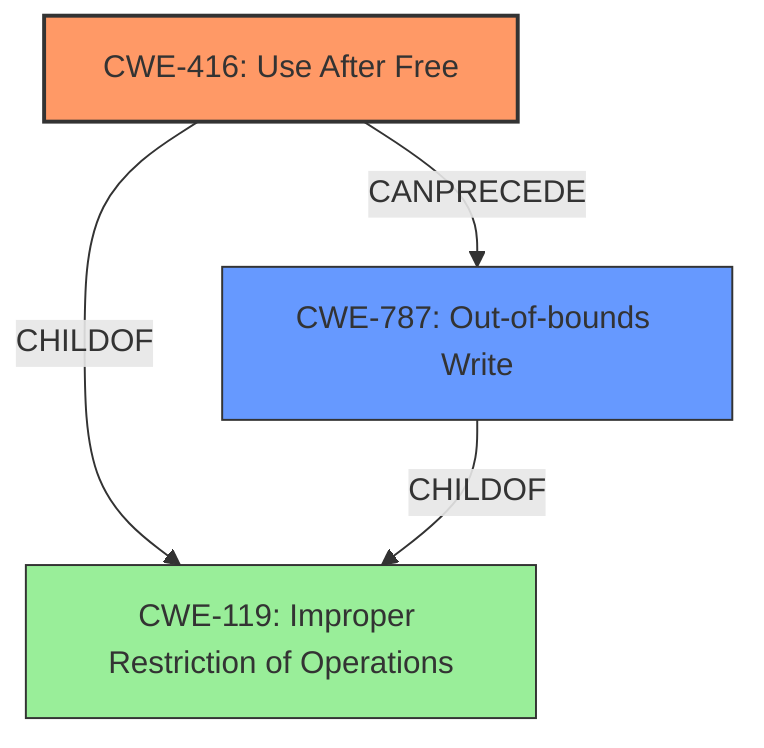

# Final Resolution for CVE-2022-0973

# Summary
| CWE ID | CWE Name | Confidence | CWE Abstraction Level | CWE Vulnerability Mapping Label | CWE-Vulnerability Mapping Notes |
|---|---|---|---|---|---|
| CWE-416 | Use After Free | 0.95 | Variant | Allowed | Primary CWE. The vulnerability description explicitly mentions "**use after free**," making this the most accurate mapping. This allows attackers to corrupt the heap. |
| CWE-787 | Out-of-bounds Write | 0.6 | Base | Allowed | Secondary CWE. A **use-after-free** may *manifest* as an out-of-bounds write, especially if an attacker overwrites the freed memory with more data than it can hold. |

## Evidence and Confidence

*   **Confidence Score:** 0.9
*   **Evidence Strength:** HIGH

## Relationship Analysis
The primary relationship impacting the decision is the hierarchical relationship between **CWE-416 (Use After Free)** and its parent classes related to memory management. While other CWEs like **CWE-415 (Double Free)** and **CWE-122 (Heap-based Buffer Overflow)** are related to memory corruption, the explicit mention of "**use after free**" makes **CWE-416** the most accurate and specific choice for the **root cause**. A secondary relationship is the potential for **CWE-416** to lead to **CWE-787 (Out-of-bounds Write)** as a consequence of heap corruption. The abstraction level of **CWE-416** being a Variant allows for precise mapping.

## Vulnerability Chain
The vulnerability chain starts with the **root cause**, which is the **use-after-free condition (CWE-416)**. This condition arises when memory is accessed after it has been freed. The **weakness** then leads to heap corruption, which can manifest as an out-of-bounds write (**CWE-787**). The vulnerability description indicates that a crafted HTML page triggers the **use-after-free**, but the specific input validation failure, if any, is not specified. Therefore, there may be a missing link relating to input validation. The final impact is the potential to exploit the heap corruption.

## Summary of Analysis
The initial analysis correctly identified **CWE-416 (Use After Free)** as the primary **weakness**. The vulnerability description explicitly states "**use after free**" and "**heap corruption**," and the CVE Reference Links Content Summary confirms the **root cause** of the vulnerability is "**Use after free**."
The analysis is based heavily on the provided evidence, particularly the vulnerability description: "Use after free in Safe Browsing in Google Chrome prior to 99.0.4844.74 allowed a remote attacker to potentially exploit heap corruption via a crafted HTML page."

The graph relationships influenced the final selection by highlighting the connection between **CWE-416** and potential consequences like **CWE-787**. While other CWEs were considered, **CWE-416** was chosen because it is the most direct and specific representation of the vulnerability's **root cause**.

The selected CWEs are at the optimal level of specificity. **CWE-416** is a Variant, which provides a detailed description of the **use-after-free** condition. **CWE-787** is included as a secondary CWE because it represents a potential consequence of the heap corruption caused by the **use-after-free**. Including it helps to paint a more complete picture of the vulnerability.