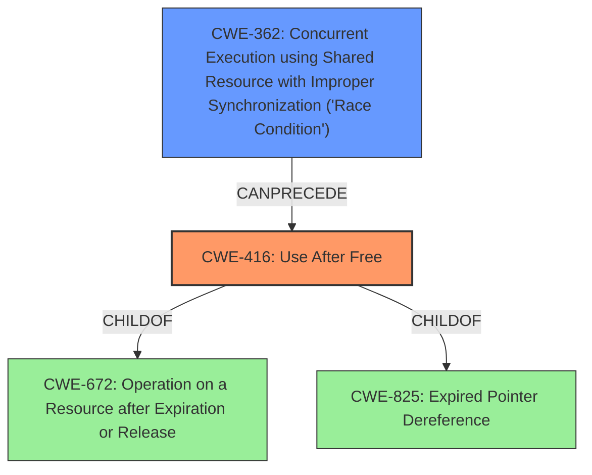

# Final Resolution for CVE-2022-0974

# Summary
| CWE ID | CWE Name | Confidence | CWE Abstraction Level | CWE Vulnerability Mapping Label | CWE-Vulnerability Mapping Notes |
|---|---|---|---|---|---|
| CWE-416 | Use After Free | 1.0 | Variant | Allowed | Primary CWE |
| CWE-362 | Concurrent Execution using Shared Resource with Improper Synchronization ('Race Condition') | 0.3 | Class | Allowed-with-Review | Secondary Candidate |

## Evidence and Confidence

*   **Confidence Score:** 0.9
*   **Evidence Strength:** MEDIUM

## Relationship Analysis
The primary CWE is CWE-416 (**Use After Free**) which is a variant of CWE-672 (**Operation on a Resource after Expiration or Release**) and CWE-825 (**Expired Pointer Dereference**). The analysis considered the 'CanFollow' relationships of CWE-416. While the description doesn't explicitly mention a race condition, it's possible that concurrency could play a role in triggering or exploiting the UAF, so CWE-362 (**Concurrent Execution using Shared Resource with Improper Synchronization ('Race Condition')**) is considered as a secondary candidate.

## Vulnerability Chain
The vulnerability chain starts with a **Use After Free (CWE-416)**. The exploitation of this **WEAKNESS** leads to **heap corruption**, which can be exploited by a remote attacker who convinces a user to engage in specific user interaction to potentially exploit heap corruption via a crafted HTML page. The absence of proper synchronization (potential **CWE-362**) could exacerbate the UAF by creating a scenario where a resource is freed by one thread while another thread is still attempting to access it.

## Summary of Analysis
The initial analysis correctly identified **CWE-416 (Use After Free)** as the primary **ROOTCAUSE**. The vulnerability description explicitly states "use after free" and indicates potential **heap corruption**, which aligns precisely with CWE-416.

The criticism provided valuable insights, particularly in considering alternative CWEs and exploring the "CanFollow" relationships. The analysis has been updated to explicitly address the possibility of a race condition (CWE-362) contributing to the UAF, even though it's not explicitly mentioned in the vulnerability description. Acknowledging and explicitly ruling out possibilities makes the analysis more robust.

The primary reason for selecting **CWE-416 (Use After Free)** is the direct match with the vulnerability description and the evidence supporting it. While other CWEs were considered, they were deemed less specific or not directly supported by the available information.
The analysis now includes a secondary candidate CWE, **CWE-362 (Concurrent Execution using Shared Resource with Improper Synchronization ('Race Condition'))**. This addition acknowledges the potential, albeit unconfirmed, role of concurrency in triggering or exploiting the UAF. While there's no explicit evidence of a race condition, the "CanFollow" relationship between CWE-362 and CWE-416, combined with the mention of heap corruption, makes it a plausible contributing factor.
The final decision is based on a combination of direct evidence (the "use after free" statement) and relationship analysis (the potential role of concurrency).
The selected CWEs are at the optimal level of specificity because **CWE-416 (Use After Free)** is a variant-level CWE that accurately captures the specific **WEAKNESS**. **CWE-362 (Concurrent Execution using Shared Resource with Improper Synchronization ('Race Condition'))** is included as a secondary candidate to account for potential concurrency issues, but it's classified as a Class-level CWE due to the lack of explicit evidence.