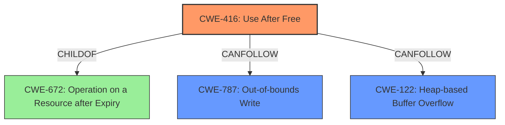

# Final Resolution for CVE-2022-0975

# Summary
| CWE ID | CWE Name | Confidence | CWE Abstraction Level | CWE Vulnerability Mapping Label | CWE-Vulnerability Mapping Notes |
|---|---|---|---|---|---|
| CWE-416 | Use After Free | 1.0 | Variant | Allowed | Primary **WEAKNESS**. Explicitly mentioned in vulnerability description. |
| CWE-787 | Out-of-bounds Write | 0.5 | Base | Consequence | Possible consequence if attacker can control the reallocated memory. Chain: CWE-416 -> CWE-787 |
| CWE-122 | Heap-based Buffer Overflow | 0.5 | Variant | Consequence | Possible consequence if attacker can control the reallocated memory. Chain: CWE-416 -> CWE-122 |

## Evidence and Confidence

*   **Confidence Score:** 0.95
*   **Evidence Strength:** HIGH

## Relationship Analysis
The primary relationship influencing the classification is the hierarchical relationship where CWE-416 is a variant of CWE-672 (Operation on a Resource after Expiry). The chain relationships, specifically CANPRECEDE and CANFOLLOW, were considered when adding CWE-787 and CWE-122 as potential consequences of CWE-416. The abstraction levels (Variant for CWE-416, Base for CWE-787, and Variant for CWE-122) helped ensure the most specific and relevant classifications were chosen. Peer relationships were considered, especially with CWE-415 (Double Free) and CWE-843 (Type Confusion), but they were deemed less directly relevant than CWE-416 based on the vulnerability description.

## Vulnerability Chain
The vulnerability chain starts with the **ROOTCAUSE** of a **use-after-free** condition (CWE-416). This occurs when memory is accessed after it has been freed. The immediate consequence is potential **heap corruption**. If an attacker can influence the contents of the reallocated memory, this can lead to further exploitation via CWE-787 (Out-of-bounds Write) or CWE-122 (Heap-based Buffer Overflow), ultimately enabling remote code execution.

## Summary of Analysis
The initial analysis correctly identified CWE-416 as the primary **WEAKNESS** based on the explicit statement "**use after free** in ANGLE in Google Chrome prior to 99.0.4844.74 allowed a remote attacker to potentially exploit **heap corruption** via a crafted HTML page." The criticism provided valuable suggestions for strengthening the analysis by considering potential vulnerability chains.

The graph relationships influenced the final selection by highlighting potential consequences of the primary **WEAKNESS**. The inclusion of CWE-787 and CWE-122 as secondary CWEs reflects the understanding that exploiting a **use-after-free** condition can lead to further memory corruption vulnerabilities.

The selected CWEs are at the optimal level of specificity. CWE-416 (Use After Free) is a Variant, providing a specific description of the **WEAKNESS**. CWE-787 (Out-of-bounds Write) and CWE-122 (Heap-based Buffer Overflow) are at the Base and Variant levels, respectively, offering relevant potential consequences of the **ROOTCAUSE**. The decision to include CWE-787 and CWE-122 as possible consequences is based on the fact that "**heap corruption**" is mentioned in the original description. If an attacker can influence the contents of reallocated memory then those are possible consequences.