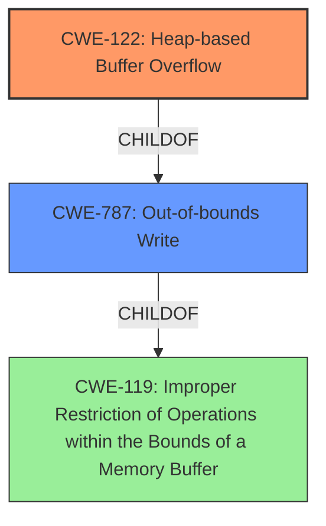

# Final Resolution for CVE-2022-0976

# Summary
| CWE ID | CWE Name | Confidence | CWE Abstraction Level | CWE Vulnerability Mapping Label | CWE-Vulnerability Mapping Notes |
|---|---|---|---|---|---|
| CWE-122 | Heap-based Buffer Overflow | 0.95 | Variant | Primary | The vulnerability description explicitly states a "Heap buffer overflow" making this a direct match. |
| CWE-787 | Out-of-bounds Write | 0.75 | Base | Secondary | A buffer overflow is a specific instance of an out-of-bounds write. While less specific than CWE-122, it represents the broader class of the **weakness**. |

## Evidence and Confidence

*   **Confidence Score:** 0.93
*   **Evidence Strength:** HIGH

## Relationship Analysis
The primary relationship influencing the decision is the hierarchical relationship between CWE-787 (**Out-of-bounds Write**) and CWE-122 (**Heap-based Buffer Overflow**). CWE-122 is a specific type of CWE-787, focusing on heap-based overflows. The choice of CWE-122 is driven by the explicit mention of "heap buffer overflow" in the vulnerability description, making it a more precise classification than its parent. While CWE-119 (**Improper Restriction of Operations within the Bounds of a Memory Buffer**) is a parent of both, its "Discouraged" usage and the availability of more specific CWEs made it less suitable.

## Vulnerability Chain
The vulnerability chain starts with a crafted HTML page. This leads to a **buffer overflow** in the GPU component's heap, as indicated by the vulnerability description. The **root cause** is the lack of proper bounds checking when processing data from the HTML page within the GPU component. This results in an **out-of-bounds write**, specifically a **heap-based buffer overflow (CWE-122)**. The impact is potential heap corruption, which could lead to arbitrary code execution.

## Summary of Analysis
The initial analysis accurately identified CWE-122 (**Heap-based Buffer Overflow**) as the primary **weakness**, supported by the explicit mention of "Heap buffer overflow in GPU" in the vulnerability description. The criticism suggested considering the mapping guidance for CWE-119 (**Improper Restriction of Operations within the Bounds of a Memory Buffer**), which is "Discouraged" when more specific CWEs are available, reinforcing the choice of CWE-122. The criticism also suggested explaining why other retriever-suggested CWEs were rejected.

*   CWE-843 (**Access of Resource Using Incompatible Type ('Type Confusion')**) was rejected because the description focuses on overflowing a buffer, not on misinterpreting the data type of the buffer.
*   CWE-190 (**Integer Overflow or Wraparound**) was rejected because there is no explicit mention of integer overflows or wraparounds in the provided data.
*   CWE-124 (**Buffer Underwrite ('Buffer Underflow')**) and CWE-125 (**Out-of-bounds Read**) were rejected because the description clearly states a **buffer overflow**, a write past the end of the buffer, not a read problem or an underwrite.
*   CWE-366 (**Race Condition within a Thread**) was rejected because it is related to multi-threaded applications, and there is nothing to suggest this instance is related.

The graph relationships influenced the final selection by highlighting the importance of choosing the most specific CWE available. The hierarchical relationship between CWE-787 (**Out-of-bounds Write**) and CWE-122 (**Heap-based Buffer Overflow**) made it clear that CWE-122 was the optimal choice due to its specificity.
The chosen CWEs are at the optimal level of specificity because CWE-122 accurately describes the heap-based nature of the **buffer overflow**, providing more precision than its parent, CWE-787. This level of detail is crucial for effective mitigation and remediation efforts.