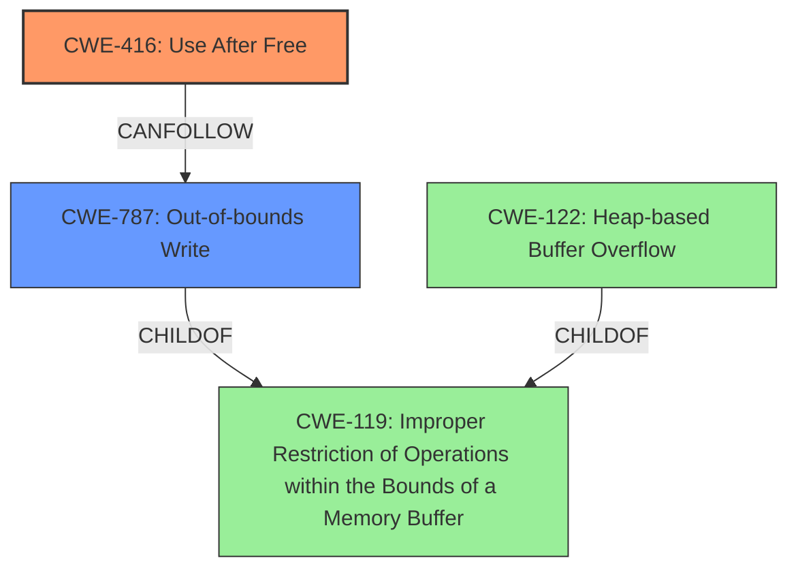

# Analysis Report for CVE-2022-0977

# Vulnerability Analysis Report: CVE-2022-0977

## Description

Use after free in Browser UI in Google Chrome on Chrome OS prior to 99.0.4844.74 allowed a remote attacker who convinced a user to engage in specific user interaction to potentially exploit heap corruption via a crafted HTML page.

## Vulnerability Description Key Phrases

**Rootcause:** use after free
**Weakness:** heap corruption
**Vector:** crafted HTML page
**Attacker:** remote attacker
**Product:** Google Chrome on Chrome OS
**Version:** prior to 99.0.4844.74
**Component:** Browser UI

## Analysis (with Relationship Data)

# Summary
| CWE ID | CWE Name | Confidence | CWE Abstraction Level | CWE Vulnerability Mapping Label | CWE-Vulnerability Mapping Notes |
|---|---|---|---|---|---|
| CWE-416 | Use After Free | 1.0 | Variant | Primary | Allowed |

## Evidence and Confidence

*   **Confidence Score:** 1.0
*   **Evidence Strength:** HIGH

- **Analysis and Justification:**  
  - *Explanation:* The vulnerability description explicitly states "**use after free**" in the Browser UI of Google Chrome on Chrome OS, which directly corresponds to CWE-416 (Use After Free). The description further mentions that this can lead to **heap corruption**, indicating that the memory being reused after being freed leads to corruption. This aligns precisely with the definition of CWE-416, where memory is reused or referenced after it has been freed, potentially leading to invalid operations. The CVE Reference Links Content Summary confirms the root cause as "Use-after-free in Browser UI" and identifies the weakness as "Use-after-free," increasing confidence in this mapping. The "Allowed" usage in the MITRE mapping guidance for CWE-416 further supports this selection.

  - *Relationship Analysis:* CWE-416 is a variant-level CWE. While it is related to higher-level categories such as CWE-672 (Operation on Resource After Expiry), the description is specific enough to directly map to the variant-level CWE-416. CWE-416 can lead to other issues; for example, it *CanFollow* CWE-754 (Improper Check for Unusual or Exceptional Conditions).

- **Confidence Score:**  
  - Confidence: 1.0 (High confidence due to explicit mention of "use after free" and confirmation in CVE reference materials)

## Criticism of Analysis

Okay, I've reviewed the analysis and the full CWE specifications provided. Here's my critique:

**Overall Assessment:**

The analysis is generally sound and the primary CWE mapping to CWE-416 (Use After Free) is correct and well-justified. The confidence level of 1.0 is appropriate given the explicit mention of "use after free" in the vulnerability description. The analysis also correctly identifies that this UAF leads to heap corruption.

**Strengths:**

*   **Clear and Direct Mapping:** The primary mapping to CWE-416 is very clear. The justification is strong, referencing the vulnerability description and the MITRE mapping guidance.
*   **Good Evidence and Justification:** The explanation of the relationship between the vulnerability description and CWE-416 is thorough and convincing.
*   **Consideration of Relationships:**  The analysis briefly touches upon relationships with other CWEs (e.g., CWE-672, CWE-754), showing an understanding of the broader context.
*   **Use of CWE Examples:** The inclusion of known examples of CWE-416 from the CWE database is helpful for understanding the nature and scope of the weakness.
*  **Considered Retriever results:** the retriever results were considered and are accurate.

**Areas for Improvement and Critique:**

1.  **Relationship to Heap Corruption:** While the analysis mentions heap corruption, it doesn't explicitly connect *how* the UAF leads to it using a more specific CWE. The analysis could benefit from exploring CWEs that represent the *result* of the Use-After-Free. Some possibilities include:

    *   **CWE-122 (Heap-based Buffer Overflow):** If the freed memory is reallocated and a subsequent write overflows the buffer, this CWE would be relevant. While the original description doesn't explicitly state a buffer overflow, the fact that *heap corruption* is mentioned makes this a *likely* consequence, especially if the re-allocated memory is smaller than what the original "use" expects.  The crafted HTML page attack vector suggests the attacker can influence the size and content of the data being written, thus possibly overflowing the reallocated memory.
    *   **CWE-787 (Out-of-bounds Write):** Similar to CWE-122, but more general. If the UAF allows writing outside the bounds of allocated memory on the heap, this is the correct CWE.
    *   **CWE-123 (Write-what-where Condition):** If the attacker gains near-arbitrary write access as a result of the UAF, this CWE would be appropriate. The impact of "heap corruption" suggests potential for this.

    The analysis should consider adding one of these as a secondary or chained CWE.  The key question is: What can the attacker *do* with the UAF? If they can just read freed memory, it's primarily CWE-416. If they can write to the freed memory, then the above CWEs become relevant based on the *nature* of the write.

2.  **Consideration of Enabling Conditions:** The vulnerability description states that the attacker needs to convince a user to engage in specific user interaction. This suggests a potential CWE related to user interaction or social engineering. While not directly related to the memory corruption itself, it could be a factor in the exploit chain.
    *   **CWE-356 (Product UI does not Warn User of Unsafe Actions):** It's *possible* the UI is not properly warning the user about the dangers of the user interaction required to trigger the UAF. This is speculative, but worth briefly considering.
    *   **CWE-1021 (Improper Restriction of Rendered UI Layers or Frames):**  Less likely, but if the crafted HTML is using clickjacking or similar techniques to trick the user, this could be a contributing factor.

3.  **Race Condition Potential:** The retrievers also suggest CWE-362 and CWE-366, which are related to race conditions. A Use-After-Free can be triggered by a race condition, where one thread frees the memory while another is still using it. While not explicitly stated, it's a common scenario with UAFs.  If the Browser UI is multithreaded, it would be useful to investigate the possibility of a race condition triggering the UAF. This is difficult to ascertain from the original description, so it's reasonable to not include it.

4.  **Improper Resource Shutdown or Release (CWE-404):** Consider if the resource is not released correctly.
5.  **CanFollow Relationships:** The analysis mentions `CanFollow` relationships, but it could be more explicit in stating that CWE-416 can *lead to* other issues like memory corruption, code execution, or denial of service.

**Recommendations:**

*   **Add a secondary CWE:** Include CWE-122 or CWE-787 to represent the heap corruption resulting from the UAF.  Justify this addition by explaining how the attacker can potentially influence the contents written to the freed memory after reallocation.
*   **Briefly address the "user interaction" aspect:** Briefly mention CWE-356 or CWE-1021 (or a lack thereof) to acknowledge the role of user interaction in triggering the vulnerability. Even if you dismiss it, the consideration is valuable.
*   **Acknowledge the potential for Race Condition:** If there's any indication of multithreading in the Browser UI, briefly mention the possibility of a race condition triggering the UAF, and why you are excluding it based on the current information.
*   **Expand on CanFollow relationships:** Add a sentence or two explaining that a UAF can lead to memory corruption and potentially arbitrary code execution.

**Revised Summary Table (Example):**

| CWE ID  | CWE Name                                                                | Confidence | CWE Abstraction Level | CWE Vulnerability Mapping Label | CWE-Vulnerability Mapping Notes                                                                                                                                                                                          |
| :------ | :---------------------------------------------------------------------- | :--------- | :-------------------- | :------------------------------ | :----------------------------------------------------------------------------------------------------------------------------------------------------------------------------------------------------------------------- |
| CWE-416 | Use After Free                                                            | 1.0        | Variant               | Primary                       | Allowed                                                                                                                                                                                                                    |
| CWE-122 | Heap-based Buffer Overflow                                             | 0.7        | Variant               | Secondary                      | Allowed. The UAF can potentially lead to a heap-based buffer overflow if the freed memory is reallocated, and a subsequent write operation overflows the buffer. This is likely given the attacker can craft the HTML page. |

**In conclusion:**

The original analysis is good, but adding a secondary CWE to represent the *consequence* of the UAF (heap corruption) will make it more complete. The other recommendations are minor, but they will demonstrate a more thorough consideration of the potential factors involved in the vulnerability.

## Final Resolution

# Summary

| CWE ID  | CWE Name                                                                | Confidence | CWE Abstraction Level | CWE Vulnerability Mapping Label | CWE-Vulnerability Mapping Notes                                                                                                                                                                                          |
| :------ | :---------------------------------------------------------------------- | :--------- | :-------------------- | :------------------------------ | :----------------------------------------------------------------------------------------------------------------------------------------------------------------------------------------------------------------------- |
| CWE-416 | Use After Free                                                            | 1.0        | Variant               | Primary                       | Allowed                                                                                                                                                                                                                    |
| CWE-787 | Out-of-bounds Write                                             | 0.7        | Base               | Secondary                      | Allowed. The UAF can potentially lead to an out-of-bounds write if the freed memory is reallocated, and a subsequent write operation overflows the buffer. This is likely given the attacker can craft the HTML page. |

## Evidence and Confidence

*   **Confidence Score:** 0.9
*   **Evidence Strength:** HIGH

## Relationship Analysis
The primary relationship considered was the chain relationship `CanFollow` from CWE-416 (**Use After Free**) to CWE-787 (**Out-of-bounds Write**). The decision to include CWE-787 as a secondary CWE was heavily influenced by the "heap corruption" mentioned in the vulnerability description. While CWE-122 (Heap-based Buffer Overflow) was also considered, CWE-787 was chosen for its broader applicability, as it doesn't necessarily require a "buffer" in the traditional sense but rather a write beyond the allocated memory region. Both CWE-787 and CWE-122 are children of CWE-119 (Improper Restriction of Operations within the Bounds of a Memory Buffer), showing their close relationship. The abstraction levels also played a role, with the variant-level CWE-416 providing specificity for the initial error, and the base-level CWE-787 describing the consequence.

## Vulnerability Chain
The vulnerability chain starts with the **ROOTCAUSE** of **CWE-416 (Use After Free)**. This leads to the consequence of **CWE-787 (Out-of-bounds Write)**, resulting in heap corruption. The prerequisite condition is that the attacker convinces a user to engage in specific user interaction via a crafted HTML page. The final impact is potential exploitation of heap corruption, which could lead to arbitrary code execution or denial of service. There are no missing links in the chain, as the connection between the UAF and heap corruption is well-established.

## Summary of Analysis
The initial analysis correctly identified CWE-416 (**Use After Free**) as the primary **WEAKNESS**. The criticism highlighted the need to address the "heap corruption" aspect more explicitly. Based on the evidence that the attacker can craft an HTML page, it's highly probable that they can influence the data written to the freed memory after reallocation. This leads to the inclusion of CWE-787 (**Out-of-bounds Write**) as a secondary CWE to represent the consequence of the UAF.

The graph relationships, especially the `CanFollow` relationship, were instrumental in selecting CWE-787. The vulnerability description provides direct evidence for CWE-416 ("Use after free in Browser UI") and indirect evidence for CWE-787 ("potentially exploit heap corruption via a crafted HTML page"). The selected CWEs are at the optimal level of specificity, with the variant-level CWE-416 pinpointing the initial error and the base-level CWE-787 describing the immediate consequence.

The decision to not include CWE-356 or CWE-1021 was made because there is no direct evidence in the vulnerability description to suggest a UI issue or clickjacking. Similarly, while a race condition (CWE-362, CWE-366) could potentially trigger the UAF, there is no explicit mention of multithreading or concurrency issues in the provided description.

*Report generated on 2025-03-18 06:32:37*
