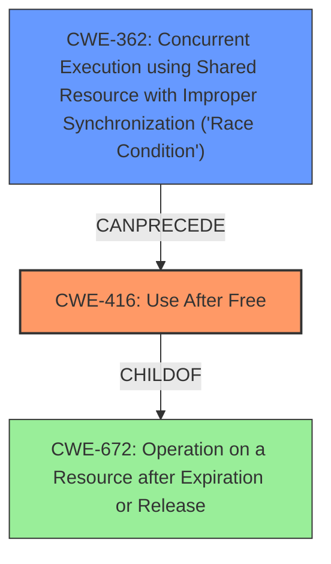

# Analysis Report for CVE-2022-0978

# Vulnerability Analysis Report: CVE-2022-0978

## Description

Use after free in ANGLE in Google Chrome prior to 99.0.4844.74 allowed a remote attacker to potentially exploit heap corruption via a crafted HTML page.

## Vulnerability Description Key Phrases

**Rootcause:** Use after free
**Impact:** heap corruption
**Vector:** crafted HTML page
**Attacker:** remote attacker
**Product:** Google Chrome
**Version:** prior to 99.0.4844.74
**Component:** ANGLE

## Analysis (with Relationship Data)

# Summary
| CWE ID | CWE Name | Confidence | CWE Abstraction Level | CWE Vulnerability Mapping Label | CWE-Vulnerability Mapping Notes |
|---|---|---|---|---|---|
| CWE-416 | Use After Free | 1.0 | Variant | Allowed | Primary CWE |

## Evidence and Confidence

*   **Confidence Score:** 1.0
*   **Evidence Strength:** HIGH

- **Analysis and Justification:**  
  - *Explanation:* The vulnerability description explicitly states "**Use after free**" as the **rootcause**, which directly matches the description of CWE-416 (Use After Free). The description also mentions that this **weakness** can lead to heap corruption. The CVE Reference Links Content Summary reinforces this by stating the **root_cause** as "Use after free," leading to "Remote code execution." The high retriever score for CWE-416 further supports this mapping. CWE-416 is a Variant level CWE, which is a preferred level of abstraction. MITRE mapping guidance for CWE-416 indicates this is ALLOWED for Use After Free vulnerabilities.

  - *Relationship Analysis:* CWE-416 is a variant of CWE-672 (Operation on a Resource after Expiry). It CanFollow CWE-754 (Improper Check for Unusual or Exceptional Conditions), CWE-364 (Signal Handler Race Condition), and CWE-362 (Concurrent Execution using Shared Resource with Improper Synchronization ('Race Condition')).

- **Confidence Score:**  
  - Confidence: 1.0 (Clear evidence from vulnerability description, key phrases, and CVE reference materials)

## Criticism of Analysis

## Critique of the Analysis

The analysis correctly identifies CWE-416 (Use After Free) as the primary CWE for this vulnerability. The confidence score of 1.0 is justified given the explicit mention of "Use after free" in the vulnerability description. The justification is well-articulated, referencing the vulnerability description, key phrases, CVE reference links, and retriever scores. The provided examples and relevant CWE specifications further support the accuracy of the mapping.

Here's a breakdown of strengths and potential areas for improvement:

**Strengths:**

*   **Accurate Identification of Primary CWE:** The core identification of CWE-416 is solid and well-supported.
*   **Clear and Comprehensive Justification:** The reasoning behind the CWE selection is clearly explained, referencing multiple sources of evidence.
*   **Appropriate Abstraction Level:** CWE-416 is a Variant-level CWE, which is the preferred level for root cause analysis.
*   **Consideration of CWE Relationships:** The analysis acknowledges the relationships between CWE-416 and other CWEs (e.g., parent CWEs like CWE-672 and possible CanFollow relationships).
*   **Use of CWE Examples:** The inclusion of known examples for CWE-416 helps illustrate the nature of the vulnerability.
*   **Comprehensive CWE Specifications:** Providing the full CWE specifications allows for thorough review and understanding of related weaknesses, mitigations, and relationships.
*   **Mapping Guidance adherence:** The Analysis follows the mapping guidance described in CWE-416 (Allowed)

**Potential Areas for Improvement:**

1.  **Chain Analysis & Secondary CWEs:**  While the analysis mentions related CWEs, it doesn't explicitly explore potential *chain* relationships that might provide a more complete picture of the vulnerability. Although the main cause is Use-After-Free, it may be caused by another weakness. For example, the retriever results mentioned CWE-362 (Race Condition) and CWE-754 (Improper Check for Exceptional Conditions). Consider whether either of these could be a *preceding* CWE in a chain leading to the Use After Free.

    *   **Example:** If a race condition (CWE-362) leads to the object being freed prematurely in one thread while another thread still holds a reference to it, this would create a chain: `CWE-362 -> CWE-416`. Similarly, the ANGLE component might not correctly check if a resource was released before attempting an operation, resulting in `CWE-754 -> CWE-416`

    *   Including these is important to have a more granular and thorough picture of what is happening. The current report only has CWE-416, and a full analysis includes what *causes* CWE-416.

2.  **Mitigation Strategies Specific to ANGLE/Google Chrome:** While the generic mitigations for CWE-416 are helpful, the analysis could be enhanced by discussing mitigation strategies that are particularly relevant to the ANGLE component within Google Chrome.  For example, are there specific coding practices or memory management techniques that Google employs to prevent Use-After-Free vulnerabilities in ANGLE?
3.  **Addressing Retriever Results:** The Retriever Results table shows other CWEs with relatively high scores, such as CWE-366 (Race Condition within a Thread), CWE-843 (Type Confusion), and CWE-415 (Double Free). Even though CWE-416 is the primary weakness, the analysis should briefly address *why* these other CWEs were considered but ultimately rejected as primary candidates. This would demonstrate a more thorough evaluation process.
4.  **Specificity within the Description** While the attack vector is "crafted HTML page", the HTML page is invoking ANGLE, the graphics library. It may be good to identify a more specific component if possible (e.g. a certain kind of ANGLE shader, a specific ANGLE function or class). This will help in a more tailored analysis and mitigation strategies.
5.  **Consider CWE-672:**  CWE-416 is a child of CWE-672 (Operation on a Resource after Expiration or Release). The analysis should explicitly state why a more general CWE-672 is not applicable in this situation.

**Revised Summary Table (Example with a Possible Chain):**

| CWE ID | CWE Name | Confidence | CWE Abstraction Level | CWE Vulnerability Mapping Label | CWE-Vulnerability Mapping Notes |
|---|---|---|---|---|---|
| CWE-416 | Use After Free | 1.0 | Variant | Allowed | Primary CWE |
| CWE-362 | Concurrent Execution using Shared Resource with Improper Synchronization ('Race Condition') | 0.6 | Class | Allowed-with-Review | Possible preceding CWE in a chain: CWE-362 -> CWE-416. Investigate if a race condition may have led to the premature freeing of the memory. |

**In Summary:**

The initial analysis is strong in its identification and justification of the primary CWE. However, by exploring potential chain relationships, addressing the retriever results more explicitly, and considering specific mitigations for the affected component, the analysis can become even more comprehensive and insightful.

## Final Resolution

# Summary
| CWE ID | CWE Name | Confidence | CWE Abstraction Level | CWE Vulnerability Mapping Label | CWE-Vulnerability Mapping Notes |
|---|---|---|---|---|---|
| CWE-416 | **Use After Free** | 1.0 | Variant | Allowed | Primary CWE |
| CWE-362 | Concurrent Execution using Shared Resource with Improper Synchronization ('Race Condition') | 0.4 | Class | Allowed-with-Review | Possible preceding **weakness** in a chain: CWE-362 -> CWE-416. Investigate if a race condition may have led to the premature freeing of the memory. |

## Evidence and Confidence

*   **Confidence Score:** 0.8
*   **Evidence Strength:** MEDIUM

## Relationship Analysis
The primary **weakness** is CWE-416 (**Use After Free**), a variant of CWE-672 (Operation on a Resource after Expiration or Release). While CWE-672 is a parent, CWE-416 is more specific and directly reflects the **rootcause** described in the vulnerability. The analysis considers a potential chain relationship with CWE-362 (Race Condition), where a race condition could lead to premature freeing of memory. The retriever results also mentioned CWE-366 (Race Condition within a Thread), which is a child of CWE-362. Exploring this chain provides a more comprehensive understanding of the vulnerability.

## Vulnerability Chain
The vulnerability chain starts with a potential CWE-362 (**Race Condition**), where multiple threads access a shared resource without proper synchronization. This could lead to a premature release of memory, which is then accessed by another thread, resulting in CWE-416 (**Use After Free**). The final impact is heap corruption, potentially leading to remote code execution.

Missing links: The description does not explicitly state that a **race condition** caused the **use-after-free**. This is only a possibility. Further investigation is needed.

## Summary of Analysis
The initial analysis correctly identified CWE-416 (**Use After Free**) as the primary CWE. The criticism correctly pointed out the need to explore potential chain relationships. The vulnerability description explicitly states "Use after free," which strongly supports the selection of CWE-416. The CVE Reference Links Content Summary reinforces this by stating the **root_cause** as "Use after free," leading to "Remote code execution."

The inclusion of CWE-362 as a secondary CWE is based on the possibility that a **race condition** could have led to the **use-after-free**. However, this is only a hypothesis based on retriever results and common patterns. There is no explicit evidence in the vulnerability description to confirm this. Therefore, the confidence score for CWE-362 is lower.

The selection of CWE-416 is at the optimal level of specificity because it directly matches the **rootcause** described in the vulnerability. While CWE-672 is a parent, CWE-416 is more specific and provides a better understanding of the actual **weakness**.

I am lowering the overall confidence score to 0.8 because the possibility of CWE-362 being a part of the chain is only a hypothesis. More evidence is needed to confirm this.

The evidence strength is MEDIUM, based on the explicit statement in the vulnerability description and the potential for a chain relationship. More information would be needed to get to high confidence in CWE-362.

*Report generated on 2025-03-18 06:33:19*
