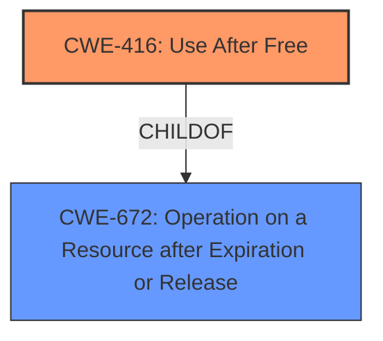

# Final Resolution for CVE-2022-0979

# Summary
| CWE ID | CWE Name | Confidence | CWE Abstraction Level | CWE Vulnerability Mapping Label | CWE-Vulnerability Mapping Notes |
|---|---|---|---|---|---|
| CWE-416 | Use After Free | 1.0 | Variant | Allowed | Primary CWE |

## Evidence and Confidence

*   **Confidence Score:** 1.0
*   **Evidence Strength:** HIGH

## Relationship Analysis
The primary relationship influencing the decision is the direct match of the vulnerability description to CWE-416. While other CWEs might be related as potential consequences or contributing factors, CWE-416 is the most specific and directly applicable **rootcause**. CWE-416 is a variant of CWE-672 (Operation on a Resource after Expiration or Release), indicating a hierarchical relationship where CWE-416 provides a more granular description of the issue.

## Vulnerability Chain
The vulnerability chain starts with the crafted HTML page, leading to a **use-after-free** (**CWE-416**) within the Safe Browsing component. This **weakness** can then lead to **heap corruption**, which is the impact described in the CVE. While heap corruption itself isn't explicitly classified here, it's a direct consequence of the **CWE-416** condition.

## Summary of Analysis
The initial analysis and subsequent criticism both strongly support the selection of CWE-416 (Use After Free) as the primary **rootcause** for this vulnerability. The vulnerability description explicitly mentions "use after free," providing direct evidence for this classification. The criticism suggests minor improvements, such as acknowledging the potential for heap corruption as a consequence and briefly explaining why other highly ranked CWEs from the Retriever Results are not the best fit. These suggestions strengthen the justification but do not change the primary CWE selection. The evidence from the vulnerability description is: "Use after free in Safe Browsing in Google Chrome on Android prior to 99.0.4844.74 allowed a remote attacker who convinced a user to engage in specific user interaction to potentially exploit heap corruption via a crafted HTML page.". The selected CWE is at the optimal level of specificity, as it directly addresses the **rootcause** described in the vulnerability.