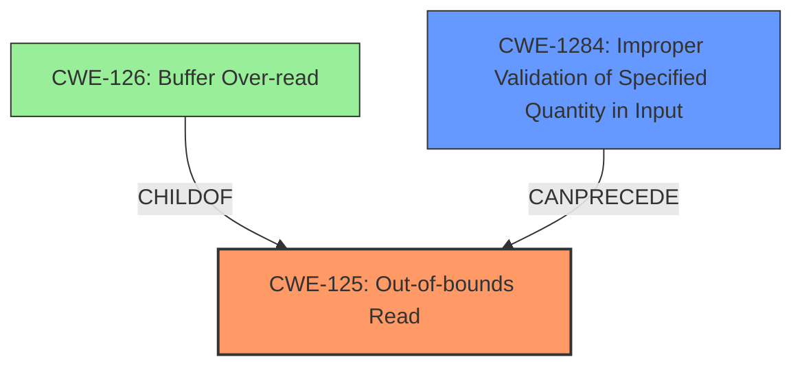

# Final Resolution for CVE-2022-1061

# Summary
| CWE ID   | CWE Name                                          | Confidence | CWE Abstraction Level | CWE Vulnerability Mapping Label | CWE-Vulnerability Mapping Notes                                                                                                                                                                                                                                                           |
| :------- | :------------------------------------------------- | :--------- | :-------------------- | :----------------------------------- | :--------------------------------------------------------------------------------------------------------------------------------------------------------------------------------------------------------------------------------------------------------------------------------- |
| **CWE-125** | Out-of-bounds Read                                 | 0.9        | Base                  | Allowed                               | The primary **weakness** is an **out-of-bounds read** due to insufficient bounds checking when parsing symbol headers. The fix adds a size check to prevent reading beyond buffer boundary.                                                                                                    |
| CWE-1284 | Improper Validation of Specified Quantity in Input | 0.7        | Base                  | Allowed                               | The secondary **weakness** is the lack of validation of the buffer size in the input, leading to the possibility of reading beyond the buffer boundary. The `parseDragons` function in `libr/bin/p/bin_symbols.c` did not verify if there were enough bytes in the input `buf`. |

*   Primary CWEs: **CWE-125**
*   Secondary Candidate CWEs: **CWE-1284**

## Evidence and Confidence

*   **Confidence Score:** 0.9
*   **Evidence Strength:** HIGH

## Relationship Analysis

The primary relationship influencing the decision is the hierarchical relationship between **CWE-125** (Out-of-bounds Read) and potential variants. While **CWE-126** (Buffer Over-read) is a closer variant, **CWE-125** is sufficient in describing the **rootcause**. **CWE-1284** (Improper Validation of Specified Quantity in Input) is chosen as a secondary CWE because the vulnerability stems from a missing size check on the input buffer.

## Vulnerability Chain

The vulnerability chain starts with **CWE-1284** (Improper Validation of Specified Quantity in Input), where the input buffer size is not validated. This leads to **CWE-125** (Out-of-bounds Read) when the code attempts to read beyond the allocated buffer. The impact is a crash and potential information leakage.

## Summary of Analysis

The initial analysis and the criticism both align on **CWE-125** (Out-of-bounds Read) being the primary **weakness**. The criticism suggests increasing the confidence score for **CWE-1284** (Improper Validation of Specified Quantity in Input), which is a reasonable adjustment based on the evidence that the missing size check is the direct cause of the vulnerability.

The decision is heavily based on the vulnerability description, which states "Heap Buffer Overflow in parseDragons in GitHub repository radareorg/radare2 prior to 5.6.8." and the fact that the fix involved adding a size check. The retriever results support this by listing **CWE-1284** as a potential candidate.

The graph relationships influenced the decision by highlighting the relationship between **CWE-125** and its variants, and the potential chain of events leading to the **out-of-bounds read**.

The selected CWEs are at the optimal level of specificity because **CWE-125** accurately describes the **out-of-bounds read**, and **CWE-1284** captures the **root cause** related to input validation.