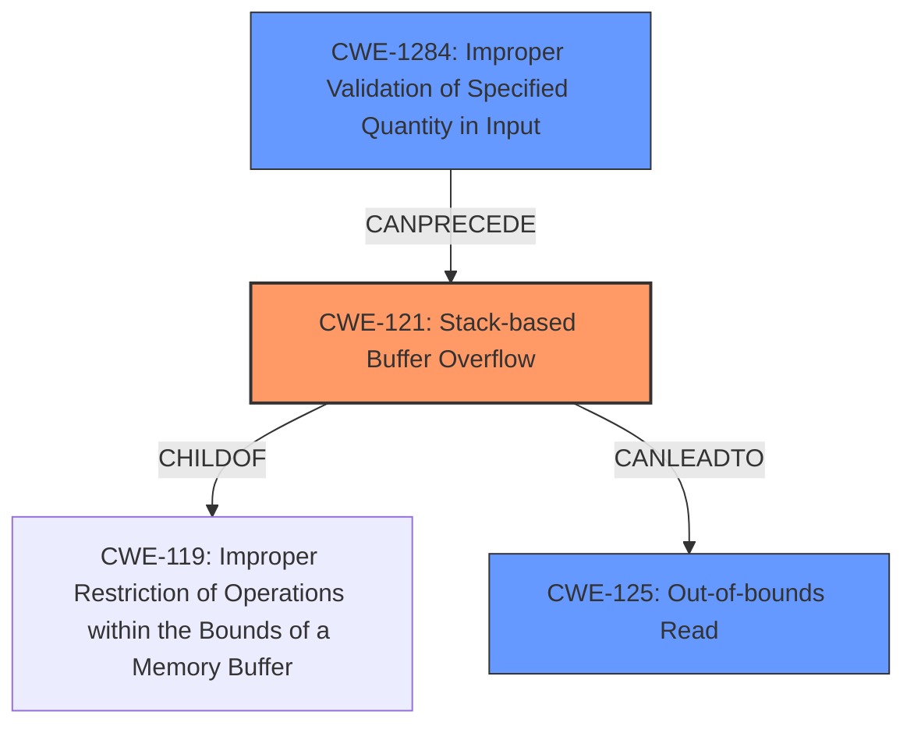

# Final Resolution for CVE-2022-1068

# Summary
| CWE ID  | CWE Name                                                                 | Confidence | CWE Abstraction Level | CWE Vulnerability Mapping Label | CWE-Vulnerability Mapping Notes |
| :-------- | :----------------------------------------------------------------------- | :--------- | :-------------------- | :------------------------------ | :------------------------------ |
| CWE-121 | Stack-based Buffer Overflow                                              | 0.95       | Variant               | Allowed                         | Primary CWE. Variant of CWE-119. |
| CWE-1284 | Improper Validation of Specified Quantity in Input | 0.75       | Base               | Allowed                         | Secondary CWE. |
| CWE-125 | Out-of-bounds Read | 0.30       | Base               | Allowed                         | Secondary CWE. Possibly not applicable. |

## Evidence and Confidence

*   **Confidence Score:** 0.90
*   **Evidence Strength:** MEDIUM

## Relationship Analysis
The primary relationship impacting the decision is that CWE-121 is a variant of the Class-level CWE-119 (Improper Restriction of Operations within the Bounds of a Memory Buffer). This makes CWE-121 a more specific and preferred mapping. CWE-1284 (Improper Validation of Specified Quantity in Input) can precede CWE-121, as the lack of input validation is a common cause of buffer overflows. CWE-125 (Out-of-bounds Read) is a potential consequence of a buffer overflow, but not a guaranteed one.

## Vulnerability Chain
The vulnerability chain starts with **CWE-1284 (Improper Validation of Specified Quantity in Input)**, where the software fails to validate the length of the input string. This leads to **CWE-121 (Stack-based Buffer Overflow)**, where an overly long string overwrites the stack. The potential impact is **CWE-125 (Out-of-bounds Read)**, if the program attempts to read from the overwritten stack area. The description indicates the program crashes due to the overflow which suggests memory corruption.

## Summary of Analysis
The initial analysis and criticism were both considered. The primary **WEAKNESS** is clearly a **stack-based buffer overflow**, as explicitly stated in the vulnerability description: "Modbus Tools Modbus Slave (versions 7.4.2 and prior) is vulnerable to a stack-based buffer overflow in the registration field. This may cause the program to crash when a long character string is used." This provides strong evidence for **CWE-121 (Stack-based Buffer Overflow)**. The vulnerability description also indicates that a long character string is used, which points to missing or insufficient input validation. Therefore, **CWE-1284 (Improper Validation of Specified Quantity in Input)** is a relevant secondary **WEAKNESS**, as it explains the **ROOT CAUSE** of the buffer overflow.

The inclusion of **CWE-125 (Out-of-bounds Read)** is less certain. While a buffer overflow *can* lead to an out-of-bounds read, the vulnerability description doesn't explicitly state that this occurs. The justification for including CWE-125 in the initial analysis was weak: "The buffer overflow often happens because of... reading beyond the boundaries." This is a generality, not specific evidence. Therefore, the confidence in CWE-125 is lowered, and it's noted as "Possibly not applicable."

The graph relationships influenced the decision by highlighting the hierarchical relationship between CWE-121 and CWE-119, reinforcing the choice of CWE-121 as the more specific mapping. The CANPRECEDE relationship between CWE-1284 and CWE-121 provides further support for including CWE-1284 as a secondary CWE.

The selected CWEs are at the optimal level of specificity. CWE-121 is a Variant, providing more detail than the Class-level CWE-119. CWE-1284 is a Base CWE, directly addressing the lack of input validation. Using the Pillar-level CWE-20 (Improper Input Validation) would be too broad.

The confidence score is set to 0.90, which is considered high, based on evidence of the vulnerability being stack-based and the lack of input validation. The evidence strength is considered medium, as the vulnerability description doesn't provide enough details to confirm the Out-of-bounds read.