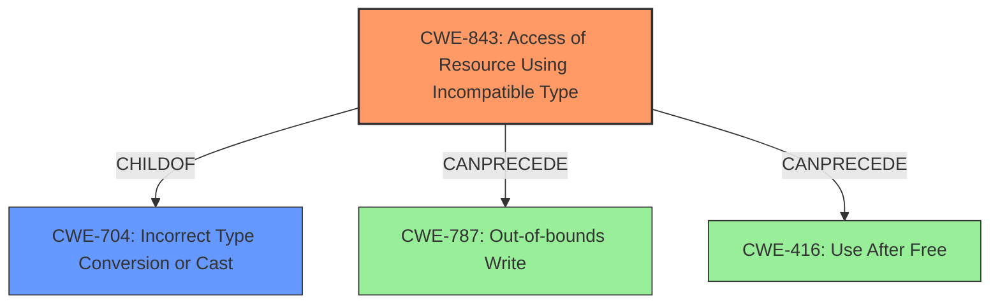

# Final Resolution for CVE-2022-1096

# Summary
| CWE ID | CWE Name | Confidence | CWE Abstraction Level | CWE Vulnerability Mapping Label | CWE-Vulnerability Mapping Notes |
|---|---|---|---|---|---|
| CWE-843 | Access of Resource Using Incompatible Type ('Type Confusion') | 1.0 | Base | Primary | Allowed. CWE-843 accurately reflects the vulnerability: a **type confusion** in V8 leading to heap corruption. While a child of the more general CWE-704, CWE-843 provides a more precise and descriptive mapping. Mitigation involves stricter type checking and runtime validation. Observed Example: CVE-2010-4577 is a good example. |

## Evidence and Confidence

*   **Confidence Score:** 1.0
*   **Evidence Strength:** HIGH

## Relationship Analysis
The primary relationship to consider is that CWE-843 is a child of CWE-704 (Incorrect Type Conversion or Cast). While CWE-704 is a broader category, CWE-843 specifically addresses the *access* of a resource using an incompatible type, making it a more precise fit for this vulnerability. The vulnerability description explicitly mentions "**type confusion**", which aligns directly with the definition of CWE-843. Type confusion often leads to memory corruption vulnerabilities such as out-of-bounds write (CWE-787) or use-after-free (CWE-416), but in this case, the **type confusion** is the root cause, with heap corruption as a consequence.

## Vulnerability Chain
The vulnerability chain starts with the **type confusion** (CWE-843) within the V8 JavaScript engine. This **type confusion** allows a remote attacker to craft a malicious HTML page. When the V8 engine processes this page, the **type confusion** leads to heap corruption, which can then be exploited for arbitrary code execution.

**Root Cause:** CWE-843 (**Type Confusion**)
**Consequence:** Heap Corruption

## Summary of Analysis
The initial analysis correctly identified CWE-843 as the primary **weakness**. The vulnerability description explicitly states "**type confusion** in V8," which is a direct match for CWE-843: "Access of Resource Using Incompatible Type ('Type Confusion')." The CVE Reference Links Content Summary reinforces this by stating, "The vulnerability is a **type confusion** error within the V8 JavaScript engine," and that **type confusion** can lead to "unexpected behavior and memory corruption." The Retriever Results also strongly suggest CWE-843 as the primary candidate. The MITRE mapping guidance for CWE-843 indicates this is ALLOWED, making it a strong and accurate mapping.

The criticism provided valuable suggestions for improvement, including explicitly addressing why CWE-704 is not the best fit and mentioning potential mitigations. The analysis already noted that memory corruption vulnerabilities like CWE-787 and CWE-416 can be impacts of type confusion, but it's important to maintain the distinction between cause and effect, which the initial assessment already handled well.

The selection of CWE-843 is at the optimal level of specificity. While CWE-704 is a parent, CWE-843 provides a more accurate and descriptive representation of the actual **weakness** being exploited.