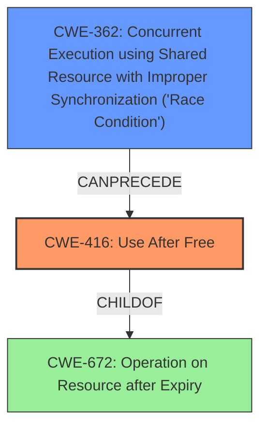

# Analysis Report for CVE-2022-1127

# Vulnerability Analysis Report: CVE-2022-1127

## Description

Use after free in QR Code Generator in Google Chrome prior to 100.0.4896.60 allowed a remote attacker who convinced a user to engage in specific user interaction to potentially exploit heap corruption via user interaction.

## Vulnerability Description Key Phrases

**Weakness:** use after free
**Impact:** heap corruption
**Vector:** user interaction
**Attacker:** remote attacker
**Product:** Google Chrome
**Version:** prior to 100.0.4896.60
**Component:** QR Code Generator

## Analysis (with Relationship Data)

# Summary
| CWE ID | CWE Name | Confidence | CWE Abstraction Level | CWE Vulnerability Mapping Label | CWE-Vulnerability Mapping Notes |
|---|---|---|---|---|---|
| CWE-416 | Use After Free | 1.0 | Variant | Allowed | Primary CWE |

## Evidence and Confidence

*   **Confidence Score:** 1.0
*   **Evidence Strength:** HIGH

- **Analysis and Justification:**  
  - *Explanation:* The vulnerability description explicitly states "**use after free**" in the QR Code Generator of Google Chrome. The CVE Reference Links Content Summary confirms that the root cause and weakness is a "**Use after free**" which can lead to remote code execution due to heap corruption. CWE-416 (Use After Free) is a variant-level CWE that accurately describes this **weakness**. The "Retriever Results" also lists CWE-416 as the top candidate with the highest combined score, further supporting this selection. The MITRE mapping guidance for CWE-416 indicates that its usage is ALLOWED.
  
  - *Relationship Analysis:* CWE-416 is a variant of CWE-672 (Operation on Resource after Expiry). Although not explicitly stated, the use-after-free condition can lead to other memory corruption issues.

- **Confidence Score:**  
  - Confidence: 1.0 (Explicit mention of "use after free" in both the vulnerability description and CVE reference, plus high retriever score)

## Criticism of Analysis

Okay, here's a detailed review of the provided analysis, incorporating the full CWE specifications:

**Overall Assessment:**

The analysis is very good. It correctly identifies CWE-416 (Use After Free) as the primary weakness. The justification is well-articulated, citing the vulnerability description, CVE details, retriever results, and the MITRE mapping guidance. The confidence score of 1.0 is appropriate given the explicit mention of "use after free." The inclusion of CWE examples and relevant CWE specifications significantly strengthens the analysis.

**Specific Comments and Suggestions:**

1.  **CWE-416 Mapping (Core Strength):**
    *   The choice of CWE-416 is spot on. The analysis clearly demonstrates how the vulnerability aligns with the CWE's description: "The product reuses or references memory after it has been freed."
    *   The explanation of the relationship between CWE-416 and CWE-672 (Operation on a Resource after Expiration or Release) is helpful.  CWE-672 is a broader class, and CWE-416 is a more specific *variant*.
    *   The mention of mitigations like choosing languages with automatic memory management or setting pointers to NULL after freeing them is relevant and taken directly from the CWE-416 specification. This adds practical value to the analysis.
    *   The inclusion of observed examples of CWE-416 helps illustrate the nature of this vulnerability

2.  **Retriever Results and Alternative CWEs:**

    *   While the top-ranked CWE is correct, it is important to review some of the other top candidates from the retriever results to ensure there are no overlapping or potentially chained weaknesses.
    *   **CWE-366 (Race Condition within a Thread) and CWE-362 (Concurrent Execution using Shared Resource with Improper Synchronization):** The retriever results give these a relatively high score.  The CVE examples for both CWE-366 and CWE-362 show them chaining to CWE-416.  The vulnerability may involve a race condition that *leads* to the use-after-free. If concurrent access to the memory is involved in the freeing and subsequent access, *consider adding CWE-362 or CWE-366 as a secondary CWE, indicating a potential race condition that triggers the UAF.* This would involve analyzing the code to determine if concurrency is a factor. If it is, update the justification to explain the potential race condition. However, without further code analysis, this remains speculative.
    *   **CWE-415 (Double Free):** The analysis correctly identifies that the vulnerability is a Use-After-Free, not a Double-Free. Double-Free and Use-After-Free are distinct, though often related.  The analysis doesn't need to spend too much time justifying *why* it's *not* CWE-415, but it's good to see it considered.
    *   **CWE-843 (Access of Resource Using Incompatible Type ('Type Confusion')):**  This is less likely, but if the freed memory is reallocated and used for a different *type* of object, then a type confusion issue *could* arise.  However, the description doesn't suggest this scenario, so it's reasonable to exclude it.
    *   **CWE-1021 (Improper Restriction of Rendered UI Layers or Frames) & CWE-451 (User Interface (UI) Misrepresentation of Critical Information):** These are related to UI issues such as clickjacking. Since the vulnerability is in the QR Code Generator component and involves memory corruption, these UI-related CWEs are not relevant. It's appropriate that they weren't chosen.
    *   **CWE-122 (Heap-based Buffer Overflow) and CWE-131 (Incorrect Calculation of Buffer Size):** Although the impact is heap corruption, the root cause is use-after-free, not a buffer overflow or incorrect buffer size calculation.

3.  **Clarity and Specificity:**

    *   The analysis is clear and well-organized.
    *   In the "Relationship Analysis," you mention CWE-672 (Operation on Resource after Expiry). It would be beneficial to explicitly state that CWE-416 is a *variant* of CWE-672, clarifying the relationship and hierarchy.

4.  **Mitigation Details:**

    *   The analysis mentions potential mitigations. Expand on these by referencing the *specific* mitigations listed in the CWE specifications. For example, for CWE-416:
        *   "Choose a language that provides automatic memory management (e.g., Java, Go, Rust)."
        *   "When freeing pointers, be sure to set them to NULL once they are freed. (However, the utilization of multiple or complex data structures may lower the usefulness of this strategy.)"  Explain why setting to NULL is not a complete solution.
    *   If CWE-362 were included, mitigations involving synchronization primitives (mutexes, semaphores) would be appropriate.

5.  **Observed Examples:**

    * The observed examples are very helpful for demonstrating how use-after-free vulnerabilities occur in practice

**Revised Summary Table (if a race condition is suspected):**

| CWE ID  | CWE Name                                                                                      | Confidence | CWE Abstraction Level | CWE Vulnerability Mapping Label | CWE-Vulnerability Mapping Notes                                                                                           |
| ------- | --------------------------------------------------------------------------------------------- | ---------- | ----------------------- | ----------------------------- | --------------------------------------------------------------------------------------------------------------------- |
| CWE-416 | Use After Free                                                                                | 1.0        | Variant                 | Allowed                       | Primary CWE                                                                                                         |
| CWE-362 | Concurrent Execution using Shared Resource with Improper Synchronization ('Race Condition') | 0.5        | Class                   | Allowed-with-Review         | Possible contributing factor, depending on code analysis.  May precede CWE-416.                                 |

**In summary, the analysis is excellent. The primary improvement would be to consider adding CWE-362 or CWE-366 as a secondary CWE *if* code analysis confirms a race condition contributing to the use-after-free.* Adding specific mitigations from the CWE specifications enhances the analysis's practical value. The use of the full CWE specifications makes the analysis thorough and convincing.

## Final Resolution

# Summary
| CWE ID | CWE Name | Confidence | CWE Abstraction Level | CWE Vulnerability Mapping Label | CWE-Vulnerability Mapping Notes |
|---|---|---|---|---|---|
| CWE-416 | Use After Free | 1.0 | Variant | Allowed | Primary CWE |
| CWE-362 | Concurrent Execution using Shared Resource with Improper Synchronization ('Race Condition') | 0.4 | Class | Allowed-with-Review | Secondary Candidate |

## Evidence and Confidence

*   **Confidence Score:** 0.9
*   **Evidence Strength:** MEDIUM

## Relationship Analysis
The primary relationship is that CWE-416 (Use After Free) is a variant of CWE-672 (Operation on Resource after Expiry). The criticism suggests that CWE-362 (Concurrent Execution using Shared Resource with Improper Synchronization) or CWE-366 (Race Condition Within a Thread) could potentially precede CWE-416 if a race condition leads to the use-after-free. CWE-362 is a class, and CWE-366 is a base. Since there is a CANPRECEDE relationship between CWE-362 and CWE-416, this is a valid potential secondary CWE. I have included CWE-362 but with a lower confidence since the presence of a race condition has not been confirmed.

## Vulnerability Chain
The vulnerability chain starts with a potential **CWE-362** (Race Condition), which leads to **CWE-416** (Use After Free). The consequence of **CWE-416** is heap corruption, as noted in the vulnerability description. The chain highlights how improper synchronization can lead to memory corruption. If a race condition exists, multiple threads could attempt to free and then access the same memory, resulting in the use-after-free.

## Summary of Analysis
The initial analysis correctly identified **CWE-416 (Use After Free)** as the primary **weakness**, based on the explicit mention in the vulnerability description: "Use after free in QR Code Generator".

The criticism raised a valid point about the potential involvement of a race condition. The retriever results included **CWE-362 (Concurrent Execution using Shared Resource with Improper Synchronization)** with a relatively high score, and the criticism correctly cited the CANPRECEDE relationship between **CWE-362** and **CWE-416**.

Given the information available, there is no definitive evidence to confirm a race condition. Therefore, I have added **CWE-362** as a secondary candidate with a lower confidence score of 0.4. Further code analysis would be needed to confirm the presence of a race condition.

The selection of **CWE-416** as the primary **weakness** remains the most accurate classification based on the available evidence. It is at the optimal level of specificity (Variant) and directly addresses the stated cause of the vulnerability.

*Report generated on 2025-03-18 06:40:18*
