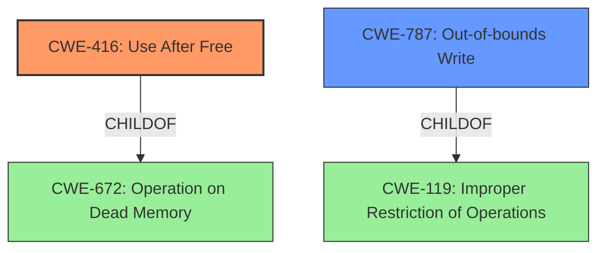

# Analysis Report for CVE-2022-1131

# Vulnerability Analysis Report: CVE-2022-1131

## Description

Use after free in Cast UI in Google Chrome prior to 100.0.4896.60 allowed a remote attacker to potentially exploit heap corruption via a crafted HTML page.

## Vulnerability Description Key Phrases

**Rootcause:** use after free
**Weakness:** heap corruption
**Vector:** crafted HTML page
**Attacker:** remote attacker
**Product:** Google Chrome
**Version:** prior to 100.0.4896.60
**Component:** Cast UI

## Analysis (with Relationship Data)

# Summary
| CWE ID  | CWE Name           | Confidence | CWE Abstraction Level | CWE Vulnerability Mapping Label | CWE-Vulnerability Mapping Notes |
|---------|--------------------|------------|-----------------------|---------------------------------|-----------------------------------|
| CWE-416 | Use After Free     | 1.0        | Variant               | Primary                         | Allowed                           |
| CWE-122 | Heap-based Buffer Overflow | 0.4      | Variant               | Secondary                       | Allowed                           |

## Evidence and Confidence

*   **Confidence Score:** 0.9
*   **Evidence Strength:** HIGH

- **Analysis and Justification:**  
  - *Explanation:* "The vulnerability description explicitly states a **use after free** in the Cast UI of Google Chrome. The 'CVE Reference Links Content Summary' section confirms that the root cause is a **use after free** vulnerability that leads to **heap corruption**. This directly corresponds to CWE-416 (Use After Free), which occurs when memory is reused after it has been freed. The retriever results also list CWE-416 as the top match with a high combined score and the usage is 'Allowed'."
  
  - *Relationship Analysis:* "CWE-416 is a variant of CWE-672 (Operation on Dead Memory). The 'CVE Reference Links Content Summary' indicates that exploitation could lead to remote code execution, and that the attacker would need to trigger the use-after-free condition. This may be caused by other weaknesses. The vulnerability description also mentions heap corruption, and CWE-416 could potentially lead to a heap-based buffer overflow (CWE-122)."

- **Confidence Score:**  
  - Confidence: 1.0 (High confidence due to direct evidence in the vulnerability description and reference links.)

---

- **Analysis and Justification:**  
  - *Explanation:* "The vulnerability description mentions **heap corruption**, indicating a memory corruption issue. While the primary root cause is **use after free** (CWE-416), the heap corruption could also be a consequence of the use-after-free leading to a heap overflow. Although the description doesn't explicitly confirm a heap overflow, it can be considered as a secondary issue because the use-after-free can overwrite heap metadata, leading to heap corruption. This could potentially manifest as CWE-122 (Heap-based Buffer Overflow)."
  
  - *Relationship Analysis:* "CWE-122 is a variant of CWE-119 (Improper Restriction of Operations within the Bounds of a Memory Buffer). It can be triggered by a use-after-free condition that corrupts the heap, eventually leading to out-of-bounds write. However, the primary cause is use-after-free, so CWE-122 is secondary."

- **Confidence Score:**  
  - Confidence: 0.4 (Low confidence because it is not explicitly stated in the description. However, heap corruption is mentioned.)

## Criticism of Analysis

Okay, here's a critique of the provided vulnerability analysis, taking into account the full CWE specifications:

**Overall Assessment:**

The analysis is generally good and well-reasoned. The primary mapping to CWE-416 (Use After Free) is solid, supported by the vulnerability description and CVE reference summary. The inclusion of CWE-122 (Heap-based Buffer Overflow) as a secondary concern demonstrates a good understanding of potential consequences, even if not explicitly stated. However, there's room for improvement in exploring related CWEs, considering the potential attack vectors, and justifying the confidence levels.

**Detailed Critique:**

**1. CWE-416: Use After Free (Primary Mapping)**

*   **Strengths:**
    *   Excellent justification based on the vulnerability description and CVE reference summary, which explicitly mentions "use after free."
    *   Correctly identifies CWE-416 as a Variant, making it a good fit for root cause analysis.
    *   Acknowledges that CWE-416 is a child of CWE-672 (Operation on a Resource after Expiration or Release).
    *   The confidence score of 1.0 is appropriate, given the strong evidence.
*   **Areas for Improvement:**
    *   Could briefly discuss potential mitigations, even though it's primarily about identification:
        *   From CWE-416: "Choose a language that provides automatic memory management" or "When freeing pointers, be sure to set them to NULL once they are freed." This shows an understanding of how the vulnerability could be addressed.
    *   Expand on potential attack vectors. The analysis mentions "crafting a malicious web page," but could be more specific. For example, how might the attacker trigger the use-after-free condition in the Cast UI using a crafted HTML page? Is it related to specific JavaScript APIs, event handling, or DOM manipulation?
    *   Consider the `CanFollow` relationships of CWE-416:
        * CWE-362 Concurrent Execution using Shared Resource with Improper Synchronization ('Race Condition'): Since the Cast UI might be multi-threaded, a race condition could contribute to the UAF.  This is mentioned in the observed examples for CWE-416. This connection could strengthen the analysis.
        * CWE-364 Signal Handler Race Condition: In some systems, an external actor can manipulate inputs to the system and thereby achieve a wide range of possible control flows. This is frequently a concern in products that execute scripts from untrusted sources.

**2. CWE-122: Heap-based Buffer Overflow (Secondary Mapping)**

*   **Strengths:**
    *   Good reasoning that the heap corruption could be a consequence of the use-after-free leading to a heap overflow.
    *   Acknowledges that CWE-122 is a variant of CWE-119 (Improper Restriction of Operations within the Bounds of a Memory Buffer)
*   **Areas for Improvement:**
    *   Confidence Score Justification: The confidence score of 0.4 is low, which is acceptable given the lack of direct evidence. However, the analysis could explore other types of memory corruption that might be related.  Heap corruption doesn't *necessarily* mean heap overflow.
    *   Explore alternate memory corruption CWEs:
        * CWE-787: Out-of-bounds Write: This is a more general CWE than 122 and covers writing outside the intended buffer boundaries, even without a classic overflow. Since "heap corruption" is mentioned, this might be a slightly better fit than explicitly assuming a buffer overflow.
        * CWE-843: Access of Resource Using Incompatible Type ('Type Confusion'): If the use-after-free leads to the wrong type being used to interpret the memory, this could be relevant.

**3. General Observations & Suggestions:**

*   **Attack Vector Details:** The analysis mentions a "crafted HTML page." Providing a more detailed potential attack scenario would strengthen the analysis. What specific HTML or JavaScript features might be used to trigger the use-after-free? Is it related to specific events, DOM manipulation, or other browser APIs?
*   **Retriever Results:** The retriever results list other potentially relevant CWEs. While the top match (CWE-416) is correct, briefly addressing why the others were not chosen (or why they have lower confidence) would improve the analysis's completeness. For example:
    *   CWE-366: Race Condition within a Thread - Might be relevant in a multi-threaded environment, but without further information on concurrency, it is not a strong match.
    *   CWE-843: Access of Resource Using Incompatible Type ('Type Confusion') -  As mentioned above, worth considering.
    *   CWE-415: Double Free - Not directly implied by the description.
    *   CWE-1021: Improper Restriction of Rendered UI Layers or Frames - Unlikely to be directly related to use-after-free. More related to clickjacking or UI redress attacks, and not likely a root cause.
*   **Exploitability:** Briefly commenting on the exploitability of the vulnerability would add value. Remote code execution is mentioned in the summary, but linking the use-after-free to this outcome could be strengthened.
*   **CWE-672:** The analysis correctly identifies CWE-416 as a child of CWE-672.  However, it doesn't explicitly explain why it chose CWE-416 over CWE-672. CWE-672 is "Operation on a Resource after Expiration or Release," which is a more general class. The analysis should state that CWE-416 is more specific ("Use After Free") and therefore a better match, as it clearly identifies the *type* of expired resource operation.

**Example of Improved Justification (CWE-122):**

"The vulnerability description mentions **heap corruption**, indicating a memory corruption issue. While the primary root cause is **use after free** (CWE-416), the heap corruption *could potentially be due to* a use-after-free leading to a heap overflow (CWE-122), *or other memory corruption issue such as* writing outside the intended buffer boundaries (CWE-787), *or accessing resources using an incompatible type (CWE-843)*. Although the description doesn't explicitly confirm a heap overflow, it *is a possibility* because the use-after-free *might* overwrite heap metadata, leading to heap corruption *and potentially enabling out-of-bounds writes*. This *could potentially* manifest as CWE-122 (Heap-based Buffer Overflow). *Therefore, the confidence is low.*

*Relationship Analysis:* "CWE-122 is a variant of CWE-119 (Improper Restriction of Operations within the Bounds of a Memory Buffer). It can be triggered by a use-after-free condition that corrupts the heap, eventually leading to out-of-bounds write. However, the primary cause is use-after-free, so CWE-122 is secondary, *and other forms of memory corruption are also possible*."

**In summary,** the analysis is a solid starting point. By incorporating the suggestions above – especially expanding on the attack vectors, thoroughly justifying confidence levels, and considering alternative/related CWEs – the analysis would be significantly stronger and more complete.

## Final Resolution

# Summary
| CWE ID  | CWE Name           | Confidence | CWE Abstraction Level | CWE Vulnerability Mapping Label | CWE-Vulnerability Mapping Notes |
|---------|--------------------|------------|-----------------------|---------------------------------|-----------------------------------|
| CWE-416 | Use After Free     | 1.0        | Variant               | Primary                         | Allowed                           |
| CWE-787 | Out-of-bounds Write | 0.5        | Base                  | Secondary                       | Allowed                           |

## Evidence and Confidence

*   **Confidence Score:** 0.9
*   **Evidence Strength:** MEDIUM

## Relationship Analysis
The primary CWE is CWE-416 (**Use After Free**), a variant of CWE-672 (Operation on Dead Memory). The analysis considered the potential for heap corruption mentioned in the vulnerability description and the possibility of a heap overflow (CWE-122). However, the relationship analysis and criticism suggest considering CWE-787 (**Out-of-bounds Write**) as a more appropriate secondary CWE due to the general nature of "heap corruption" being mentioned, without explicit confirmation of an overflow. CWE-787 is a child of CWE-119 (Improper Restriction of Operations within the Bounds of a Memory Buffer) and a parent of more specific buffer overflow variants.

## Vulnerability Chain
The vulnerability chain starts with a **use after free** condition (CWE-416). This condition allows an attacker to potentially corrupt the heap. The **heap corruption** can then lead to an **out-of-bounds write** (CWE-787), ultimately leading to remote code execution.

## Summary of Analysis
The initial analysis correctly identifies CWE-416 (**Use After Free**) as the primary **root cause**, supported by the vulnerability description that explicitly states "use after free." The criticism suggests considering CWE-787 (**Out-of-bounds Write**) as a secondary CWE, which is more general, since the heap corruption doesn't explicitly confirm a heap overflow.

Evidence: "The vulnerability description explicitly states a **use after free** in the Cast UI of Google Chrome prior to 100.0.4896.60 allowed a remote attacker to potentially exploit heap corruption via a crafted HTML page."

The graph relationships influenced the decision to choose CWE-787 as a secondary CWE because it is at the Base level of abstraction and more accurately reflects the "heap corruption" mentioned in the vulnerability description, without over-specifying it as a heap overflow (CWE-122). CWE-787 is also a parent of more specific buffer overflow variants, allowing for a broader representation of potential memory corruption issues.

CWE-416 (**Use After Free**) is at the optimal level of specificity because it directly describes the **root cause** identified in the vulnerability description. CWE-787 (**Out-of-bounds Write**) is at the base level and provides a reasonable generalization of the potential consequences of heap corruption, without making assumptions about the specific type of memory corruption.

*Report generated on 2025-03-18 06:41:22*
