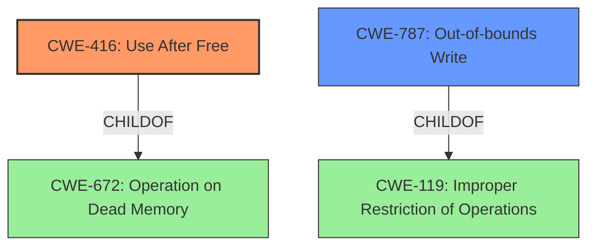

# Final Resolution for CVE-2022-1131

# Summary
| CWE ID  | CWE Name           | Confidence | CWE Abstraction Level | CWE Vulnerability Mapping Label | CWE-Vulnerability Mapping Notes |
|---------|--------------------|------------|-----------------------|---------------------------------|-----------------------------------|
| CWE-416 | Use After Free     | 1.0        | Variant               | Primary                         | Allowed                           |
| CWE-787 | Out-of-bounds Write | 0.5        | Base                  | Secondary                       | Allowed                           |

## Evidence and Confidence

*   **Confidence Score:** 0.9
*   **Evidence Strength:** MEDIUM

## Relationship Analysis
The primary CWE is CWE-416 (**Use After Free**), a variant of CWE-672 (Operation on Dead Memory). The analysis considered the potential for heap corruption mentioned in the vulnerability description and the possibility of a heap overflow (CWE-122). However, the relationship analysis and criticism suggest considering CWE-787 (**Out-of-bounds Write**) as a more appropriate secondary CWE due to the general nature of "heap corruption" being mentioned, without explicit confirmation of an overflow. CWE-787 is a child of CWE-119 (Improper Restriction of Operations within the Bounds of a Memory Buffer) and a parent of more specific buffer overflow variants.

## Vulnerability Chain
The vulnerability chain starts with a **use after free** condition (CWE-416). This condition allows an attacker to potentially corrupt the heap. The **heap corruption** can then lead to an **out-of-bounds write** (CWE-787), ultimately leading to remote code execution.

## Summary of Analysis
The initial analysis correctly identifies CWE-416 (**Use After Free**) as the primary **root cause**, supported by the vulnerability description that explicitly states "use after free." The criticism suggests considering CWE-787 (**Out-of-bounds Write**) as a secondary CWE, which is more general, since the heap corruption doesn't explicitly confirm a heap overflow.

Evidence: "The vulnerability description explicitly states a **use after free** in the Cast UI of Google Chrome prior to 100.0.4896.60 allowed a remote attacker to potentially exploit heap corruption via a crafted HTML page."

The graph relationships influenced the decision to choose CWE-787 as a secondary CWE because it is at the Base level of abstraction and more accurately reflects the "heap corruption" mentioned in the vulnerability description, without over-specifying it as a heap overflow (CWE-122). CWE-787 is also a parent of more specific buffer overflow variants, allowing for a broader representation of potential memory corruption issues.

CWE-416 (**Use After Free**) is at the optimal level of specificity because it directly describes the **root cause** identified in the vulnerability description. CWE-787 (**Out-of-bounds Write**) is at the base level and provides a reasonable generalization of the potential consequences of heap corruption, without making assumptions about the specific type of memory corruption.