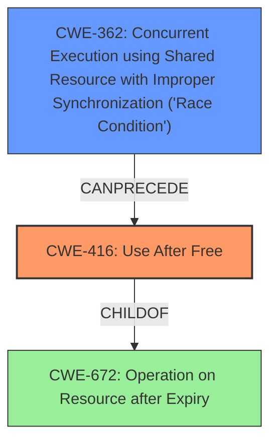

# Final Resolution for CVE-2022-1133

# Summary

| CWE ID | CWE Name | Confidence | CWE Abstraction Level | CWE Vulnerability Mapping Label | CWE-Vulnerability Mapping Notes |
|---|---|---|---|---|---|
| CWE-416 | Use After Free | 0.95 | Variant | Primary | Allowed |
| CWE-362 | Concurrent Execution using Shared Resource with Improper Synchronization ('Race Condition') | 0.7 | Class | Secondary | Allowed-with-Review |

## Evidence and Confidence

*   **Confidence Score:** 0.85
*   **Evidence Strength:** MEDIUM

## Relationship Analysis
The primary weakness is **CWE-416 (Use After Free)**, a variant level weakness, which is a child of **CWE-672 (Operation on Resource after Expiry)**. The criticism suggests that a race condition (**CWE-362 (Concurrent Execution using Shared Resource with Improper Synchronization ('Race Condition'))**) could be the cause of the **use after free** vulnerability, given the multi-threaded nature of WebRTC. **CWE-362** is a class, and the analysis considers that it can precede **CWE-416**. Therefore, I added **CWE-362** as a secondary weakness with a slightly lower confidence level, as there is no explicit mention of a race condition in the vulnerability description, but it is a plausible contributing factor based on the context.

## Vulnerability Chain
The vulnerability chain starts with a potential **race condition** (**CWE-362**), where multiple threads in WebRTC access the same memory resource. Due to improper synchronization, one thread might free the memory while another thread is still using it. This leads to the **use-after-free** condition (**CWE-416**), where the thread accesses memory that has already been freed, leading to heap corruption and potentially allowing a remote attacker to execute arbitrary code.

## Summary of Analysis
The initial analysis correctly identified **CWE-416 (Use After Free)** as the primary weakness based on the explicit description of the vulnerability. The criticism raised a valid point about the potential involvement of a race condition, given the context of WebRTC. Based on the criticism and the relationships between the CWEs, I have added **CWE-362 (Concurrent Execution using Shared Resource with Improper Synchronization ('Race Condition'))** as a secondary weakness.

The evidence for **CWE-416** is strong, as the vulnerability description clearly states "use after free." The evidence for **CWE-362** is less direct, but the criticism provides a logical argument based on the multi-threaded nature of WebRTC and the common occurrence of race conditions leading to UAF vulnerabilities. As the criticism stated: "While the primary vulnerability is a UAF, a race condition might be the *cause* of the UAF. Multiple threads within WebRTC could be accessing the same memory, and improper synchronization could lead to a thread freeing the memory while another is still using it. In this case, the vulnerability could be described as a chain: CWE-362 -> CWE-416."

The selected CWEs are at the optimal level of specificity. **CWE-416** is a Variant, and **CWE-362** is a Class, which are appropriate levels of abstraction for mapping to the root causes of vulnerabilities. While further base CWEs might exist as children of **CWE-362**, without explicit evidence of the specific synchronization issues or type of race condition it is best to stay at the class level.