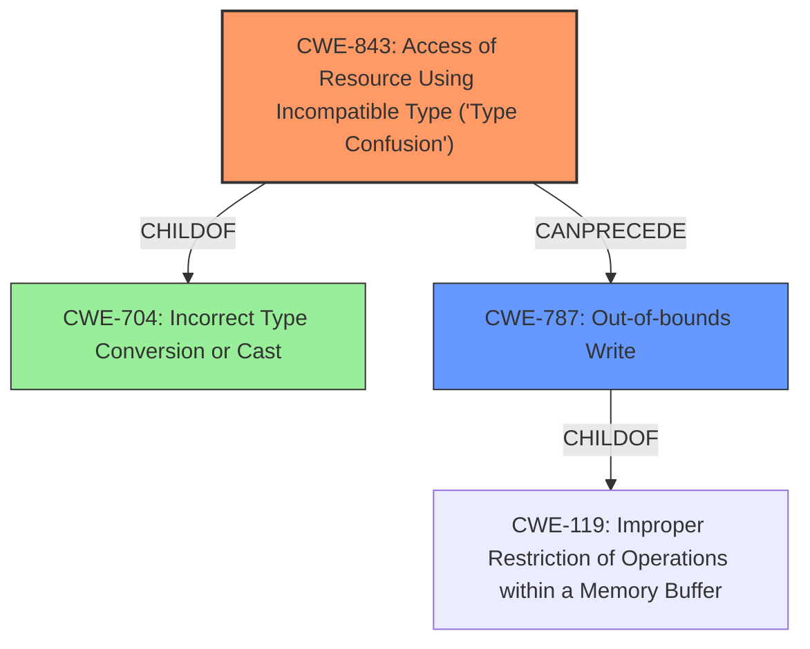

# Analysis Report for CVE-2022-1134

# Vulnerability Analysis Report: CVE-2022-1134

## Description

Type confusion in V8 in Google Chrome prior to 100.0.4896.60 allowed a remote attacker to potentially exploit heap corruption via a crafted HTML page.

## Vulnerability Description Key Phrases

**Rootcause:** confusion in V8 in Google Chrome
**Impact:** heap corruption
**Vector:** crafted HTML page
**Attacker:** remote attacker
**Product:** Google Chrome
**Version:** prior to 100.0.4896.60

## Analysis (with Relationship Data)

# Summary
| CWE ID | CWE Name | Confidence | CWE Abstraction Level | CWE Vulnerability Mapping Label | CWE-Vulnerability Mapping Notes |
|---|---|---|---|---|---|
| CWE-843 | Access of Resource Using Incompatible Type ('Type Confusion') | 0.90 | Base | Allowed | Primary CWE |

## Evidence and Confidence

*   **Confidence Score:** 0.90
*   **Evidence Strength:** HIGH

- **Analysis and Justification:**  
  - *Explanation:* The vulnerability description clearly states "**type confusion in V8 in Google Chrome**" as the root cause, leading to "**heap corruption**". The CVE Reference Links Content Summary also explicitly mentions "**Type Confusion in V8**" as the root_cause and "**Type confusion**" as one of the weaknesses. This aligns directly with CWE-843, which describes "Access of Resource Using Incompatible Type ('Type Confusion')". The description for CWE-843 states: "The product allocates or initializes a resource such as a pointer, object, or variable using one type, but it later accesses that resource using a type that is incompatible with the original type." The use of incompatible types can certainly lead to memory corruption, like heap corruption which is stated in the vulnerability description. Also, CWE-843 is the primary CWE match for similar vulnerabilities. The MITRE mapping guidance for CWE-843 indicates this is ALLOWED and is at the Base level of abstraction which is preferred.

  - *Relationship Analysis:* No direct relationships were found for CWE-843.

- **Confidence Score:**  
  - Confidence: 0.90 (High confidence due to direct mention of "type confusion" in vulnerability description and supporting CVE reference links)

## Criticism of Analysis

Okay, here's a detailed review of the provided CWE analysis, incorporating the full CWE specifications:

**Overall Assessment:**

The analysis is strong and well-reasoned. The selection of CWE-843 as the primary CWE is highly appropriate, given the vulnerability description's explicit mention of "type confusion." The confidence level of 0.90 is justified by the clear evidence from both the vulnerability description and the CVE reference summary.

**Detailed Review:**

*   **Vulnerability Description Key Phrases:** The extracted key phrases are accurate and relevant to the vulnerability.

*   **CWE for Similar CVE Descriptions:** The selection of CWE-843 as the primary match is excellent.

*   **Retriever Results:** The retriever results correctly prioritize CWE-843, further supporting the choice. It is also good that other CWEs are included, as they could represent possible secondary weaknesses or consequences.

*   **Summary Table:** The summary table accurately reflects the analysis and the chosen CWE.

*   **Evidence and Confidence:**

    *   **Confidence Score:** The assigned confidence score of 0.90 is appropriate.
    *   **Evidence Strength:** The evidence is indeed HIGH, as the root cause is explicitly stated as "type confusion."
    *   **Analysis and Justification:**
        *   The explanation is clear, concise, and directly connects the vulnerability description to the CWE-843 definition.  The justification correctly highlights the potential for memory corruption due to incompatible types, as described in the CWE. It is also good to note that the MITRE mapping guidance for CWE-843 indicates this is ALLOWED and is at the Base level of abstraction which is preferred.
        *   The "Relationship Analysis" section stating that no direct relationships were found for CWE-843 is accurate, but it could be slightly expanded. While there aren't *direct* exploitative relationships from the description, it's worth mentioning that CWE-843 is a *child* of CWE-704 (Incorrect Type Conversion or Cast). This parent-child relationship could be briefly mentioned to demonstrate a deeper understanding of the CWE hierarchy.
        * It is very good to include example observed examples.
        * It is good to include the full CWE specifications for the mentioned CWEs.

*   **CWE Examples from Database:** The provided examples are relevant and help to illustrate the nature of CWE-843. The inclusion of CVEs with the phrase "Type confusion in V8 in Google Chrome" is especially relevant.

*   **Relevant CWE Specifications:**

    *   The inclusion of the full CWE specifications is extremely helpful for a thorough review.
    *   **CWE-843:**
        *   The analysis aligns perfectly with the description of CWE-843: "The product allocates or initializes a resource such as a pointer, object, or variable using one type, but it later accesses that resource using a type that is incompatible with the original type."
        *   The "Mapping Guidance" for CWE-843 explicitly states it is "Allowed" and is a "Base level of abstraction," which is preferred. The analysis correctly utilizes this guidance.
        *   The "Applicable Platform" note correctly identifies that this weakness is possible in type-unsafe languages.
    *   **CWE-787 (Out-of-bounds Write):** It's worth noting that while CWE-843 is the primary cause, the resulting "heap corruption" could manifest as an out-of-bounds write (CWE-787). However, focusing on CWE-843 is the right choice because it represents the root cause.
    *   **CWE-704 (Incorrect Type Conversion or Cast):** As mentioned earlier, acknowledging the parent relationship between CWE-704 and CWE-843 could add further depth to the analysis. While CWE-843 is a more specific and appropriate mapping, understanding the broader context of type conversion issues is valuable.

**Suggestions for Improvement:**

*   **Acknowledge the Parent-Child Relationship:** Briefly mention that CWE-843 is a child of CWE-704 (Incorrect Type Conversion or Cast) in the "Relationship Analysis" section. This demonstrates a deeper understanding of the CWE hierarchy.
*   **Consider Secondary Consequences (briefly):** While the focus on CWE-843 is correct, briefly acknowledge that the resulting "heap corruption" could potentially lead to consequences like out-of-bounds writes (CWE-787), information disclosure (depending on the specific memory layout), or denial of service. However, emphasize that CWE-843 is the root cause.

**Conclusion:**

The analysis is excellent and demonstrates a strong understanding of CWE concepts and the specific vulnerability. The mapping to CWE-843 is highly accurate and well-justified. The suggested improvements are minor and intended to further enhance the depth and comprehensiveness of the analysis.

## Final Resolution

# Summary
| CWE ID | CWE Name | Confidence | CWE Abstraction Level | CWE Vulnerability Mapping Label | CWE-Vulnerability Mapping Notes |
|---|---|---|---|---|---|
| CWE-843 | Access of Resource Using Incompatible Type ('Type Confusion') | 0.95 | Base | Allowed | Primary CWE |
| CWE-787 | Out-of-bounds Write | 0.6 | Base | Allowed | Secondary Candidate |

## Evidence and Confidence

*   **Confidence Score:** 0.9
*   **Evidence Strength:** HIGH

## Relationship Analysis
The primary relationship that impacted my decision was the parent-child relationship between CWE-704 (Incorrect Type Conversion or Cast) and CWE-843 (**Type Confusion**). While CWE-704 is a broader class, CWE-843 is a more specific **base** that directly aligns with the "type confusion" described in the vulnerability. Additionally, the potential consequence of **heap corruption** suggests a possible **CWE-787 (Out-of-bounds Write)**, creating a chain where type confusion leads to memory corruption. I am adding CWE-787 as a secondary candidate as a result of the **heap corruption**.

## Vulnerability Chain
The vulnerability chain starts with **CWE-843 (Type Confusion)**, where the product uses an incompatible type for a resource. This leads to **heap corruption**, which can then manifest as **CWE-787 (Out-of-bounds Write)** if the incompatible type results in writing beyond the allocated buffer.

## Summary of Analysis
The initial analysis correctly identified **CWE-843 (Type Confusion)** as the primary weakness. The vulnerability description explicitly mentions "type confusion," providing strong evidence for this classification. The retriever results and the mapping guidance for CWE-843 support this decision. The criticism suggested acknowledging the parent-child relationship with **CWE-704 (Incorrect Type Conversion or Cast)**, which I have incorporated into the relationship analysis. Additionally, the heap corruption indicates a likely **CWE-787 (Out-of-bounds Write)** as a secondary consequence, so I've added it as a secondary candidate.

The graph relationships influenced my decision by highlighting the connection between type conversion issues (**CWE-704**), type confusion (**CWE-843**), and potential memory corruption (**CWE-787**). **CWE-843** remains the most specific and appropriate classification based on the available evidence, representing the root cause of the vulnerability.

*Report generated on 2025-03-18 06:44:50*
