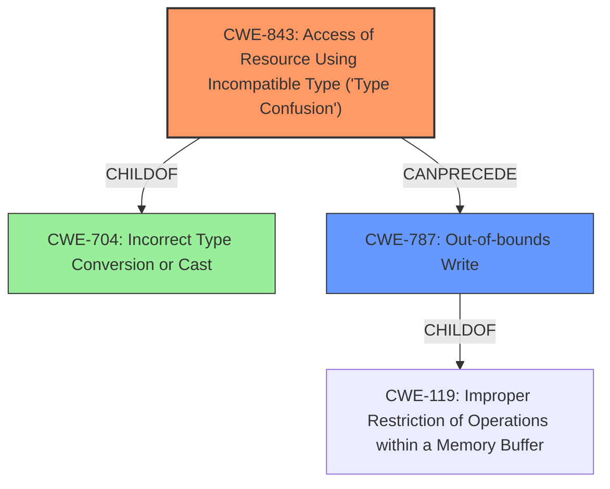

# Final Resolution for CVE-2022-1134

# Summary
| CWE ID | CWE Name | Confidence | CWE Abstraction Level | CWE Vulnerability Mapping Label | CWE-Vulnerability Mapping Notes |
|---|---|---|---|---|---|
| CWE-843 | Access of Resource Using Incompatible Type ('Type Confusion') | 0.95 | Base | Allowed | Primary CWE |
| CWE-787 | Out-of-bounds Write | 0.6 | Base | Allowed | Secondary Candidate |

## Evidence and Confidence

*   **Confidence Score:** 0.9
*   **Evidence Strength:** HIGH

## Relationship Analysis
The primary relationship that impacted my decision was the parent-child relationship between CWE-704 (Incorrect Type Conversion or Cast) and CWE-843 (**Type Confusion**). While CWE-704 is a broader class, CWE-843 is a more specific **base** that directly aligns with the "type confusion" described in the vulnerability. Additionally, the potential consequence of **heap corruption** suggests a possible **CWE-787 (Out-of-bounds Write)**, creating a chain where type confusion leads to memory corruption. I am adding CWE-787 as a secondary candidate as a result of the **heap corruption**.

## Vulnerability Chain
The vulnerability chain starts with **CWE-843 (Type Confusion)**, where the product uses an incompatible type for a resource. This leads to **heap corruption**, which can then manifest as **CWE-787 (Out-of-bounds Write)** if the incompatible type results in writing beyond the allocated buffer.

## Summary of Analysis
The initial analysis correctly identified **CWE-843 (Type Confusion)** as the primary weakness. The vulnerability description explicitly mentions "type confusion," providing strong evidence for this classification. The retriever results and the mapping guidance for CWE-843 support this decision. The criticism suggested acknowledging the parent-child relationship with **CWE-704 (Incorrect Type Conversion or Cast)**, which I have incorporated into the relationship analysis. Additionally, the heap corruption indicates a likely **CWE-787 (Out-of-bounds Write)** as a secondary consequence, so I've added it as a secondary candidate.

The graph relationships influenced my decision by highlighting the connection between type conversion issues (**CWE-704**), type confusion (**CWE-843**), and potential memory corruption (**CWE-787**). **CWE-843** remains the most specific and appropriate classification based on the available evidence, representing the root cause of the vulnerability.