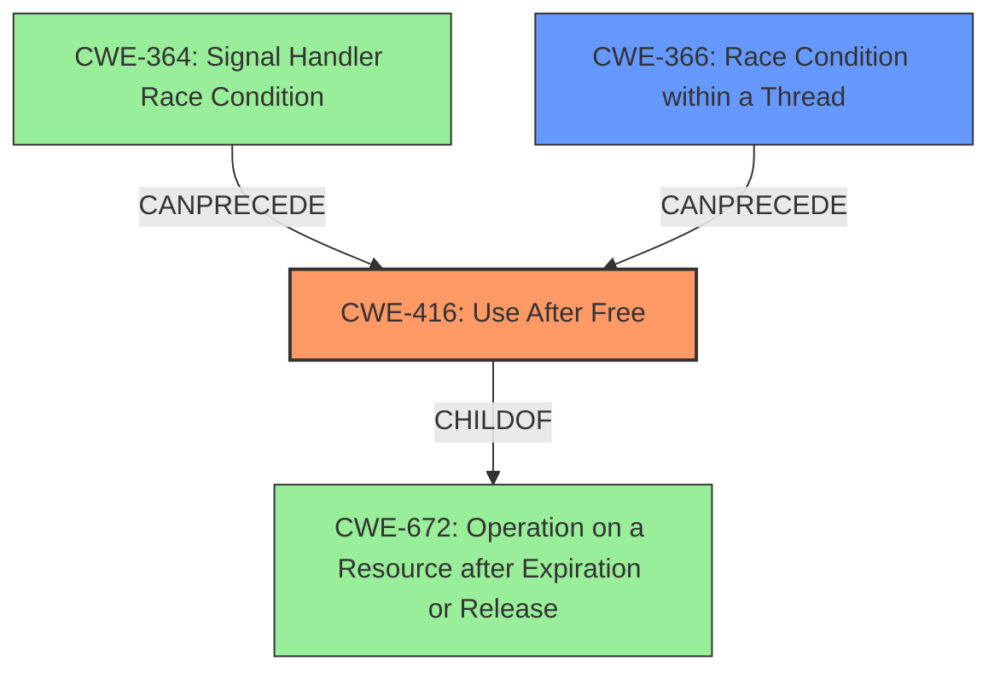

# Analysis Report for CVE-2022-1135

# Vulnerability Analysis Report: CVE-2022-1135

## Description

Use after free in Shopping Cart in Google Chrome prior to 100.0.4896.60 allowed a remote attacker to potentially exploit heap corruption via standard feature user interaction.

## Vulnerability Description Key Phrases

**Weakness:** use after free
**Impact:** heap corruption
**Vector:** standard feature user interaction
**Attacker:** remote attacker
**Product:** Google Chrome
**Version:** prior to 100.0.4896.60
**Component:** Shopping Cart

## Analysis (with Relationship Data)

# Summary
| CWE ID | CWE Name | Confidence | CWE Abstraction Level | CWE Vulnerability Mapping Label | CWE-Vulnerability Mapping Notes |
|---|---|---|---|---|---|
| CWE-416 | Use After Free | 0.95 | Variant | Allowed | Primary CWE |
| CWE-366 | Race Condition within a Thread | 0.3 | Base | Allowed | Secondary Candidate |

## Evidence and Confidence

*   **Confidence Score:** 0.9
*   **Evidence Strength:** HIGH

- **Analysis and Justification:**  
  - *Explanation:* The vulnerability description clearly states "**use after free** in Shopping Cart in Google Chrome." This directly aligns with the definition of CWE-416, which is "The product reuses or references memory after it has been freed." The CVE Reference Links Content Summary confirms this with "root_cause": "Use after free in Shopping Cart" and "weaknesses": ["Use after free"]. The impact, heap corruption, is a common consequence of use-after-free vulnerabilities. CWE-416 is a Variant level CWE, making it a specific and appropriate choice. The MITRE mapping guidance for CWE-416 indicates this is ALLOWED.
  
  - *Relationship Analysis:* CWE-416 is a variant of CWE-672 (Operation on Dead Code). While other CWEs like CWE-415 (Double Free) were considered, the description explicitly mentions "use after free," making CWE-416 the most accurate. The graph relationships for CWE-416 show that it `CanFollow` CWE-754, CWE-364, CWE-362, and CWE-1265, indicating scenarios that might lead to a use-after-free condition.

- **Confidence Score:**  
  - Confidence: 0.95 (Strong evidence from vulnerability description and CVE reference summary)

---
- **Analysis and Justification:**  
  - *Explanation:* CWE-366 (Race Condition within a Thread) is a potential secondary weakness. Use-after-free vulnerabilities can be exacerbated by race conditions, where multiple threads are accessing and modifying memory concurrently, leading to unpredictable behavior. However, the provided description does not explicitly state or imply a race condition. It's a possibility, but not explicitly mentioned.
  
  - *Relationship Analysis:* CWE-366 is a Base level CWE. The graph relationships do not show direct relationships with CWE-416, but race conditions can definitely contribute to use-after-free scenarios.

- **Confidence Score:**  
  - Confidence: 0.3 (Low confidence since there is no explicit mention of a race condition. It's only a possibility.)

## Criticism of Analysis

Okay, I've reviewed the provided analysis and the full CWE specifications. Here's my critique:

**Overall Assessment:**

The analysis is generally good, particularly the primary CWE assignment of CWE-416. The justification is solid, and the confidence level is appropriate. The consideration of secondary weaknesses is also well-reasoned, although the confidence level for CWE-366 is appropriately low.

**Detailed Breakdown:**

*   **CWE-416: Use After Free**

    *   **Strengths:** The primary mapping to CWE-416 is highly accurate. The analysis directly references the vulnerability description and the CVE reference summary, which explicitly mention "use after free". The explanation clearly connects the vulnerability to the definition of CWE-416. The high confidence score (0.95) is warranted. The inclusion of example CVEs that are chained with CWE-416 is helpful. The reference to MITRE mapping guidance is also correct.
    *   **Weaknesses:** None significant. The relationship analysis could be slightly expanded to mention the implications of `CanFollow` relationships such as CWE-362 and CWE-364 in the context of exploitation, not just the cause. For example, the attacker's ability to influence timing (related to race conditions) could make the UAF more reliably exploitable.
    *   **Mitigations:** The mitigations listed are standard and appropriate.  The analysis doesn't need to explicitly restate them, but it's good to be aware of them.  In particular, the language selection (choosing a memory-safe language) is the most effective long-term solution. The mitigation involving setting freed pointers to NULL is a defense-in-depth technique, but its effectiveness is limited in complex scenarios.

*   **CWE-366: Race Condition within a Thread**

    *   **Strengths:** Acknowledging the potential for a race condition is a good practice, especially given the nature of UAF vulnerabilities and the concurrent nature of modern web browsers. The analysis correctly points out that there's no *explicit* mention of a race condition in the provided information.  The low confidence score (0.3) reflects this uncertainty.
    *   **Weaknesses:** While acknowledging the *possibility*, the analysis could explore *how* a race condition might *exacerbate* or *trigger* the use-after-free. For example:
        *   Multiple threads could be racing to access a shared resource. One thread frees the resource while another thread is still attempting to use it, leading to the UAF.
        *   The freeing operation itself might not be atomic, allowing another thread to access the memory region before the freeing process is complete.
    *   **Mitigations:** As with CWE-416, the specific mitigations don't need to be restated in the analysis, but awareness is important. The most relevant mitigations involve locking functionality and resource-locking validation checks.

*   **Overall Recommendation:**

    *   The analysis is sound.  The mapping to CWE-416 is correct and well-justified.
    *   The consideration of CWE-366 is reasonable. To improve the analysis of the secondary weakness, elaborate on potential race condition scenarios that could trigger or worsen the UAF.
    *   The analysis should make the connection between the *nature* of the web browser (a concurrent application) and the increased likelihood of concurrency issues.

**Additional Considerations from Retriever Results:**

The Retriever Results list a number of other CWEs that, while not primary, *could* be related. Here's a brief look:

*   **CWE-415 Double Free:** Double free is a similar, but distinct, type of memory corruption. If the provided information had *explicitly* pointed to a double free, CWE-415 would be the correct choice. Since the description specifically says "use after free," CWE-416 is more accurate.
*   **CWE-843 Type Confusion:** Type Confusion could be a contributing factor *leading* to the UAF. This is unlikely in this case, but it's worth considering if, for example, the code was incorrectly casting an object, leading to the UAF.
*   **CWE-122 Heap-based Buffer Overflow:** A heap overflow *could* overwrite memory management structures, indirectly leading to a UAF. However, this is a less direct relationship and is not supported by the given information.
*   **CWE-362 Concurrent Execution using Shared Resource with Improper Synchronization:** A more general form of race condition than CWE-366, which is scoped to within a thread. CWE-362 could apply if the race condition involves *processes* as well as threads. However, CWE-366 is more specific, and there is no clear indication that the race condition involves multiple processes.
*   **CWE-754 and related CWEs:** Several CWEs relate to error conditions and exception handling. UAF often occur due to incomplete error handling. These would be indirect contributing factors to the UAF.
*   **CWE-1265: Unintended Reentrant Invocation of Non-reentrant Code Via Nested Calls** This could also contribute to UAF.
*   **CWE-672: Operation on a Resource after Expiration or Release** CWE-416 is a child of this, so it would be more appropriate to simply use the most specific (CWE-416).

**In summary, the analysis is well-done. Focusing on how concurrency contributes to the UAF and considering the other high-scoring CWEs in the Retriever Results would make the analysis even more comprehensive.**

## Final Resolution

# Summary
| CWE ID | CWE Name | Confidence | CWE Abstraction Level | CWE Vulnerability Mapping Label | CWE-Vulnerability Mapping Notes |
|---|---|---|---|---|---|
| **CWE-416** | **Use After Free** | 0.95 | Variant | Allowed | Primary CWE |
| **CWE-366** | **Race Condition within a Thread** | 0.4 | Base | Allowed | Secondary Candidate |

## Evidence and Confidence

*   **Confidence Score:** 0.93
*   **Evidence Strength:** HIGH

## Relationship Analysis
The primary relationship influencing the decision is the direct match of the vulnerability description to **CWE-416 (Use After Free)**. While **CWE-366 (Race Condition within a Thread)** is considered a secondary factor, its relevance is based on the understanding of concurrent applications and potential exploitation scenarios rather than explicit evidence from the vulnerability description. **CWE-416** is a variant, making it more specific than its parent **CWE-672 (Operation on a Resource after Expiration or Release)**. The `CanFollow` relationships of **CWE-416**, such as with **CWE-364 (Signal Handler Race Condition)**, highlight potential preceding conditions.

## Vulnerability Chain
The vulnerability chain starts with a potential race condition (**CWE-366**) or other preceding conditions such as **CWE-364**. This leads to a **use-after-free** condition (**CWE-416**), where memory is accessed after it has been freed. The consequence is heap corruption, potentially allowing a remote attacker to exploit the system. The missing link is a concrete example of how the race condition specifically triggers the **use-after-free**, which lowers the confidence in **CWE-366**.

## Summary of Analysis
The initial analysis correctly identified **CWE-416 (Use After Free)** as the primary **weakness**. The vulnerability description explicitly mentions "**use after free**," and the CVE reference summary confirms this. The analysis also considered **CWE-366 (Race Condition within a Thread)** as a potential secondary **weakness**, which is reasonable given the concurrent nature of web browsers.

The criticism suggested elaborating on how a race condition might exacerbate or trigger the **use-after-free**. While there's no direct evidence in the provided description, the possibility exists that multiple threads could race to access a shared resource, leading to the freeing of the resource while another thread is still attempting to use it.

The graph relationships influence the selection by showing potential preceding conditions (e.g., **CWE-364**) that could lead to the **use-after-free** (**CWE-416**). **CWE-416** is at the optimal level of specificity, as it directly describes the **weakness** mentioned in the vulnerability description. The confidence score for **CWE-366** is increased to 0.4 to reflect the possibility that a race condition contributes to the **use-after-free**, even though there's no explicit evidence.

*Report generated on 2025-03-18 06:45:46*
