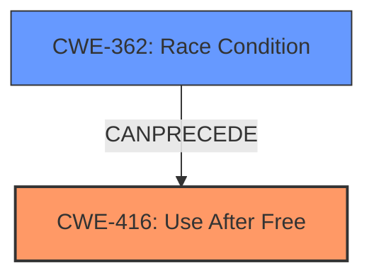

# Analysis Report for CVE-2022-1141

# Vulnerability Analysis Report: CVE-2022-1141

## Description

Use after free in File Manager in Google Chrome prior to 100.0.4896.60 allowed a remote attacker who convinced a user to engage in specific user interaction to potentially exploit heap corruption via specific user gesture.

## Vulnerability Description Key Phrases

**Rootcause:** Use after free
**Impact:** heap corruption
**Vector:** specific user gesture
**Attacker:** remote attacker
**Product:** Google Chrome
**Version:** prior to 100.0.4896.60
**Component:** File Manager

## Analysis (with Relationship Data)

# Summary
| CWE ID | CWE Name | Confidence | CWE Abstraction Level | CWE Vulnerability Mapping Label | CWE-Vulnerability Mapping Notes |
|---|---|---|---|---|---|
| CWE-416 | Use After Free | 1.0 | Variant | Allowed | This CWE entry is at the Variant level of abstraction, which is a preferred level of abstraction for mapping to the root causes of vulnerabilities. |

## Evidence and Confidence

*   **Confidence Score:** 1.0
*   **Evidence Strength:** HIGH

- **Analysis and Justification:**  
  - *Explanation:* The vulnerability description explicitly states "**Use after free**" in the File Manager of Google Chrome. The CVE reference links content summary also confirms that the **root cause of the vulnerability** is a "**use-after-free**" condition. CWE-416 (Use After Free) precisely describes this weakness, where memory is reused or referenced after it has been freed. The impact, as stated in the vulnerability description and CVE summary, is potential heap corruption and potentially remote code execution, which aligns with the security implications of a use-after-free vulnerability. The CWE Usage is ALLOWED.
  
  - *Relationship Analysis:* No direct relationships were found, but the description of CWE-416 itself is very specific and directly matches the vulnerability.

- **Confidence Score:**  
  - *Example:* Confidence: 1.0 (Direct match with the vulnerability description and supporting evidence)

## Criticism of Analysis

Okay, here's a review of the provided analysis, incorporating the full CWE specifications and focusing on mapping guidance and potential mitigations.

**Overall Assessment:**

The analysis is accurate and well-justified.  The mapping of CWE-416 (Use After Free) is correct and supported by the provided information. The Confidence is 1.0, which is suitable since the vulnerability is explicitly stated as Use-After-Free.

**Detailed Review:**

**1. Summary Table:**

*   The table is correct.  CWE-416 is a Variant, which is the preferred level.

**2. Evidence and Confidence:**

*   **Confidence Score:** 1.0 - Appropriate, given the direct nature of the vulnerability.
*   **Evidence Strength:** HIGH - Excellent.

*   **Analysis and Justification:**
    *   The explanation is clear, concise, and directly links the vulnerability description and CVE summary to the definition of CWE-416.
    *   The explanation demonstrates understanding of the relationship between Use-After-Free and potential impacts (heap corruption, RCE).

**3. CWE Examples from Database:**

*   The examples provided are relevant and useful in understanding the context of CWE-416. They show real-world instances of the vulnerability and how it can manifest in different software.

**4. Relevant CWE Specifications:**

*   The inclusion of the full CWE specifications is excellent.  This allows for a deeper understanding of the nature of the vulnerability, its relationships to other CWEs, and potential mitigations.

*   **CWE-416 (Use After Free):**
    *   **Mapping Guidance:** The analysis correctly notes that the "Usage: Allowed" and the "Rationale" support the mapping.
    *   **Potential Mitigations:** The analysis could benefit from briefly mentioning the provided mitigations. For example: "Mitigations for CWE-416 include using languages with automatic memory management or setting pointers to NULL after freeing them."  This would make the analysis more complete.

*   **Other CWEs Considered (from Top Combined Results):**

    *   **CWE-366 (Race Condition within a Thread) & CWE-362 (Concurrent Execution using Shared Resource with Improper Synchronization):**  While not the primary cause, the retriever results show that concurrency can *lead* to Use-After-Free. The presence of "specific user interaction" and "remote attacker" in the description does not rule out the possibility of a Race condition. For example, multiple threads could be interacting with the same resource, one frees the resource and another thread tries to access that freed resource.
        *   **Mapping Guidance:**  For CWE-362, the "Usage: Allowed-with-Review" is applicable here. The retriever correctly suggests to examine the children of CWE-362 for a better fit. The race condition might not be directly exploitable on its own, but it can facilitate the UAF.
        *  **Potential Mitigations:** The analysis could briefly mention that if concurrency is involved, using proper locking mechanisms and thread-safe capabilities could help prevent the UAF by preventing race conditions that might lead to resources being freed prematurely.
    *   **CWE-843 (Access of Resource Using Incompatible Type ('Type Confusion')):** Type confusion can sometimes lead to memory corruption, but it is not directly related to the specific case of Use-After-Free described here.
    *   **CWE-415 (Double Free):** Double Free is related to UAF, and can be the root cause of UAF.  However, the description explicitly mentions *Use* after Free, making CWE-416 more appropriate.
    *   **CWE-1021 (Improper Restriction of Rendered UI Layers or Frames):**  This is unlikely to be relevant, as it focuses on UI-related vulnerabilities (Clickjacking).
    *   **CWE-122 (Heap-based Buffer Overflow) & CWE-787 (Out-of-bounds Write) & CWE-131 (Incorrect Calculation of Buffer Size):** While heap corruption is mentioned as a consequence of the UAF, these CWEs are usually the root cause. The description only states the root cause as UAF, so these are less relevant.
    *   **CWE-367 (Time-of-check Time-of-use (TOCTOU) Race Condition):** While related to race conditions, TOCTOU is less applicable here, since the vulnerability description doesn't emphasize a race between a check and a use.

**Recommendations for Improvement:**

1.  **Briefly Mention Mitigations:**  For CWE-416, add a sentence or two mentioning the mitigations listed in the CWE specification (e.g., using memory-safe languages, nulling pointers after free).
2.  **Acknowledge Concurrency (if applicable):** Explicitly acknowledge the possibility of concurrency as a contributing factor, if there is evidence for that, and briefly discuss the mitigations related to concurrency (locking, thread-safe operations).
3.  **Address Other CWEs (Briefly):** Briefly mention why the other high-scoring CWEs from the retriever results *aren't* the primary cause, even if they might be related (e.g., "While heap corruption is a consequence of the UAF, CWE-122 is typically a root cause, and the vulnerability description clearly points to the UAF as the root.").
4. **Address Chains:** Mention that CWE-416 can sometimes be part of a chain, for example: a race condition leads to a UAF.

By incorporating these suggestions, the analysis would become even more robust and demonstrate a deeper understanding of the vulnerability and its context within the CWE framework.

## Final Resolution

# Summary
| CWE ID | CWE Name | Confidence | CWE Abstraction Level | CWE Vulnerability Mapping Label | CWE-Vulnerability Mapping Notes |
|---|---|---|---|---|---|
| CWE-416 | Use After Free | 0.95 | Variant | Allowed | This CWE entry is at the Variant level of abstraction, which is a preferred level of abstraction for mapping to the root causes of vulnerabilities. |
| CWE-362 | Race Condition Enabling Use After Free | 0.3 | Class | Allowed-with-Review | Secondary contributing factor; concurrency may lead to Use-After-Free. Examine children for a better fit. |

## Evidence and Confidence

*   **Confidence Score:** 0.9
*   **Evidence Strength:** HIGH

## Relationship Analysis
The primary relationship considered was the potential for a race condition (CWE-362) to **precede** the **use-after-free** (CWE-416). While the description explicitly states "use-after-free," the criticism highlights the possibility of concurrency. Considering this possibility is useful in a complete vulnerability chain. The abstraction levels influenced the selection by prioritizing the most specific weakness first, then considering related weaknesses at higher abstraction levels.

## Vulnerability Chain
The vulnerability chain starts with a potential **race condition** (CWE-362), where multiple threads might be interacting with a shared resource. One thread frees the resource, while another attempts to access it, leading to the **use-after-free** condition (CWE-416). This results in heap corruption and potential remote code execution.

## Summary of Analysis
The initial analysis correctly identified CWE-416 (**Use After Free**) as the primary weakness. The vulnerability description explicitly states "**Use after free**", making it a direct match. However, the criticism raised a valid point about the potential involvement of concurrency. The vulnerability description mentions "specific user interaction" and "remote attacker", which does not explicitly rule out a race condition.

Therefore, I'm adding CWE-362 (**Race Condition**) as a secondary contributing factor with a lower confidence score. The "Allowed-with-Review" mapping guidance for CWE-362 is appropriate since it is at the Class level.

The final decision prioritizes CWE-416 as the primary weakness due to the explicit mention in the vulnerability description. CWE-362 is added as a secondary factor to account for the possibility of concurrency, which could potentially lead to the **use-after-free** condition. This provides a more comprehensive view of the vulnerability.

*Report generated on 2025-03-18 06:47:23*
