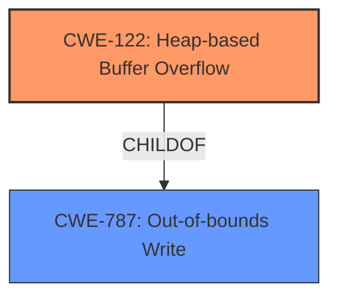

# Final Resolution for CVE-2022-1143

# Summary
| CWE ID  | CWE Name                                                     | Confidence | CWE Abstraction Level | CWE Vulnerability Mapping Label | CWE-Vulnerability Mapping Notes |
| :-------- | :----------------------------------------------------------- | :---------- | :---------------------- | :------------------------------ | :------------------------------ |
| CWE-122 | Heap-based Buffer Overflow | 0.9 | Variant | Allowed | Primary CWE |
| CWE-787 | Out-of-bounds Write | 0.7 | Base | Allowed | Secondary Candidate |

## Evidence and Confidence

*   **Confidence Score:** 0.9
*   **Evidence Strength:** HIGH

## Relationship Analysis
The analysis correctly identifies CWE-122 as a Variant of CWE-787. CWE-122 is more specific as the vulnerability occurs on the heap. The other retriever results such as CWE-190 (Integer Overflow) and CWE-416 (Use After Free) are not directly related to the buffer overflow and require more information.

## Vulnerability Chain
The vulnerability chain starts with the user interaction that leads to specific input into DevTools. This input is then processed, leading to a **Heap buffer overflow** (**CWE-122**), which is a form of **Out-of-bounds Write** (**CWE-787**). The consequence is potential heap corruption, which could lead to arbitrary code execution or other security impacts.

## Summary of Analysis
The initial analysis and the criticism are both sound. The vulnerability description clearly indicates a **Heap buffer overflow**, making CWE-122 the most appropriate primary CWE. The confidence score of 0.9 is justified due to the explicit mention of "heap buffer overflow" in the description. The inclusion of CWE-787 as a secondary candidate is also reasonable as it represents the broader category of out-of-bounds write. The relationships between the CWEs, particularly the child-of relationship between CWE-122 and CWE-787, influenced the final selection by ensuring that the most specific CWE was chosen while still acknowledging the broader context. The selected CWEs are at the optimal level of specificity because CWE-122 directly addresses the heap-based nature of the overflow, while CWE-787 provides a more general categorization.