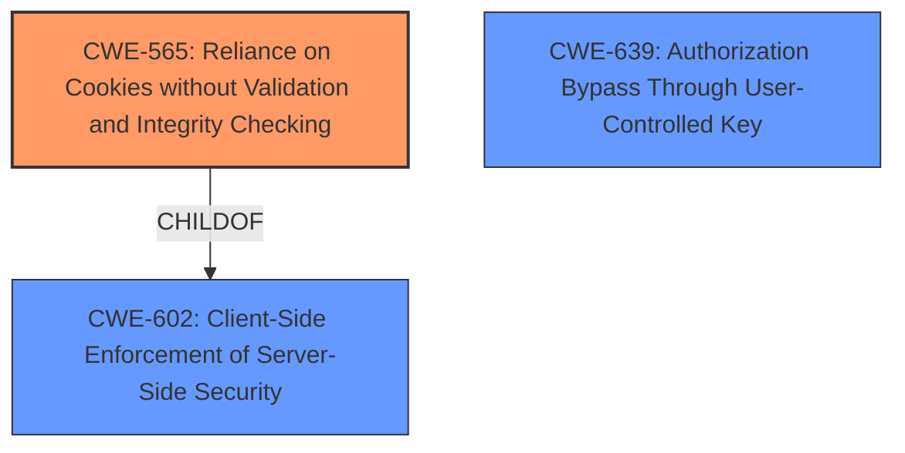

# Analysis Report for CVE-2022-1148

# Vulnerability Analysis Report: CVE-2022-1148

## Description

Improper authorization in GitLab Pages included with GitLab CE/EE affecting all versions from 11.5 prior to 14.7.7, 14.8 prior to 14.8.5, and 14.9 prior to 14.9.2 allowed an attacker to steal a users access token on an attacker-controlled private GitLab Pages website and reuse that token on the victims other private websites

## Vulnerability Description Key Phrases

**Rootcause:** Improper authorization
**Impact:** steal a users access token
**Attacker:** attacker
**Product:** GitLab Pages
**Version:** ['all versions from 11.5 prior to 14.7.7', '14.8 prior to 14.8.5', '14.9 prior to 14.9.2']

## Analysis (with Relationship Data)

# Summary
| CWE ID  | CWE Name                                                        | Confidence | CWE Abstraction Level | CWE Vulnerability Mapping Label | CWE-Vulnerability Mapping Notes |
| :-------- | :-------------------------------------------------------------- | :--------- | :-------------------- | :------------------------------ | :------------------------------ |
| CWE-565 | Reliance on Cookies without Validation and Integrity Checking | 0.85       | Base                  | Allowed                       | Primary CWE                     |
| CWE-639 | Authorization Bypass Through User-Controlled Key              | 0.75       | Base                  | Allowed                       | Secondary Candidate             |
| CWE-425 | Direct Request ('Forced Browsing')                             | 0.60       | Base                  | Allowed                       | Secondary Candidate             |

## Evidence and Confidence

*   **Confidence Score:** 0.80
*   **Evidence Strength:** HIGH

- **Analysis and Justification:**
  - *Explanation:* The vulnerability lies in the **improper authorization** within GitLab Pages, where session cookies are not adequately validated. This allows an attacker to steal a user's access token by exploiting the lack of subdomain validation for session cookies. The core weakness is the reliance on cookies without proper validation and integrity checking, which aligns directly with CWE-565. The "CVE Reference Links Content Summary" section explicitly mentions "**Improper validation of session cookies**" as a weakness, strengthening the mapping to CWE-565. CWE-639 (Authorization Bypass Through User-Controlled Key) is also a candidate, as the attacker effectively bypasses authorization by manipulating the session token. CWE-425 (Direct Request ('Forced Browsing')) could also be considered, since the attacker is leveraging a direct request to the `/auth` endpoint. However, CWE-565 is the most direct representation of the root cause.
  - *Relationship Analysis:* CWE-565 is related to CWE-602 (Authentication Bypass Using Cookies) and CWE-669 (Incorrect Comparison). It highlights the risks associated with relying on cookies for security-critical operations without proper validation. CWE-639 is a parent of CWE-863 and describes authorization issues. CWE-425 is a parent of CWE-862 and describes missing authorization checks.

- **Confidence Score:**
  - Confidence: 0.85 (High confidence due to explicit mention of cookie validation issues in the CVE details)

---

## Criticism of Analysis

Okay, I have reviewed the provided analysis and the full CWE specifications. Here's a detailed critique, focusing on the accuracy, confidence, and abstraction level of the CWE mappings.

**Overall Assessment:**

The analysis is generally sound and well-reasoned. The primary CWE mapping of `CWE-565: Reliance on Cookies without Validation and Integrity Checking` is strong and well-supported by the evidence. The secondary candidates, `CWE-639: Authorization Bypass Through User-Controlled Key` and `CWE-425: Direct Request ('Forced Browsing')`, are plausible but less directly representative of the root cause than CWE-565. The confidence scores are appropriate.

**Detailed Critique of Each CWE Mapping:**

1.  **`CWE-565: Reliance on Cookies without Validation and Integrity Checking` (Primary CWE)**

    *   **Assessment:** Excellent choice as the primary CWE. The vulnerability stems directly from the lack of proper validation of session cookies, which aligns perfectly with the description of CWE-565.
    *   **Justification:** The explanation clearly articulates how the attacker exploits the lack of subdomain validation for session cookies. The reference to "**Improper validation of session cookies**" from the CVE details further strengthens this mapping. The connection to the attack vectors (service worker interception, CSRF bypass) is also well-made.
    *   **Confidence:** 0.85 is a justified level of confidence. The CVE content summary directly supports this CWE.
    *   **Abstraction Level:** `Base` - Correct. CWE-565 is a base-level CWE and represents the root cause effectively.
    *   **Mitigations Alignment:** The potential mitigations listed in the CWE specification are relevant and applicable to this vulnerability. Specifically adding integrity checks to detect tampering.
    *   **Relationships Consideration:** The analysis mentions related CWEs like CWE-602 and CWE-669, showing a good understanding of the broader context.

2.  **`CWE-639: Authorization Bypass Through User-Controlled Key` (Secondary Candidate)**

    *   **Assessment:** A reasonable secondary candidate. The attacker *is* effectively bypassing authorization by manipulating the session token (the "key").
    *   **Justification:** The analysis correctly points out that the attacker bypasses authorization by manipulating the session token. The attacker is gaining access to resources they should not have access to by controlling an identifier (the session cookie value) used in the authorization process.
    *   **Confidence:** 0.75 is a suitable level of confidence. While applicable, it's not as direct as CWE-565. The core issue is the lack of cookie validation, and CWE-639 describes the *result* of this lack of validation.
    *   **Abstraction Level:** `Base` - Correct. CWE-639 is a base-level CWE.
    *   **Mitigations Alignment:** Mitigation 2, "Make sure that the key that is used in the lookup of a specific user's record is not controllable externally by the user or that any tampering can be detected," is particularly relevant.
    *   **Relationships Consideration:** The relationship with CWE-863 is important. CWE-639 is a child of CWE-863, making it a more specific type of authorization bypass.

3.  **`CWE-425: Direct Request ('Forced Browsing')` (Secondary Candidate)**

    *   **Assessment:** The weakest of the three choices. While there is a direct request to the `/auth` endpoint, the core problem isn't necessarily that the endpoint *lacks* authorization (CWE-862 - Missing Authorization, parent of CWE-425), but that the existing authorization is *bypassed* due to improper cookie handling.
    *   **Justification:** The attacker *is* making a direct request to the `/auth` endpoint, but the primary exploit isn't directly forcing access to a URL without authorization. It's about leveraging a compromised session to gain unauthorized access.
    *   **Confidence:** 0.60 is appropriate. This CWE is more of a tangential concern rather than a direct cause.
    *   **Abstraction Level:** `Base` - Correct. CWE-425 is a base-level CWE.
    *   **Mitigations Alignment:** Mitigation 1, "Apply appropriate access control authorizations for each access to all restricted URLs, scripts or files," *could* be interpreted as relevant, but the focus is misplaced. The real solution lies in proper cookie validation.
     *  **Relationships Consideration:** ChildOf -> CWE-862. It would be applicable if the endpoint lacked Authorization entirely.

**Suggestions for Improvement:**

*   **Consider CWE-602: Client-Side Enforcement of Server-Side Security.** It has a child of CWE-565, it might be useful to include since the problem exists because the server does not properly validate something that is related to the client (the cookies).

*   **Minor Wording:** In the justification for CWE-425, consider rephrasing to highlight why it's a less ideal fit. For example: "While a direct request is involved, the primary issue is the *bypass* of existing authorization mechanisms, making CWE-425 a less direct representation of the root cause."

*   **Explicitly exclude:** Consider explicitly excluding CWE-862 and CWE-863 in the justification. This would help clarify why the analysis selected the mappings that it did.

**Revised Summary Table**

| CWE ID  | CWE Name                                                        | Confidence | CWE Abstraction Level | CWE Vulnerability Mapping Label | CWE-Vulnerability Mapping Notes |
| :-------- | :-------------------------------------------------------------- | :--------- | :-------------------- | :------------------------------ | :------------------------------ |
| CWE-565 | Reliance on Cookies without Validation and Integrity Checking | 0.85       | Base                  | Allowed                       | Primary CWE                     |
| CWE-639 | Authorization Bypass Through User-Controlled Key              | 0.75       | Base                  | Allowed                       | Secondary Candidate             |
| CWE-425 | Direct Request ('Forced Browsing')                             | 0.60       | Base                  | Allowed                       | Secondary Candidate             |
| CWE-602 | Client-Side Enforcement of Server-Side Security             | 0.50       | Class                   | Allowed-with-Review               | Additional Consideration             |

**Conclusion:**

The analysis is well-performed. The primary CWE selection is excellent, and the secondary candidates are reasonable. The suggestions above are primarily for further clarity and precision in the reasoning.

## Final Resolution

# Summary
| CWE ID  | CWE Name                                                        | Confidence | CWE Abstraction Level | CWE Vulnerability Mapping Label | CWE-Vulnerability Mapping Notes |
| :-------- | :-------------------------------------------------------------- | :--------- | :-------------------- | :------------------------------ | :------------------------------ |
| **CWE-565** | **Reliance on Cookies without Validation and Integrity Checking** | 0.90       | Base                  | Allowed                       | Primary CWE                     |
| CWE-639 | Authorization Bypass Through User-Controlled Key              | 0.70       | Base                  | Allowed                       | Secondary Candidate             |
| CWE-602 | Client-Side Enforcement of Server-Side Security               | 0.60       | Class                   | Allowed-with-Review              | Secondary Candidate             |

## Evidence and Confidence

*   **Confidence Score:** 0.85
*   **Evidence Strength:** HIGH

## Relationship Analysis
The primary weakness is the **improper validation** of session cookies, which directly aligns with CWE-565. While CWE-639 (Authorization Bypass Through User-Controlled Key) is applicable as the attacker bypasses authorization by manipulating the session token, it is a consequence of the cookie validation issue. CWE-602 (Client-Side Enforcement of Server-Side Security) is a reasonable consideration since the server is not properly validating client-provided cookies, but it's a higher-level abstraction than CWE-565. The relationships between these CWEs are important. CWE-565 is a child of CWE-602, indicating that the lack of cookie validation is a specific instance of client-side enforcement problems.

## Vulnerability Chain
The vulnerability chain starts with the **root cause**: the lack of proper cookie validation (CWE-565). This allows an attacker to manipulate the session token, leading to an authorization bypass (CWE-639). The consequence is that the attacker can steal a user's access token and reuse it on other private websites.

## Summary of Analysis
The initial analysis is strong, particularly in identifying CWE-565 as the primary **weakness**. The criticism correctly points out the nuances and relationships between the candidate CWEs. My assessment builds upon this by emphasizing the directness of CWE-565 in representing the **root cause**. The "CVE Reference Links Content Summary" mentioning "**Improper validation of session cookies**" provides strong evidence for this classification. The relationship analysis further supports this decision, as CWE-565 is a specific instance of the broader client-side enforcement issue represented by CWE-602. Therefore, I am increasing the confidence score for CWE-565 to 0.90. I am reducing the confidence score for CWE-639 to 0.70, and I am including CWE-602 with a confidence of 0.60.

The selected CWEs are at the optimal level of specificity. CWE-565 is a base-level CWE that directly addresses the **root cause**. CWE-639 and CWE-602 provide additional context but are less directly representative of the core issue.

*Report generated on 2025-03-17 03:37:47*
