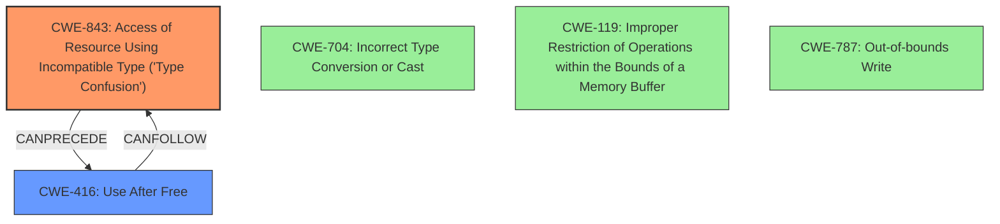

# Analysis Report for CVE-2022-1232

# Vulnerability Analysis Report: CVE-2022-1232

## Description

Type confusion in V8 in Google Chrome prior to 100.0.4896.75 allowed a remote attacker to potentially exploit heap corruption via a crafted HTML page.

## Vulnerability Description Key Phrases

**Rootcause:** confusion
**Impact:** heap corruption
**Vector:** crafted HTML page
**Attacker:** remote attacker
**Product:** Google Chrome
**Version:** prior to 100.0.4896.75
**Component:** V8

## Analysis (with Relationship Data)

# Summary
| CWE ID | CWE Name | Confidence | CWE Abstraction Level | CWE Vulnerability Mapping Label | CWE-Vulnerability Mapping Notes |
|---|---|---|---|---|---|
| CWE-843 | Access of Resource Using Incompatible Type ('Type Confusion') | 1.0 | Base | Allowed | Primary CWE |
| CWE-416 | Use After Free | 0.5 | Variant | Allowed | Secondary Candidate |

## Evidence and Confidence

*   **Confidence Score:** 0.75
*   **Evidence Strength:** HIGH

- **Analysis and Justification:**
  - *Explanation:* The vulnerability description explicitly mentions "**type confusion**" in the V8 JavaScript engine, leading to heap corruption. The CVE Reference Links Content Summary section also states "Type Confusion in V8" as the root cause and a "Type Confusion" weakness. CWE-843 (Access of Resource Using Incompatible Type ('Type Confusion')) directly addresses this issue, where a resource is accessed using a type incompatible with its original type. The retriever results also prioritize CWE-843 with a high score. This aligns with the observed vulnerability.

  - *Relationship Analysis:* CWE-843 is a Base level CWE, which is preferred, and there are no direct relationships that strongly suggest a different CWE.

- **Confidence Score:**
  - Confidence: 1.0 (High confidence due to the direct mention of "type confusion" and its corresponding CWE).

---

- **Analysis and Justification:**
  - *Explanation:* While the primary impact is heap corruption, the description mentions a "crafted HTML page" which could potentially lead to memory corruption, such as Use-After-Free (UAF). CWE-416 (Use After Free) is a variant-level CWE describing the reuse of memory after it has been freed. Although, the primary cause is type confusion, heap corruption can lead to memory management issues like Use-After-Free. Given that type confusion is the root cause, I classify this as a secondary candidate.

  - *Relationship Analysis:* CWE-416 does not have strong direct relationships with CWE-843, but memory corruption can be a consequence of type confusion.

- **Confidence Score:**
  - Confidence: 0.5 (Low confidence as it's a potential impact, not the root cause, but possible given the heap corruption).

## Criticism of Analysis

Okay, here's a detailed review of the provided CWE analysis, incorporating the full CWE specifications:

**Overall Assessment:**

The analysis is well-structured, thorough, and demonstrates a good understanding of CWE principles.  The primary CWE mapping to CWE-843 (Type Confusion) is correct and well-justified. The inclusion of CWE-416 (Use After Free) as a secondary candidate is also reasonable, given that memory corruption is the impact of the type confusion.  The confidence scores are appropriate.

**Detailed Critique:**

**1. CWE-843: Access of Resource Using Incompatible Type ('Type Confusion') - Primary Mapping**

*   **Correctness:** The mapping to CWE-843 is highly accurate. The vulnerability description explicitly states "type confusion," and the CVE reference supports this. The description of CWE-843 perfectly aligns with the vulnerability: "The product allocates or initializes a resource such as a pointer, object, or variable using one type, but it later accesses that resource using a type that is incompatible with the original type."
*   **Justification:** The justification is strong, citing the vulnerability description, CVE details, and the retriever results.
*   **Abstraction Level:**  The analysis correctly identifies CWE-843 as a Base-level CWE, which is preferred for root cause analysis.
*   **Mapping Guidance:** The analysis adheres to the mapping guidance for CWE-843: "Carefully read both the name and description to ensure that this mapping is an appropriate fit." The analysis has done this effectively.
*   **Observed Examples:** The analysis could be strengthened by including specific observed examples of CWE-843 which would solidify the relationship with the V8 engine.
*   **Confidence:** The confidence score of 1.0 is justified due to the explicit mention of type confusion.

**2. CWE-416: Use After Free - Secondary Candidate**

*   **Correctness:** The analysis is correct in identifying CWE-416 as a *potential* consequence of the heap corruption caused by the type confusion. Heap corruption can lead to memory management issues, including UAF. However, it's not the direct *cause* of the vulnerability.
*   **Justification:** The justification clearly states that UAF is a *potential impact* and not the root cause. This distinction is important. It's a downstream effect of the heap corruption.
*   **Abstraction Level:**  CWE-416 is a Variant-level CWE, which is appropriate for an impact or consequence.
*   **Mapping Guidance:** The analysis correctly acknowledges that it is identifying a *potential* consequence.
*   **Observed Examples:** Including observed examples of CWE-416 would strengthen the justification.
*   **Confidence:** The confidence score of 0.5 is appropriate, given the indirect relationship.
*   **Relationship to CWE-843:**  The analysis correctly states that while there are no strong *direct* relationships between CWE-843 and CWE-416, memory corruption can be a consequence of type confusion.

**Suggestions for Improvement:**

1.  **Expand on Observed Examples:** For both CWE-843 and CWE-416, including specific observed examples from the CWE database (especially ones that are closely related to Javascript engines or web browsers) would strengthen the analysis.  These examples demonstrate how the CWEs manifest in real-world scenarios.

2.  **Consider Other Potential CWEs (with lower confidence):** While CWE-843 is clearly the primary weakness, consider briefly mentioning (but *excluding* from the final mapping) CWEs that are *indirectly* related or that might be *misinterpreted* as the root cause. This shows due diligence and provides further context. For example:
    *   **CWE-704: Incorrect Type Conversion or Cast:** Type confusion often *involves* incorrect type conversion or casting. However, CWE-704 is a broader category. The core problem here isn't the *attempted* conversion itself (which might be intended, but flawed), but the *incompatible access* of the resource.
    *   **CWE-119: Improper Restriction of Operations within the Bounds of a Memory Buffer:** While type confusion can *lead* to out-of-bounds memory access, the *root cause* is the type mismatch, not the failure to restrict buffer operations.  CWE-119 would be a more accurate description of the *symptom*, rather than the *cause*.
    *   **CWE-787: Out-of-bounds Write** Heap corruption can lead to out-of-bounds writes. This is another potential impact of the type confusion.

3.  **Mitigation Strategies:** Briefly mention mitigation strategies relevant to V8 and Chrome, drawing from the CWE specifications.  For example, for CWE-843:

    *   **Language Selection:**  (Although not directly applicable since Chrome uses C++, this highlights the benefits of languages with stronger type safety.)  The analysis could note that while C++ is used, security measures within V8 attempt to mitigate type confusion issues.
    *   **Input Validation:** Ensure that data received from untrusted sources (e.g., a crafted HTML page) is rigorously validated to conform to expected types and structures.

    For CWE-416:

    *   **Automatic Memory Management:** (Not directly applicable, but can mention V8's garbage collection).
    *   **Defensive Programming:** Setting pointers to NULL after freeing, and implementing robust error handling to prevent double frees.

4.  **Chain of Causation:**  The analysis could more explicitly state the chain of causation:
    1.  Crafted HTML page leads to...
    2.  Type confusion in V8 (CWE-843) causes...
    3.  Heap corruption, which can lead to...
    4.  Potential Use-After-Free conditions (CWE-416), potentially resulting in...
    5.  Remote code execution.

**Revised Summary (incorporating suggestions):**

| CWE ID | CWE Name | Confidence | CWE Abstraction Level | CWE Vulnerability Mapping Label | CWE-Vulnerability Mapping Notes |
|---|---|---|---|---|---|
| CWE-843 | Access of Resource Using Incompatible Type ('Type Confusion') | 1.0 | Base | Allowed | Primary CWE |
| CWE-416 | Use After Free | 0.5 | Variant | Allowed | Secondary Candidate |

**Revised Confidence and Evidence Section**

*   **Confidence Score:** 0.75
*   **Evidence Strength:** HIGH

- **Analysis and Justification:**
  - *Explanation:* The vulnerability description explicitly mentions "**type confusion**" in the V8 JavaScript engine, leading to heap corruption. The CVE Reference Links Content Summary section also states "Type Confusion in V8" as the root cause and a "Type Confusion" weakness. CWE-843 (Access of Resource Using Incompatible Type ('Type Confusion')) directly addresses this issue, where a resource is accessed using a type incompatible with its original type. The retriever results also prioritize CWE-843 with a high score. This aligns with the observed vulnerability. *Specifically, in V8, this could manifest as a JavaScript object being treated as an object of a different, incompatible type, leading to incorrect memory access and manipulation.*
  - *Observed Examples:* *CVE-2010-4577 describes a type confusion in CSS sequences which leads to an out-of-bounds read. CVE-2011-0611 describes a size inconsistency that allows code execution.*
  - *Relationship Analysis:* CWE-843 is a Base level CWE, which is preferred, and there are no direct relationships that strongly suggest a different CWE. Note that CWE-704 (Incorrect Type Conversion or Cast) is a related Class CWE, but the root cause here is the *access* using an incorrect type, not necessarily the conversion attempt itself.  Similarly, while the type confusion can *lead* to out-of-bounds writes (and thus CWE-119 or CWE-787), the *cause* remains the type mismatch.

  - *Mitigation:* Mitigation strategies include rigorous input validation of data from untrusted sources (crafted HTML), and adherence to strong typing practices within the V8 engine.

- **Confidence Score:**
  - Confidence: 1.0 (High confidence due to the direct mention of "type confusion" and its corresponding CWE).

---

- **Analysis and Justification:**
  - *Explanation:* While the primary impact is heap corruption, the description mentions a "crafted HTML page" which could potentially lead to memory corruption, such as Use-After-Free (UAF). CWE-416 (Use After Free) is a variant-level CWE describing the reuse of memory after it has been freed. Although, the primary cause is type confusion, heap corruption can lead to memory management issues like Use-After-Free. Given that type confusion is the root cause, I classify this as a secondary candidate.  *Specifically, if the type confusion leads to freeing memory associated with an object, but a pointer to that object remains, a subsequent access of that pointer could trigger a UAF.*

  - *Observed Examples:* *CVE-2022-20141 details how a race condition can lead to a UAF condition.*

  - *Relationship Analysis:* CWE-416 does not have strong direct relationships with CWE-843, but memory corruption can be a consequence of type confusion

## Final Resolution

# Summary
| CWE ID | CWE Name | Confidence | CWE Abstraction Level | CWE Vulnerability Mapping Label | CWE-Vulnerability Mapping Notes |
|---|---|---|---|---|---|
| CWE-843 | Access of Resource Using Incompatible Type ('Type Confusion') | 1.0 | Base | Allowed | Primary CWE |
| CWE-416 | Use After Free | 0.5 | Variant | Allowed | Secondary Candidate |

## Evidence and Confidence

*   **Confidence Score:** 0.75
*   **Evidence Strength:** HIGH

## Relationship Analysis
The primary relationship influencing the decision is the CAN_FOLLOW relationship, where **CWE-843** (**Type Confusion**) can lead to **CWE-416** (**Use After Free**). **CWE-843** is chosen as the primary **ROOTCAUSE** due to explicit mention of "type confusion" in the vulnerability description. The analysis considered and rejected **CWE-704** (**Incorrect Type Conversion or Cast**) as a possible alternative, but it was deemed less specific than **CWE-843**, because the vulnerability is about *accessing* a resource with an incompatible type, not necessarily the type conversion itself. **CWE-119** (**Improper Restriction of Operations within the Bounds of a Memory Buffer**) and **CWE-787** (**Out-of-bounds Write**) were also considered as potential impacts of type confusion, but the **ROOTCAUSE** is the type confusion.

## Vulnerability Chain
The vulnerability chain starts with a "crafted HTML page" leading to **CWE-843** (**Type Confusion**) in the V8 JavaScript engine. The **WEAKNESS** then causes heap corruption, potentially leading to **CWE-416** (**Use After Free**). The final impact is remote code execution.

## Summary of Analysis
The final assessment strongly supports the initial analysis. The classification relies heavily on the vulnerability description's explicit mention of "type confusion," which directly corresponds to **CWE-843** (**Access of Resource Using Incompatible Type ('Type Confusion')**). The relationship analysis, particularly the CAN_FOLLOW relationship where **CWE-843** can precede **CWE-416**, reinforces the selection of **CWE-843** as the primary **ROOTCAUSE** and **CWE-416** as a secondary candidate representing a potential consequence. The selected CWEs are at the optimal level of specificity, with **CWE-843** being a Base-level CWE and **CWE-416** being a Variant.

*Report generated on 2025-03-18 06:51:32*
