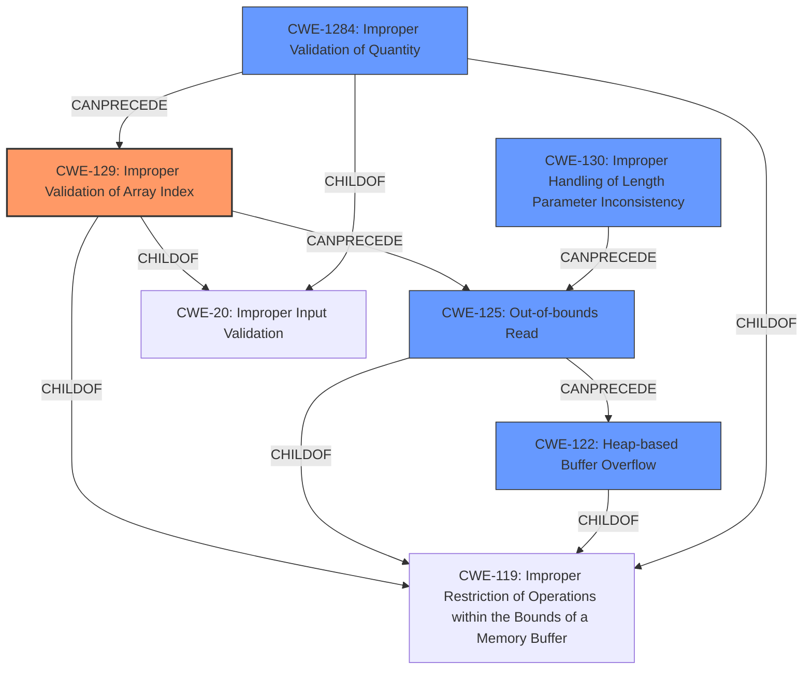

# Final Resolution for CVE-2022-1237

# Summary
| CWE ID    | CWE Name                               | Confidence | CWE Abstraction Level | CWE Vulnerability Mapping Label | CWE-Vulnerability Mapping Notes |
| :--------- | :------------------------------------- | :--------- | :-------------------- | :------------------------------ | :------------------------------ |
| CWE-129     | Improper Validation of Array Index     | 0.90       | Variant               | Allowed                         | Primary CWE                     |
| CWE-125     | Out-of-bounds Read                     | 0.75       | Base                  | Allowed                         | Secondary Candidate             |
| CWE-122     | Heap-based Buffer Overflow             | 0.70       | Variant               | Allowed                         | Secondary Candidate             |
| CWE-1284     | Improper Validation of Quantity      | 0.60       | Base                  | Allowed                         | Secondary Candidate             |
| CWE-130     | Improper Handling of Length Parameter Inconsistency | 0.55    | Base                   | Allowed                | Additional Candidate          |

## Evidence and Confidence

*   **Confidence Score:** 0.85
*   **Evidence Strength:** HIGH

## Relationship Analysis
The analysis focuses on identifying the root cause and consequences of the vulnerability.
  - The primary selection, CWE-129 (Improper Validation of Array Index), is a variant-level CWE, providing good specificity.
  - CWE-125 (Out-of-bounds Read) and CWE-122 (Heap-based Buffer Overflow) are consequences of the primary weakness.
  - CWE-1284 (Improper Validation of Quantity) reflects the lack of validation of size-related inputs.
  - CWE-130 (Improper Handling of Length Parameter Inconsistency) addresses inconsistencies between length parameters and actual data size.
  - All selected CWEs except CWE-130 are children of CWE-119 (Improper Restriction of Operations within the Bounds of a Memory Buffer). Although CWE-119 is not selected due to its discouraged usage, recognizing this parent-child relationship adds context.
  - CWE-129 and CWE-1284 are children of CWE-20 (Improper Input Validation), indicating a broader input validation issue.

## Vulnerability Chain
The vulnerability chain starts with the **improper validation of input quantities (CWE-1284)** and the **improper handling of length parameter inconsistencies (CWE-130)** present in the NE header. This leads to **improper validation of the array index (CWE-129)**, which results in an **out-of-bounds read (CWE-125)**, ultimately causing a **heap-based buffer overflow (CWE-122)**.

Root Cause: **CWE-1284 (Improper Validation of Quantity), CWE-130 (Improper Handling of Length Parameter Inconsistency)**
Weakness: **CWE-129 (Improper Validation of Array Index)**
Consequence: **CWE-125 (Out-of-bounds Read), CWE-122 (Heap-based Buffer Overflow)**

## Summary of Analysis
The initial analysis and subsequent criticism provide a comprehensive view of the vulnerability. The selection of **CWE-129 (Improper Validation of Array Index)** as the primary weakness is well-supported by the evidence, specifically the description of the vulnerability as an "Improper Validation of Array Index" leading to a heap overflow. The CVE reference confirms this root cause, stating that the out-of-bounds read is due to manipulated offsets and sizes in the NE header without proper validation.

The graph relationships reinforce the understanding of the vulnerability chain. The parent-child relationships, such as CWE-129 and CWE-1284 being children of CWE-20 (Improper Input Validation) and CWE-119 (Improper Restriction of Operations within the Bounds of a Memory Buffer), highlight the broader context of input validation and memory management issues.

The decision to include **CWE-130 (Improper Handling of Length Parameter Inconsistency)** is based on the observation that the vulnerability arises from manipulating offsets and lengths from the NE header, which are not validated properly. This inconsistency between the length parameters and the actual data size is a key factor contributing to the vulnerability.

The selected CWEs are at the optimal level of specificity. While CWE-20 (Improper Input Validation) could be considered, the more specific CWE-129 and CWE-1284 provide a more accurate and detailed representation of the vulnerability. Similarly, while CWE-119 (Improper Restriction of Operations within the Bounds of a Memory Buffer) is a parent of several selected CWEs, it is too broad to be the primary classification.