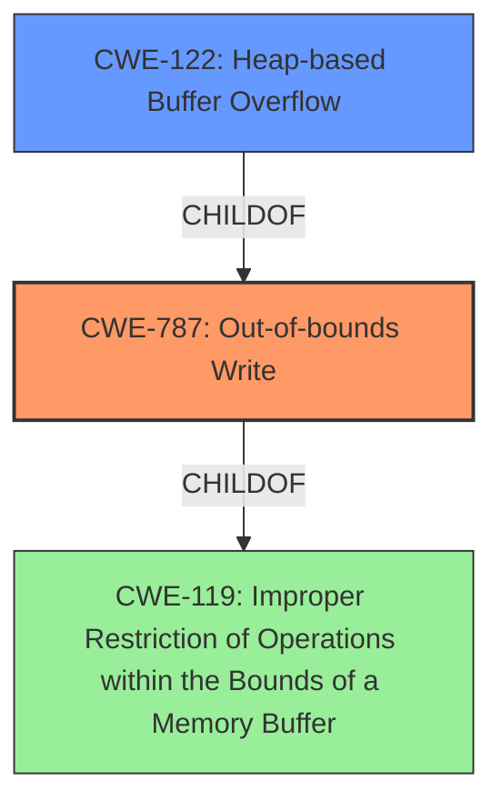

# Analysis Report for CVE-2022-1238

# Vulnerability Analysis Report: CVE-2022-1238

## Description

Out-of-bounds Write in libr/bin/format/ne/ne.c in GitHub repository radareorg/radare2 prior to 5.6.8. This vulnerability is heap overflow and may be exploitable. For more general description of heap buffer overflow, see [CWE](https//cwe.mitre.org/data/definitions/122.html).

## Vulnerability Description Key Phrases

**Weakness:** Out-of-bounds Write
**Vector:** heap overflow
**Product:** radare2
**Version:** prior to 5.6.8
**Component:** libr/bin/format/ne/ne.c

## Analysis (with Relationship Data)

# Summary
| CWE ID | CWE Name | Confidence | CWE Abstraction Level | CWE Vulnerability Mapping Label | CWE-Vulnerability Mapping Notes |
|---|---|---|---|---|---|
| CWE-787 | Out-of-bounds Write | 0.95 | Base | Allowed | Primary CWE |
| CWE-122 | Heap-based Buffer Overflow | 0.75 | Variant | Allowed | Secondary Candidate |

## Evidence and Confidence

*   **Confidence Score:** 0.90
*   **Evidence Strength:** HIGH

- **Analysis and Justification:**  
  - *Explanation:* The vulnerability is described as an "**Out-of-bounds Write**" in the `libr/bin/format/ne/ne.c` component of radare2. The description specifies this is a "**heap overflow**". The root cause, as determined by the CVE Reference Links Content Summary, involves writing data beyond the intended buffer. This aligns directly with CWE-787 (Out-of-bounds Write), which is defined as "The product writes data past the end, or before the beginning, of the intended buffer." The fact that the overflow occurs in the heap portion of memory further suggests CWE-122 (Heap-based Buffer Overflow) as a more specific variant. However, since the primary issue is writing out of bounds, CWE-787 is the most appropriate primary CWE. The description highlights the potential for exploitation, which is a characteristic consequence of out-of-bounds writes.

  - *Relationship Analysis:* CWE-787 is a base-level CWE and a child of CWE-119 (Improper Restriction of Operations within the Bounds of a Memory Buffer). Given that the specific issue is writing beyond buffer boundaries, CWE-787 is more descriptive than its parent. CWE-122 is a variant of CWE-787 and represents a more specific case of heap overflows. The graph relationships show that CWE-787 can precede various other CWEs such as CWE-825 (Expired Pointer Dereference) and CWE-824 (Access of a Resource After It Has Been Dropped), indicating potential consequences of out-of-bounds writes.

- **Confidence Score:**
  - Confidence: 0.95 (High confidence due to explicit mention of "Out-of-bounds Write" and "heap overflow" in the vulnerability description and supporting CVE analysis.)

---
- **Analysis and Justification:**  
  - *Explanation:* Given that the **Out-of-bounds Write** occurs on the heap, CWE-122 (Heap-based Buffer Overflow) is a relevant secondary weakness. CWE-122 is a variant of CWE-787, indicating a more specific location (heap) where the out-of-bounds write happens.

  - *Relationship Analysis:* CWE-122 is a variant of CWE-787 and a child of CWE-119. Although it provides more context about the location of the buffer, it is not as fundamental as the out-of-bounds write itself (CWE-787).

- **Confidence Score:**
  - Confidence: 0.75 (Medium confidence as this is a specific instance of CWE-787)

## Criticism of Analysis

Okay, here's a review of the analysis provided, incorporating the full CWE specifications and addressing the mapping guidance and potential mitigations for each CWE.

**Overall Assessment:**

The analysis is generally sound and well-justified. The primary CWE, CWE-787 (Out-of-bounds Write), is the most appropriate choice given the description of the vulnerability. The secondary CWE, CWE-122 (Heap-based Buffer Overflow), is also relevant as it provides more specific information about the location of the vulnerability on the heap.  The confidence scores accurately reflect the strength of the evidence.

**Detailed Review:**

**1. Primary CWE: CWE-787 (Out-of-bounds Write)**

*   **Confidence:** 0.95 (Excellent)
*   **Justification:** The vulnerability description clearly states "Out-of-bounds Write" and the CVE analysis confirms that the code writes past the intended buffer. This is a direct match for CWE-787.
*   **CWE Specification Considerations:**
    *   **Abstraction Level:** CWE-787 is a Base-level CWE, which is the preferred level for mapping. This is good.
    *   **Mapping Guidance:**  The mapping guidance indicates that CWE-787 is "Allowed" and encourages careful reading of the name and description to ensure appropriateness. This analysis correctly adhered to that guidance.
    *   **Relationships:** CWE-787 is a child of CWE-119 (Improper Restriction of Operations within the Bounds of a Memory Buffer). It's important to note that CWE-119 is *discouraged* for direct mapping when a more specific child like CWE-787 is applicable. The analysis correctly identified CWE-787 as more specific.
    *   **Potential Mitigations:** The analysis could be strengthened by considering and mentioning some of the potential mitigations outlined in the CWE specification:
        *   **Language Selection:** Using memory-safe languages (Java, Perl, C#, Ada) inherently prevents or reduces the risk.
        *   **Libraries or Frameworks:** Using safe string handling libraries (SafeStr, Strsafe.h) could have prevented the overflow.
        *   **Environment Hardening:** Compiler-based overflow detection mechanisms (/GS flag in Visual Studio, FORTIFY_SOURCE in GCC) could detect and potentially prevent exploitation.
*   **Improvements:**  Briefly mentioning the potential mitigations from the CWE specification would add value to the analysis. For example: "The vulnerability could have been mitigated by using a language with automatic bounds checking or by leveraging compiler-based overflow detection mechanisms."

**2. Secondary CWE: CWE-122 (Heap-based Buffer Overflow)**

*   **Confidence:** 0.75 (Good)
*   **Justification:** The vulnerability is explicitly identified as a "heap overflow." CWE-122 is a Variant of CWE-787 that specifically addresses heap-based overflows.  It provides more context.
*   **CWE Specification Considerations:**
    *   **Abstraction Level:** CWE-122 is a Variant-level CWE, which is generally acceptable as a secondary CWE to provide more context.
    *   **Mapping Guidance:** The mapping guidance indicates that CWE-122 is "Allowed" for mapping.
    *   **Relationships:** CWE-122 is a child of CWE-787 and CWE-788. Its inclusion helps further define the specific type of out-of-bounds write.
    *   **Potential Mitigations:**  Similar to CWE-787, mentioning the potential mitigations from CWE-122 would strengthen the analysis.
        *   **Automatic Bounds Checking:** Using compilers/languages with automatic bounds checking.
        *   **Abstraction Libraries:** Using libraries to abstract away risky memory management APIs.
        *   **Environment Hardening:** Using compiler and OS-level buffer overflow detection mechanisms.
*   **Improvements:**  As with the primary CWE, briefly mentioning relevant mitigations would be beneficial.

**3. Other Combined Results from Retriever Results:**

Several other CWEs were returned as combined results. It's important to understand why they are not more appropriate than CWE-787 and CWE-122:

*   **CWE-193 (Off-by-one Error):** While an off-by-one error *could* contribute to a buffer overflow, the description doesn't explicitly indicate this.  It's not the *primary* cause.  It would be appropriate to include in the analysis only if there was clear evidence that the size calculation was off by one.
*   **CWE-190 (Integer Overflow or Wraparound):** Similar to CWE-193, an integer overflow *could* be part of a chain of events leading to the overflow, but it's not the direct cause described in the original text or CVE summary.  It would need more explicit evidence.
*   **CWE-124 (Buffer Underwrite):** The description doesn't suggest writing *before* the beginning of the buffer. This is not relevant.
*   **CWE-191 (Integer Underflow):** Similar to CWE-190, it could be part of the chain, but it is not stated.
*   **CWE-126 (Buffer Over-read):** The description specifies a write, not a read, beyond the buffer. This is an out-of-bounds write, not read.
*   **CWE-130 (Improper Handling of Length Parameter Inconsistency):** A length parameter inconsistency *could* exist, but it is not mentioned in the summary.
*   **CWE-476 (NULL Pointer Dereference):** The provided information does not suggest that there was a NULL Pointer involved with the BOF.
*   **CWE-131 (Incorrect Calculation of Buffer Size):** Similar to integer overflow, incorrect buffer size calculation could lead to buffer overflow, but again, is not explicitly mentioned.

**General Recommendations:**

*   **Mitigations:**  Expand the analysis by including a brief discussion of potential mitigations, drawing from the "Potential Mitigations" sections of the relevant CWE specifications. This adds practical value to the analysis.
*   **Chain/Composite Analysis (Advanced):**  For a more thorough analysis, consider whether other CWEs could be part of a chain or composite weakness leading to the out-of-bounds write. For instance, was there improper input validation (CWE-20) that allowed a large or negative value to be used as an offset? Was there an integer overflow (CWE-190) in the calculation of the buffer size? Exploring these relationships, if applicable, would provide a deeper understanding of the vulnerability.  However, it's important to only include these if there is evidence to support them; don't add them speculatively.
*   **Explicitly Rule Out Incorrect Results:** If the Retriever Results have other CWEs of a high score, you should explicitly state in the explanation why they do not fit in the summary.
*   **Specificity:** Ensure that the vulnerability is as specific as possible. If the heap-based buffer overflow occurs while writing data, it can be noted in the CWE summary.

By incorporating these suggestions, the analysis can be even more comprehensive and useful.

## Final Resolution

# Summary

| CWE ID | CWE Name | Confidence | CWE Abstraction Level | CWE Vulnerability Mapping Label | CWE-Vulnerability Mapping Notes |
|---|---|---|---|---|---|
| CWE-787 | Out-of-bounds Write | 0.95 | Base | Allowed | Primary CWE |
| CWE-122 | Heap-based Buffer Overflow | 0.75 | Variant | Allowed | Secondary Candidate |

## Evidence and Confidence

*   **Confidence Score:** 0.92
*   **Evidence Strength:** HIGH

## Relationship Analysis
The primary relationship impacting the decision is the parent-child relationship between CWE-119 (Improper Restriction of Operations within the Bounds of a Memory Buffer), CWE-787 (Out-of-bounds Write) and CWE-122 (Heap-based Buffer Overflow). CWE-787 is a child of CWE-119, making it more specific, and CWE-122 is a variant of CWE-787 specifying that the out-of-bounds write occurs on the heap. This hierarchical relationship guides us to select CWE-787 as the primary cause because it directly addresses the out-of-bounds write, while CWE-122 provides additional context.

## Vulnerability Chain
The vulnerability chain starts with the **ROOTCAUSE** which is an **Out-of-bounds Write (CWE-787)** in the `libr/bin/format/ne/ne.c` component. Because it is a heap overflow, **CWE-122** occurs. The consequence is a potential for exploitation.

## Summary of Analysis
The initial analysis and criticism were both accurate. The vulnerability description clearly states an "**Out-of-bounds Write**" occurs and that it is a "**heap overflow**". The provided evidence supports the classification of CWE-787 as the primary CWE because the description specifies writing beyond the intended buffer. CWE-122 is included as a secondary CWE because it specifies the location of the buffer on the heap.

The graph relationships reinforced the decision to use CWE-787 as the primary CWE due to its direct representation of the **WEAKNESS**. The relationships also confirmed the relevance of CWE-122 as a more specific variant that provides additional context without overshadowing the core issue.

The selected CWEs are at the optimal level of specificity. CWE-787 is a Base CWE, which is preferred for primary mappings. CWE-122 is a Variant CWE, which is useful for providing additional context.

*Report generated on 2025-03-18 06:53:38*
